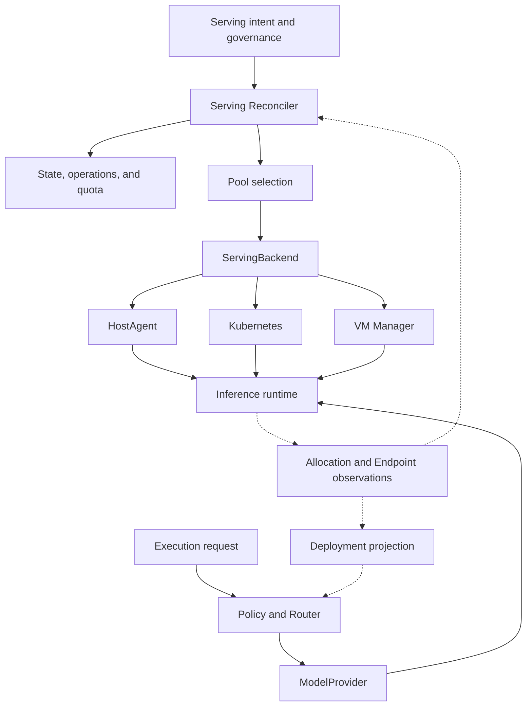
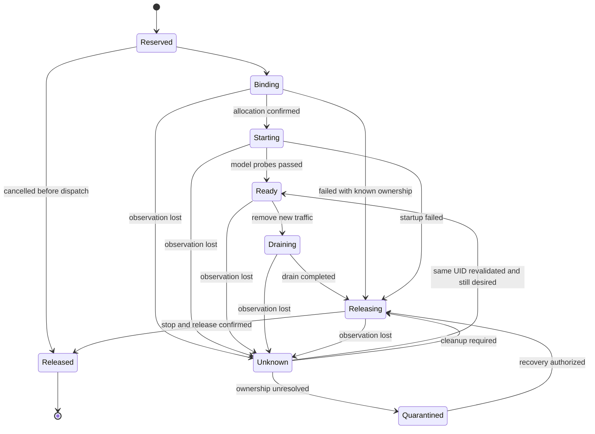

# Carrier-Neutral Multi-Model Serving and GPU Scheduling

**English** | [简体中文](01-carrier-neutral-multi-model-serving.zh-CN.md)

> Status: development design proposal; not implemented or promoted to a frozen contract.
> Observation date: 2026-09-14; code baseline: [`ff374ac`](https://github.com/tommyxie2026-tech/aicloud/tree/ff374acdc1b36b7cd13e0a25e04f754ae6064c89).
> Scope: multi-model inference on physical hosts, standalone containers, Kubernetes Pods, and processes or containers inside VMs.
> translation-status: synchronized

## 1. Goals, Scope, and Evidence Levels

Build a control plane that declares, governs, and observes model-serving capacity consistently. Applications continue to address model capabilities and callable `Deployment` objects; each backend manages its own compute resources. Kubernetes, KubeVirt, and HostAgent are integration choices.

This design supplies model execution capacity beneath the AI Execution OS. It integrates with existing `ExecutionTarget`, Policy, Evidence, and accounting contracts instead of introducing another business execution kernel.

| Scope | Treatment in this design |
| --- | --- |
| Multi-model colocation | Different models, multiple replicas of one model, and validated shared execution modes |
| Multiple carriers | Prepared physical hosts or VMs, standalone OCI containers, Kubernetes, and later VM lifecycle integration |
| Multiple accelerator families | Common capability descriptions; validate NVIDIA GPUs, other GPUs, PPUs, and their drivers/runtimes separately |
| GPU scheduling | Pool selection, quota, exclusive allocation authority, device observation, release, and recovery |
| Machine provisioning | MVP uses prepared hosts; PXE, BMC, firmware, and machine delivery remain infrastructure responsibilities |
| Training and advanced distributed inference | Outside MVP; multi-node gang scheduling, prefill/decode separation, and online KV transfer require separate designs |

Evidence labels apply throughout: **[F] published fact** cites official documentation; **[C] code fact** refers to the baseline above; **[D] design recommendation** describes proposed behavior; **[U] unverified** requires hardware experiments or contract review. Prescriptive content without [F] or [C] is [D], not a claim that the repository already implements it.

## 2. Repository Baseline and Compatibility Boundaries

| Existing entry point [C] | Confirmed responsibility | Proposed extension [D] |
| --- | --- | --- |
| [`internal/domain/model_version.go`](../../internal/domain/model_version.go) | Model identity, artifact digest, and governance evidence | Keep `ModelVersion`; do not introduce a synonymous `ModelRevision` |
| [`internal/domain/deployment.go`](../../internal/domain/deployment.go) | Endpoint, capacity, health, deployment lifecycle, and routing eligibility | Add separate desired-state and observation records for managed Deployments |
| [`internal/router/deployment_plan.go`](../../internal/router/deployment_plan.go) | Select callable model and Deployment candidates | Consume validated health, capacity, and compatibility projections |
| [`internal/modelruntime/executor.go`](../../internal/modelruntime/executor.go) | Resolve a Provider by Deployment/Model and invoke it | Register the corresponding Provider instance before a managed Endpoint becomes ready |
| [`model/provider/provider.go`](../../model/provider/provider.go) | `Generate`, `Health`, and capabilities; no infrastructure execution authority | Keep inference protocol adapters separate from resource lifecycle adapters |
| [`execution/types.go`](../../execution/types.go) | `ExecutionTarget`, `TargetSnapshot.DeploymentRef`, Attempt/Evidence | Pin model, runtime, and Deployment lineage in target snapshots |
| [`execution/lease.go`](../../execution/lease.go) | Worker node-execution leases; external effects still require target-side protection | Use separate GPU ownership records and enforce fencing at the resource authority |
| [`infra/adapter/adapter.go`](../../infra/adapter/adapter.go) | `ClusterAdapter` and its Fake implementation | Preserve cluster delivery; add a serving lifecycle Backend port |
| [`infra/mapping/kubevirt/README.md`](../../infra/mapping/kubevirt/README.md) | Neutral desired-VM mapping skeleton | Implement actual VM APIs, discovery, and passthrough later; live KubeVirt integration is not present |

Compatibility constraints:

1. Preserve the [`Provider / Model / Deployment contract`](../../docs/architecture/provider-model-deployment-contract.md). `Provider` adapts inference connectivity; `ServingBackend` adapts resource lifecycle operations.
2. Current `DeploymentLifecycle` values are `discovered / ready / degraded / draining / retired / blocked`. Allocation states in this proposal remain separate and project into that lifecycle using [`deployment_transition.go`](../../internal/domain/deployment_transition.go). Older wording in frozen examples does not justify adding enum values silently.
3. New module names and APIs are proposals. Before implementation, complete ADR, contract, migration, and bilingual review under [`S0 Contract Freeze`](../../docs/architecture/S0-Contract-Freeze.md) and the [`Pre-Code Gate`](../../docs/architecture/pre-code-architecture-gate.md).
4. R1 `Execution` and older `Task` governance contracts coexist. This proposal does not settle their migration. Every serving operation needs explicit execution lineage; integration must define its mapping to existing Task accounting and audit contracts.

## 3. Architecture and Carrier Representation

A single `carrier = baremetal | container | vm` field cannot describe all deployment shapes. Containers can run on physical hosts or VMs, and a VM can also be a Kubernetes Node.

| Orthogonal dimension | Examples | Decisions affected |
| --- | --- | --- |
| `infrastructure` | `baremetal`, `vm` | Isolation, physical failure domain, device ownership |
| `packaging` | `process`, `oci` | Artifact delivery, startup, and cleanup |
| `orchestrator` | `host-agent`, `kubernetes`, `vm-manager` | Instance lifecycle authority |
| `runtime` | vLLM, SGLang, Triton, vendor engines | Model support, parallelism, protocol, performance |
| `allocationAPI` | Host allocation service, Device Plugin, DRA, Hypervisor API | Resource declarations and allocation evidence |
| `sharingMode` | `exclusive`, `mig`, `vgpu`, `time-slicing`, `engine-managed` | Isolation and capacity commitments |



The deployment management path is the control plane; requests through Router, Provider, and Runtime form the data plane. During a control-plane outage, existing instances may continue serving under still-valid identity and policy snapshots. Creation, expansion, and migration stop; expired authorization must not become an indefinite permit.

## 4. Domain Objects and Ownership

The additions below are logical data models, not existing Go types or Kubernetes CRDs.

| Object | Key fields | Source of truth and lifecycle |
| --- | --- | --- |
| `ModelVersion`, existing | `ID`, `ArtifactDigest`, Admission/Evaluation evidence | Model registry; admitted versions follow the existing contract |
| `Deployment`, existing | `ID`, `ModelVersionID`, `Provider`, `Endpoint`, `Lifecycle` | Callable Router target, not an individual process |
| `ServingSpec`, proposed | `deploymentId`, `specGeneration`, `runtimeProfileRef`, `placement`, `replicas`, `slo` | One desired-state record per managed Deployment |
| `RuntimeProfile`, proposed | Immutable version, model/quantization compatibility, image or package digest, argument template, driver/hardware requirements | Published after validation; arbitrary unreviewed startup scripts are not accepted |
| `ResourcePool`, proposed | `poolId`, `backendRef`, region, tenant policy, `allocationAuthority`, capabilities, observation time | One explicit management domain with an authoritative allocator |
| `ResourceDevice`, proposed | `deviceId`, `physicalDeviceId`, `parentDeviceId`, topology, configuration generation, health | Backend discovery; parent relationships deduplicate GPU, MIG, and vGPU views |
| `ReplicaAllocation`, proposed | `allocationId`, `deploymentId`, `replicaId`, `attempt`, `poolId`, `backendUID`, devices, state, fence | Resource occupancy and release evidence for each replica creation attempt |
| `EndpointObservation`, proposed | `allocationId`, actual model/runtime digest, protocol, reachable address, probe time/result | Backend observations, not a new top-level routing aggregate |
| `ServingOperation`, proposed | Operation kind, desired digest, idempotency key, execution lineage, Policy evidence, progress/result | Durable asynchronous deployment, scaling, draining, and replacement operations |

Constraints:

- One `ModelVersion` may have multiple `Deployment` objects; one Deployment may have multiple replicas of the same configuration.
- A Deployment's pool binding becomes stable once placement is committed. Cross-pool or cross-Backend replacement creates a new Deployment and uses existing `ReplacementIDs` for lineage.
- Model version, runtime artifact, or semantic configuration changes also create a new Deployment so routing and Evidence remain reproducible. Operational intent such as replica count advances `specGeneration`.
- Hosted APIs and manually registered Endpoints may have no `ServingSpec` and retain their existing behavior.
- `Deployment.Endpoint` is a stable address or pool proxy reachable by the gateway. A Pod IP or private VM address is not automatically globally reachable.
- Existing `QuotaRemaining` and `CapacityAvailable` are invocation-side signals. GPU quotas and remaining physical resources need separate fields with explicit units and timestamps; do not overload those unitless numbers.

## 5. Persistence, Transactions, and Versioning

Extend the existing PostgreSQL/repository system. Kubernetes objects and Workflow History must not become the business database.

| Proposed table | Minimum constraints |
| --- | --- |
| `serving_specs` | Unique `deployment_id`; compare-and-swap updates against the expected `spec_generation` |
| `runtime_profiles` | Unique `(profile_id, version)`; published configuration and artifact digests are immutable |
| `resource_pools` / `resource_devices` | Explicit allocation authority, physical parent, device configuration generation, and observation time |
| `replica_allocations` | Unique `(deployment_id, replica_id, attempt)`; at most one unfinished attempt per replica; rolling replacements have different identities |
| `endpoint_observations` | Unique `(allocation_id, observation_sequence)`; an old observation cannot overwrite a newer instance |
| `serving_operations` | Unique `(tenant_id, project_id, operation_kind, idempotency_key)`; the same key with a different request digest is a conflict |
| `pool_quota_reservations` / `serving_events` | Quota reservation, state update, and Outbox in one transaction; append-only events |

Tenant/project-scoped records carry explicit scope, enforced by both repository queries and RLS. Pools may be platform resources, but allocation and use require explicit grants. Missing scope never implies administrative access.

**Separate two ledgers:** platform quota reservations decide whether a tenant may consume capacity; the Backend's authoritative allocation decides which device an instance actually owns. Physical-device records for external pools are observation mirrors, not a second GPU allocator. A Host pool may use the platform allocation service as its authority, coupled with real device access enforcement in HostAgent.

Commit operation intent, quota reservation, and events atomically before external effects. Recover through Outbox delivery and idempotent reconciliation. Do not wait for model downloads, VM creation, or Pod startup inside a database transaction. A timeout requires observation and recovery; it does not prove that an external operation failed.

`specGeneration` versions desired state, `fence` is a monotonically increasing command epoch issued by the resource authority, and `backendUID` identifies a real instance. They are distinct. A PostgreSQL lease constrains control-plane writes but cannot by itself stop an old process from using a GPU.

## 6. Backend Interface and Capability Discovery

Proposed Go port below; its DTO names are placeholders for contract discussion, not directly compilable code:

```go
type ServingBackend interface {
    Capabilities(context.Context, PoolRef) (BackendCapabilities, error)
    Validate(context.Context, DesiredReplica) (ValidationResult, error)
    Ensure(context.Context, CommandEnvelope, DesiredReplica) (BackendHandle, error)
    Observe(context.Context, BackendHandle) (ReplicaObservation, error)
    Drain(context.Context, CommandEnvelope, BackendHandle, DrainPolicy) (DrainObservation, error)
    Release(context.Context, CommandEnvelope, BackendHandle) (ReleaseObservation, error)
}
```

| Method | Required semantics |
| --- | --- |
| `Capabilities` | Report validated hardware, artifacts, protocols, isolation, sharing, topology, observation, and fencing support with tested versions |
| `Validate` | No external mutation; validate the full runtime combination, identity, scope, arguments, resources, and compatibility; return deterministic rejection reasons |
| `Ensure` | Repeating a key returns the same instance; an observable handle does not imply model readiness |
| `Observe` | Return UID, generations, actual allocation, process/container/VM state, model identity, health, and observation time |
| `Drain` | Stop new traffic and track in-flight requests and deadlines without releasing devices prematurely |
| `Release` | Idempotently reclaim the specified UID and return stop/deallocation evidence; accepting a delete request is insufficient |

`CommandEnvelope` includes at least `operationId`, `idempotencyKey`, `tenantId`, `projectId`, `deploymentId`, `replicaId`, `attempt`, `specGeneration`, `desiredDigest`, `fence`, authorization reference, and deadline. Creation identity is scope + Deployment + replica + attempt; operation keys also distinguish Ensure/Drain/Release and configuration generation. A Worker retry number must not change the identity used by repeated Ensure calls.

Return structured errors: `InvalidSpec`, `UnsupportedCapability`, `PolicyDenied`, `InsufficientCapacity`, `StaleGeneration`, `BackendUnavailable`, `OwnershipUnknown`, and `ArtifactVerificationFailed`. Capacity shortage can enter a bounded queue. Invalid configuration, policy denial, and artifact verification failure must not trigger blind retries.

The Backend must enforce protection against stale commands using mechanisms it actually supports: target-side monotonic fencing, durable idempotency mappings, UID preconditions, and a single controlled writer. Where an API cannot provide adequate fencing, declare the limitation and prevent concurrent takeover. Passing a number does not establish isolation.

## 7. Implementation Boundaries for Three Backends

| Backend | Minimum implementation | Key limitations |
| --- | --- | --- |
| `HostBackend` | HostAgent receives structured configuration and manages controlled processes through systemd or containers through a controlled OCI Runtime | Machine identity, mTLS, narrowly privileged helpers; arbitrary root SSH commands are not the protocol |
| `KubernetesBackend` | Create managed workloads, service addresses, and configuration; observe UID, scheduling, and allocation; begin with Kubernetes Deployment | Do not guess GPU indices in the control plane; the cluster allocates devices; KServe is an optional later adapter |
| `VMBackend` | Integrate VM APIs and GPU mappings; guest bootstrap/agent installs the engine, warms the model, and probes readiness | VM Running does not mean model Ready; validate host/guest drivers, networking, and permissions independently |

HostAgent must restore idempotency mappings and accepted fences after restart. It reports boot identity, machine identity, process/container UID, device allocations, and orphan instances. A wiped or reinstalled host registers a new machine epoch rather than inheriting old allocations automatically.

systemd/cgroups controls for CPU, host memory, and device access are distinct from GPU memory budgeting. `CUDA_VISIBLE_DEVICES` and inference-engine memory parameters alone cannot provide a security boundary between untrusted tenants. [D]

A prepared VM can initially connect through HostBackend. VMBackend is needed when the platform owns VM creation and cleanup. Kubernetes and HostAgent inside a VM must not count the same passed-through GPU as additional independent physical capacity.

## 8. Actual Responsibilities of Kubernetes, KubeVirt, and GPU Components

**[F] Device Plugin path:** the plugin reports device resources to kubelet; a Pod requests extended resources; the scheduler chooses a node; kubelet Device Manager and the plugin select/prepare devices. Read actual allocation observations instead of interpreting `nvidia.com/gpu: 1` as a fixed GPU UUID. [S1]

**[F] KubeVirt path:** VM requirements map to Kubernetes workloads. After permitted host or mediated devices are configured, the virtualization stack assigns devices to the guest. The traditional NVIDIA GPU Operator integration distinguishes container, VM passthrough, and VM vGPU node workload modes. [S2][S3]

**[F] DRA path:** ResourceClaim/DeviceClass express device requirements. DRA is an allocation API, not a sharing or memory-isolation mechanism. The official NVIDIA/KubeVirt DRA integration documents a GPU/VFIO dual-advertisement race for the same hardware; GPU passthrough VMs do not support general live migration. [S4]

Implementation rules derived from these constraints [D]:

1. Start with separate Host, Kubernetes, and VM management pools. Each physical GPU has one authoritative management domain.
2. Kubernetes Node `allocatable` is an allocatable upper bound, not remaining inventory. Combine requests, Claims, and observed occupancy. A bound Pod does not prove that a particular GPU is prepared.
3. Future device-level management splits on one host require every other plugin, DRA driver, and HostAgent to exclude devices they do not own, with enforced access restrictions. Labels alone do not isolate devices.
4. GPU, VFIO, MIG, and vGPU representations must map to the physical parent. If two allocation APIs expose that parent, apply the vendor's preparation serialization or isolation requirements; do not assume the APIs remove the race.
5. Drain and confirm release before changing driver binding or MIG configuration, then advance the device configuration generation. This is not a lossless hot switch.
6. GPU Operator, Kubernetes, KubeVirt, driver, guest OS, runtime, and hardware form a compatibility matrix. Pin tested versions at deployment time; `latest` documentation is not a platform support declaration.

MIG as a container device and MIG-backed vGPU are distinct integration paths. VM partitioning/virtualization support requires separate validation of hardware, Hypervisor, guest drivers, and entitlement conditions. [U]

## 9. Pool Selection, Quota, and Colocation Policy

Use two-stage placement: the global control plane selects a compliant, compatible pool; that pool's authority selects nodes and devices. The first implementation does not build a cross-cluster fine-grained GPU scheduler.

**Hard filters:** identity and tenant permission → Admission/Evaluation → residency and model license → RuntimeProfile compatibility → isolation class → accelerator class/count/topology → quota and budget → Endpoint reachability. Reject missing mandatory metadata rather than compensating with Router scores. [D]

**Pool ranking:** among eligible pools, compare available throughput at the target SLO, startup time, artifact cache, fragmentation, physical failure domains, and cost per successful request. Version scoring weights after workload evaluation; there is no assumed universal formula.

| Model/traffic class | Initial deployment policy | Colocation admission |
| --- | --- | --- |
| Primary online generation | Resident replicas; prefer exclusive GPUs or validated isolated partitions | Meet p95/p99 TTFT, throughput, and failure-domain requirements |
| Embedding / Rerank | Smaller replica pools; evaluate MIG or trusted sharing | Jointly test latency, batch size, and peak memory |
| Low-frequency long-tail models | Separate cold-start queue or on-demand residency | Callers explicitly accept startup latency; do not advertise cold capacity as Ready |
| Multiple LoRAs on one base | Evaluate approved adapters within one engine | Pin base/adapter digests, permissions, quotas, and compatibility [S6] |
| Offline batch | Separate pools or low-priority queues | Explicit cancellation/preemption semantics; protect online reservations |

| GPU use mode | Possible commitment | No implicit commitment |
| --- | --- | --- |
| `exclusive` | Exclusive allocation unit with one authoritative holder | Freedom from competition for other resources on the same host |
| `mig` | Hardware partition capabilities in supported configurations [S5] | Arbitrary memory sizes, universal hardware support, or generic VM mapping |
| `vgpu` | Capabilities of the validated product and configuration | Identical compute and fault isolation across all vGPU products |
| `time-slicing` | Multiple logical access slots | Memory isolation, fault isolation, or a fixed compute proportion [S5] |
| `engine-managed` | A trusted engine budgets models inside one Allocation | Each model being a separate physical allocation or security boundary |

Record physical parents and sharing groups for every shared mode. Logical slots must not be repeatedly converted into whole GPUs or exclusive GPU-hours. Multiple full-model engine processes require accounting for every process's overhead and interference tests; a common HTTP API does not imply arbitrary models can share one engine.

## 10. Memory Estimation and Capacity Validation

Budget peak memory per device and configuration:

```text
requiredDeviceMemory = weightShard
                     + kvCacheAtTargetContextAndConcurrency
                     + activationAndWorkspace
                     + graphAndCommunicationBuffers
                     + safetyHeadroom
```

This is an engineering budget model [D]. Measured peaks for a pinned model/runtime/hardware combination determine admission.

- Weight residency includes actual dtype, quantization metadata, sharding, and duplication. MoE resident weights cannot be estimated from active parameters per token alone.
- KV Cache depends on model structure, KV dtype, context, and concurrency. Test long prompts, prefill peaks, visual inputs, and parallel communication separately.
- Include CPU RAM, NUMA, PCIe/NVLink, networking, downloads, and local storage in RuntimeProfile validation.
- A 10–20% reserve is only an initial experimental setting, not a production guarantee across hardware. Validate simultaneous process peaks for shared operation.
- vLLM `gpu-memory-utilization` configures an instance-level memory budget; explicit `kv-cache-memory-bytes` changes that calculation. [F][S7] These parameters neither guarantee a compute fraction nor establish tenant isolation. [D]

A capacity record includes model/engine digests, device type/count/interconnect, precision, context distribution, concurrency, batching policy, peak memory, TTFT, inter-token latency, end-to-end latency, successful throughput, OOM/error rate, benchmark dataset digest, and time.

Evaluate in sequence: isolated model baseline → pairwise colocation → full mix → simultaneous cold starts/restarts → long prompts and bursts → failure and recovery. Production capacity means successful throughput within SLO, not maximum GPU utilization.

## 11. Allocation State Machine and Recovery

These states belong to proposed `ReplicaAllocation`. `Reserved` means intent and platform quota are durable; it does not mean a physical GPU has been acquired.



Key rules [D]:

1. `Binding` covers workload creation and actual device preparation. Even if an instance has already started, observations must establish its UID and allocation evidence. Validated observations may skip intermediate progress states.
2. Quota-lease expiry, Agent disconnection, zero GPU utilization, or accepted Pod deletion must not directly produce `Released`. Unknown allocations remain occupied in the ledger; cancellation still requires observation or compensation.
3. Reallocation requires confirmed instance termination and authoritative deallocation, or actual fencing that prevents old GPU access. A new Pod/VM/process with the same name cannot prove that the old UID stopped.
4. `Unknown` stops new traffic and allocation. Established requests finish only under the existing authorization/timeout policy. Revalidate identity, configuration, health, and current intent before restoring service.
5. `Quarantined` capacity is unavailable. Recovery preserves evidence of host restart, device reset, or instance termination rather than simply marking a device free.
6. Operation failure and resource release are independent. `ServingOperation = Failed` does not release an Allocation or its quota.
7. One Allocation records the complete device set for a multi-GPU replica. Do not publish an Endpoint for a partial allocation; compensate within bounded retries. MVP supports validated single-node multi-GPU combinations only; multi-node gang scheduling is deferred.
8. If an old process/VM appears absent but termination evidence is insufficient, replacement may use other known-free capacity. Unknown old capacity remains occupied and metered; do not free the same GPU by assumption.

Deployment projection aggregates only healthy, compatible, reachable replicas with fresh evidence. Meet minimum serving requirements before `discovered → ready`. Reduced service maps to `degraded` or disables `RoutingEligible` according to existing transitions; draining uses `draining`. Current `blocked`/`retired` states have no recovery transition, so temporary observation loss must not be projected into a terminal state and later recovered illegally.

## 12. Deployment, Routing, Scaling, and Replacement

**Creation [D]:** accept scoped intent → verify version and Policy → create ServingOperation → persist quota reservation → select and bind a pool → Backend Ensure → Observe allocation/instance → verify artifacts and load model → warm up and probe protocol → register the Deployment's Provider → publish readiness projection.

Routing applies tenant, residency, version admission, capability, and SLO hard constraints before optimizing among eligible Deployments. Fallback uses the same constraints. Model, quantization, and runtime changes must not silently reduce quality. Once streaming output has begun, the generic path must not switch models and replay the remainder automatically.

Probe from the gateway's actual network and authentication path. Cross-cluster/site serving uses reachable service entries or pool proxies. Encrypted transport, Endpoint identity, credential rotation, timeouts, and backpressure are release requirements.

Scaling uses queue depth, KV pressure, request rate, and target latency, including load/warmup time. `replicas` has one writer: either the platform or a delegated HPA/other pool autoscaler. When delegated, the platform enforces quota and bounds without repeatedly overwriting replica counts. Start with manual/platform-fixed replicas.

Cross-Backend, model, or runtime replacement:

1. Create a new Deployment and Allocations while the old instances serve.
2. Download, verify, load, and warm; verify semantic compatibility and performance evidence.
3. Canary traffic within Policy and record old/new targets and configuration digests.
4. Send new requests to the new instances; stop admission to the old ones and wait for in-flight requests.
5. Release old Allocations while preserving Deployment history, operations, costs, and Evidence.

Reserve surge capacity and a rollback window. If capacity is insufficient, reject an uninterrupted update or use an authorized maintenance window. Different VMs on one physical host do not provide physical failure-domain redundancy. This is redeployment and traffic cutover, not a promise of generic GPU-memory, KV Cache, or in-flight session migration across engines.

## 13. Proposed API and Configuration Example

These paths and YAML are contract-design examples, not current OpenAPI endpoints or resources accepted by `kubectl apply`. Do not advertise them as supported before M0 contract freeze.

| Proposed endpoint | Behavior |
| --- | --- |
| `POST /v1/serving-operations` | Submit `deploy / scale / drain / replace`; return `202` and an operation ID |
| `GET /v1/serving-operations/{id}` | Read progress, structured reasons, and cleanup status |
| `GET /v1/deployments/{id}/serving` | Read desired/observed generations, ready replicas, and allocation summaries |
| `GET /v1/resource-pools` | Return authorized pool capabilities and timestamped capacity |
| `GET /v1/runtime-profiles/{id}/versions/{version}` | Read a pinned runtime combination and its validation evidence |

Writes require an idempotency key and explicit identity. YAML does not establish client identity. Updates carry `expectedGeneration`; generation or idempotency-content conflicts return `409`. Rejections also generate audit evidence.

```yaml
# Design example only; values require admission and hardware validation.
operation: deploy
idempotencyKey: deploy-reasoning-a-001
scope:
  tenantId: tenant-a
  projectId: project-a
deploymentId: dep-reasoning-a
modelVersionId: mv-reasoning-approved
serving:
  specGeneration: 1
  runtimeProfileRef: runtime-vllm-validated-v1
  placement:
    allowedBackends: [kubernetes, host-agent]
    preferredBackend: kubernetes
    poolSelector:
      region: private-region-a
      isolationClass: dedicated
  packaging: oci
  resourcesPerReplica:
    acceleratorClassRef: gpu-class-validated-a
    deviceCount: 2
    sharingMode: exclusive
    topology: same-node
  replicas:
    desired: 2
    min: 2
    max: 4
    owner: platform
  slo:
    ttftP95Ms: 1500
    endToEndP95Ms: 20000
  trafficPolicy:
    allowModelFallback: false
    allowCrossResidencyFallback: false
  rollout:
    maxSurgeReplicas: 1
    maxUnavailableReplicas: 0
```

Interpretation: two replicas with two devices each require four devices at steady state; one surge replica needs two additional devices. The device count must match the RuntimeProfile's parallel configuration. Numbers demonstrate semantics, not a claim that a particular GPU meets these SLOs. Switching to HostBackend requires the same OCI/runtime combination to be validated and a replacement Deployment to be created.

## 14. Security, Observability, and Cost

Preserve the [`security boundary`](../../docs/architecture/security-boundary-model.md) and [`cost contract`](../../docs/architecture/cost-accounting-contract.md). Model-generated deployment suggestions pass through the governed change entry point, Schema/Policy checks, and required authorization. ModelProvider holds no infrastructure privileges.

| Area | Development requirement [D] |
| --- | --- |
| Control-plane identity | Separate API, Reconciler, HostAgent, and Backend identities with least privilege; deny mutations if authorization infrastructure is unavailable |
| Artifacts | Pin image/package, model, tokenizer, and adapter digests; validate downloads before atomic cache publication; include license and supply-chain evidence in Admission |
| Privileges and Secrets | Minimize workload privileges; isolate privileged device preparation into a constrained component; use credential references and short-lived grants, never Prompts or logs |
| Isolation | Do not use time-slicing or memory parameters as the boundary for untrusted tenants; test shared configurations separately |
| Runtime metrics | Ready capacity, queues, cold-start time, TTFT/end-to-end latency, successful throughput, OOM, errors, time spent in Unknown, GPU/memory and host resources |
| Missing observations | Report missing data as unknown, not zero; validate GPU telemetry sources per passthrough mode, including guest or dedicated observation components |
| Trace / Evidence | Correlate Execution/Task, Attempt, ModelVersion, Deployment, RuntimeProfile, and Allocation; new deployments cannot overwrite historical snapshots |
| Metric labels | Avoid request IDs, Prompts, and unbounded Allocation IDs in ordinary Prometheus labels; use traces/events for detailed correlation |
| Accounting | Record physical occupancy, partition/sharing units, duration, and pricing version; attribute calls to Task/Attempt and shared/idle cost through explicit versioned allocation rules |

Do not count parent GPUs and child MIG/vGPU capacity twice. Retain cost during allocated idle time, uncertain ownership, and cold start. Define the R1 Execution-to-Task accounting bridge in M0; unattributed CostEvents are not a substitute.

## 15. Development Slices, Acceptance, and Rollback

These are proposed work packages, not a silent change to the official roadmap. Confirm new package names during M0.

| Phase | Deliverables and proposed code locations | Exit criteria |
| --- | --- | --- |
| M0 Contracts and experiments | ADR, bilingual API/data model, compatibility matrix; define Deployment lifecycle projection, Execution/Task lineage mapping, and SLO workload | Pass Pre-Code Gate; select real hardware and one RuntimeProfile |
| M1 Minimum vertical slice | `internal/serving/` controller/port, `internal/repository/` persistence, additive `db/migrations/`, FakeBackend, HostBackend; two validated models | Exclusive allocation, minimum quota, idempotency, fencing, drain, lost-contact isolation, Endpoint/Provider registration, and audit all work |
| M2 Kubernetes and replacement | `internal/serving/backends/kubernetes/`; whole-GPU K8s pool; cross-pool replacement, admission, canary; existing Router/TargetSnapshot integration | Replace the same model version between Host and Kubernetes with passing SLO and release evidence |
| M3 VM and sharing | `internal/serving/backends/vm/`; integrate existing `infra/` mappings; validate selected MIG/vGPU/trusted colocation/LoRA modes | Independent capability matrices, entitlement conditions, load and isolation evidence |
| M4 Optimization | Optional DRA, delegated scaling, multi-node gang, cost and topology optimization | Demonstrated benefit for a concrete workload without weakening ownership or SLO constraints |

HostBackend authorization, device access enforcement, durable allocations, and Unknown handling are MVP release prerequisites, not later optimizations. Keep the new HostAgent separate from the existing AI-oriented `agent/` package to avoid mixing responsibilities and privileges.

| Acceptance ID | Scenario | Required evidence |
| --- | --- | --- |
| A01 | Two distinct models and multiple replicas | Correct ModelVersion/Deployment/RuntimeProfile binding, independent health and routing |
| A02 | Duplicate submission and retry after lost response | One instance only; same key with changed content conflicts |
| A03 | Two Workers reconcile concurrently | Stale fence/generation cannot overwrite or delete a new UID |
| A04 | Duplicate GPU/Claim discovery and rediscovery inside a VM | No double allocation, billing, or capacity accounting for physical resources |
| A05 | Agent partition, database recovery, control-plane restart | Unknown capacity remains occupied; reconstructible state; no invented release |
| A06 | Delete accepted while the node is unreachable | Acceptance is not deallocation; enter quarantine/recovery |
| A07 | OOM, model digest mismatch, warmup failure | No Endpoint publication; compensation produces stop and quota-release evidence |
| A08 | Partial multi-GPU allocation failure | No partly ready service; partial occupancy remains tracked until compensated |
| A09 | Long prompts, peaks, and simultaneous restarts in a shared mix | Every online model meets its SLO; record interference and failure limits |
| A10 | Cross-tenant or cross-residency fallback | Hard denial; optimization scores cannot override it |
| A11 | Host → Kubernetes → rollback | Warm before cutover; old streams follow drain policy; traceable UIDs and costs |
| A12 | Gateway cannot reach an internal pool address | No false callability; failed service-entry probes withdraw routing eligibility |
| A13 | Missing scope, expired authorization, invalid image or arguments | Deny effects; no credentials exposed to models or logs |
| A14 | Scaling overlaps an upgrade | One replica-count writer, quota includes surge, no oscillating control loops |
| A15 | Roll back to the old application version | Existing Endpoints without ServingSpec remain compatible; preserve or deliberately reclaim new resources |

Use additive tables/fields and feature flags, with managed scheduling disabled by default. Import existing Endpoints read-only first, then enable a new test pool. Do not automatically adopt manually created processes, Pods, or VMs.

Rollback blocks new operations, stops new control loops, and preserves the last valid routing configuration and ownership records. Dropping tables must not conceal unreleased GPUs. Keep the old target if the new Deployment misses canary gates. After cutover, switch back directly only while the old instance is healthy, authorized, and still allocated; otherwise create a new recovery operation.

## 16. Open Questions and Primary References

Before coding, establish these environment facts [U]: hardware/counts, physical failure domains, tenant trust, models/precision/context/concurrency, installed Kubernetes/KubeVirt/driver versions, reachability, runtime compatibility, accounting rules, and recovery objectives. Disable unverified combinations by default. Do not promise a sharing ratio or SLA without measurement.

All references below are official sources accessed on 2026-09-14. `latest`/`stable` pages change; pin versions, artifact digests, and validation results in RuntimeProfile and the compatibility matrix for implementation.

- [S1] [Kubernetes — Device Plugins](https://kubernetes.io/docs/concepts/extend-kubernetes/compute-storage-net/device-plugins/): device reporting and kubelet allocation responsibilities.
- [S2] [KubeVirt — Host Devices Assignment](https://kubevirt.io/user-guide/compute/host-devices/): host and mediated device integration.
- [S3] [NVIDIA GPU Operator with KubeVirt](https://docs.nvidia.com/datacenter/cloud-native/gpu-operator/latest/gpu-operator-kubevirt.html): traditional container/VM workload modes.
- [S4] [NVIDIA GPU Operator with KubeVirt and DRA](https://docs.nvidia.com/datacenter/cloud-native/gpu-operator/latest/gpu-operator-kubevirt-dra.html): prerequisites, preparation race, and migration limits.
- [S5] [NVIDIA — Time-Slicing GPUs in Kubernetes](https://docs.nvidia.com/datacenter/cloud-native/gpu-operator/latest/gpu-sharing.html): isolation differences between sharing slots and MIG.
- [S6] [vLLM — LoRA Adapters](https://docs.vllm.ai/en/stable/features/lora/): in-engine adapter serving.
- [S7] [vLLM — serve](https://docs.vllm.ai/en/stable/cli/serve/): GPU memory and KV Cache configuration semantics.

This change records design and engineering evidence only. Subsequent ADRs, implementation, tests, and release gates determine the official supported scope.
