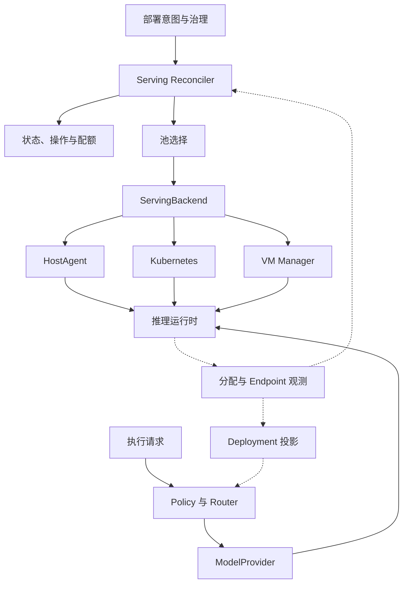
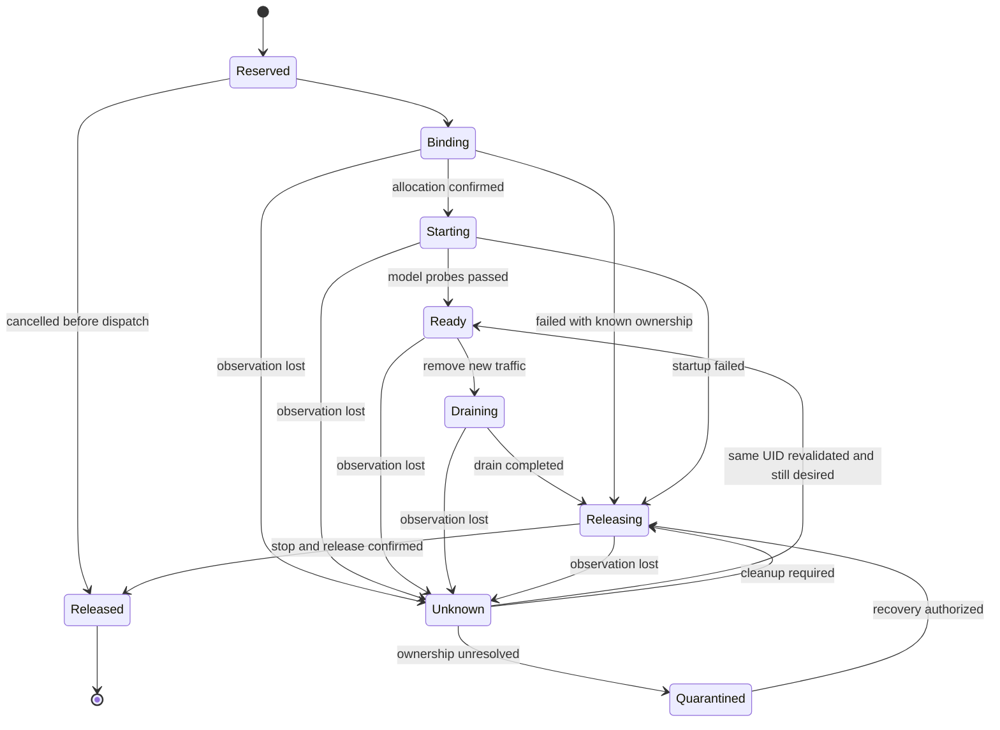

# 载体无关的多模型部署与 GPU 调度开发方案

[English](01-carrier-neutral-multi-model-serving.md) | **简体中文**

> 状态：开发设计提案，尚未实现或晋升为冻结契约。
> 观察日期：2026-09-14；代码基线：[`ff374ac`](https://github.com/tommyxie2026-tech/aicloud/tree/ff374acdc1b36b7cd13e0a25e04f754ae6064c89)。
> 适用范围：物理机、独立容器、Kubernetes Pod、VM 内进程或容器上的多模型推理服务。
> translation-status: synchronized

## 1. 目标、范围与证据等级

建设一套统一声明、治理和观测模型推理容量的控制面。应用依然面向模型能力与可调用 `Deployment`；具体计算资源由所属后端管理。Kubernetes、KubeVirt 和 HostAgent 都是接入方式。

本方案作为 AI Execution OS 的底层模型执行能力，接入已有 `ExecutionTarget`、Policy、Evidence 和成本体系，不另建业务执行内核。

| 范围 | 本方案的处理 |
| --- | --- |
| 多模型混部 | 部署多个不同模型、同模型多个副本，以及经过验证的共享运行方式 |
| 多种载体 | 预配置物理机或 VM、独立 OCI 容器、Kubernetes、后续 VM 生命周期适配 |
| 多类加速器 | 统一能力描述；NVIDIA GPU、其他 GPU、PPU 等分别验证驱动和运行时组合 |
| GPU 调度 | 池选择、配额、唯一分配权、设备观测、释放与故障恢复 |
| 基础设施装机 | MVP 使用已准备好的主机；PXE、BMC、固件、整机交付另由基础设施层负责 |
| 训练和高级分布式推理 | 不纳入 MVP；多节点 gang 调度、PD 分离、在线 KV 转移单独设计 |

证据标签适用于全文：**[F] 已发布事实**引用官方资料；**[C] 代码事实**引用上述基线；**[D] 设计建议**属于拟开发行为；**[U] 待验证**需要硬件实验或契约评审。没有标为 [F] 或 [C] 的方案性要求均为 [D]，不表示仓库已具备该能力。

## 2. 仓库现状与兼容边界

| 现有入口 [C] | 已确认的职责 | 本方案的扩展位置 [D] |
| --- | --- | --- |
| [`internal/domain/model_version.go`](../../internal/domain/model_version.go) | 模型身份、制品摘要与治理证据 | 继续使用 `ModelVersion`，不再引入同义 `ModelRevision` |
| [`internal/domain/deployment.go`](../../internal/domain/deployment.go) | Endpoint、容量、健康、部署生命周期及路由资格 | 给受管 Deployment 增加独立部署意图与观测记录 |
| [`internal/router/deployment_plan.go`](../../internal/router/deployment_plan.go) | 按模型与 Deployment 选择调用目标 | 消费经过校验的健康、容量与兼容性投影 |
| [`internal/modelruntime/executor.go`](../../internal/modelruntime/executor.go) | 按 Deployment/Model 查找 Provider 并执行请求 | 在受管 Endpoint 就绪前注册对应 Provider 实例 |
| [`model/provider/provider.go`](../../model/provider/provider.go) | `Generate`、`Health`、能力描述；禁止基础设施执行权限 | 保持推理协议适配与资源生命周期适配分离 |
| [`execution/types.go`](../../execution/types.go) | `ExecutionTarget`、`TargetSnapshot.DeploymentRef`、Attempt/Evidence | 固定目标快照中的模型、运行时和 Deployment 来源 |
| [`execution/lease.go`](../../execution/lease.go) | Worker 执行节点租约；外部副作用仍需目标端保障 | GPU 分配所有权采用独立记录与目标端 fencing |
| [`infra/adapter/adapter.go`](../../infra/adapter/adapter.go) | `ClusterAdapter` 和 Fake 实现 | 保留集群交付职责，新增推理服务 Backend port |
| [`infra/mapping/kubevirt/README.md`](../../infra/mapping/kubevirt/README.md) | 中立 VM 期望状态映射骨架 | 后续实现真实 VM API、设备发现与透传；不能视为已接通 KubeVirt |

兼容约束：

1. 沿用 [`Provider / Model / Deployment 契约`](../../docs/architecture/provider-model-deployment-contract.zh-CN.md)。`Provider` 是推理连接适配；`ServingBackend` 是资源生命周期适配。
2. 现有 `DeploymentLifecycle` 为 `discovered / ready / degraded / draining / retired / blocked`。本方案的实例分配状态不加入这个枚举；通过单独投影映射，并遵守 [`deployment_transition.go`](../../internal/domain/deployment_transition.go)。冻结文档中的旧示例用语不作为新增状态的理由。
3. 新模块的内部命名和 API 都是提案。编码前按 [`S0 Contract Freeze`](../../docs/architecture/S0-Contract-Freeze.zh-CN.md) 与 [`Pre-Code Gate`](../../docs/architecture/pre-code-architecture-gate.zh-CN.md) 完成 ADR、契约、迁移和双语评审。
4. 当前 R1 `Execution` 与旧 `Task` 治理契约并存。本方案不决定两者的最终迁移；新增部署操作必须记录明确的执行来源，并在集成阶段定义通往既有 Task 成本/审计体系的映射。

## 3. 总体架构与载体表达

不要用一个 `carrier = baremetal | container | vm` 字段表达全部部署形态。容器可以运行在物理机或 VM 上，VM 也可以成为 Kubernetes Node。

| 正交维度 | 示例 | 影响的决策 |
| --- | --- | --- |
| `infrastructure` | `baremetal`、`vm` | 隔离边界、物理故障域、设备归属 |
| `packaging` | `process`、`oci` | 制品交付、启动和回收方式 |
| `orchestrator` | `host-agent`、`kubernetes`、`vm-manager` | 哪个系统负责实例生命周期 |
| `runtime` | vLLM、SGLang、Triton、厂商引擎 | 模型支持、并行方式、协议、性能 |
| `allocationAPI` | 本机分配服务、Device Plugin、DRA、Hypervisor API | 设备声明与分配证据来源 |
| `sharingMode` | `exclusive`、`mig`、`vgpu`、`time-slicing`、`engine-managed` | 隔离与容量承诺 |



实线中的部署管理链路是控制面；请求经 Router、Provider 到 Runtime 是数据面。控制面故障时，既有实例可在仍有效的身份与策略快照下继续服务。新建、扩容、迁移等变更停止；不得把过期授权当作无限期通行证。

## 4. 核心对象与所有权

以下新增对象是逻辑数据模型，不是已存在的 Go 类型或 Kubernetes CRD。

| 对象 | 关键字段 | 事实来源与生命周期 |
| --- | --- | --- |
| `ModelVersion`，现有 | `ID`、`ArtifactDigest`、Admission/Evaluation evidence | 模型注册表；按既有契约维护获准版本 |
| `Deployment`，现有 | `ID`、`ModelVersionID`、`Provider`、`Endpoint`、`Lifecycle` | Router 的可调用目标，不等同于单个进程 |
| `ServingSpec`，新增 | `deploymentId`、`specGeneration`、`runtimeProfileRef`、`placement`、`replicas`、`slo` | 一对一描述受管 Deployment 的期望状态 |
| `RuntimeProfile`，新增 | 不可变版本、模型/量化兼容范围、镜像或安装包摘要、启动参数模板、驱动与硬件要求 | 通过验证后发布；不接受未审核的任意启动脚本 |
| `ResourcePool`，新增 | `poolId`、`backendRef`、区域、租户策略、`allocationAuthority`、能力及观测时间 | 一个明确的管理域；声明唯一权威分配方 |
| `ResourceDevice`，新增 | `deviceId`、`physicalDeviceId`、`parentDeviceId`、拓扑、配置代次、健康 | 后端发现；GPU、MIG、vGPU 通过父子关系去重 |
| `ReplicaAllocation`，新增 | `allocationId`、`deploymentId`、`replicaId`、`attempt`、`poolId`、`backendUID`、设备列表、状态、fence | 每次副本创建尝试的资源占用及释放证据 |
| `EndpointObservation`，新增 | `allocationId`、实际模型/运行时摘要、协议、可达地址、探测时间与结果 | Backend 观测；不是新的顶层路由聚合根 |
| `ServingOperation`，新增 | 操作类型、期望摘要、幂等键、执行来源、Policy evidence、进度、结果 | 持久化异步部署、扩缩容、排空和替换操作 |

约束：

- 一个 `ModelVersion` 可有多个 `Deployment`；一个 Deployment 可有多个同配置副本。
- Deployment 一旦绑定池，该绑定保持稳定。跨池或跨 Backend 替换创建新 Deployment，并使用现有 `ReplacementIDs` 记录关联。
- 模型版本、运行时制品或语义配置变化也创建新 Deployment，以保留路由和 Evidence 的可复现性。副本数等运维意图通过 `specGeneration` 更新。
- 对外托管 API 或人工登记 Endpoint 可以没有 `ServingSpec`，保持原有接入行为。
- `Deployment.Endpoint` 指向网关可达的稳定服务地址或池内代理；单个 Pod IP 或 VM 私网地址不自动成为全局可达 Endpoint。
- `QuotaRemaining`、`CapacityAvailable` 是现有调用侧信号。新增 GPU 配额和物理设备余量采用独立字段、单位与时间戳，不能塞进这些无单位的数值中。

## 5. 持久化、事务与版本策略

建议在现有 PostgreSQL/repository 体系中增加表，而不是把 Kubernetes 对象或 Workflow History 当作业务数据库。

| 建议表 | 最低约束 |
| --- | --- |
| `serving_specs` | `deployment_id` 唯一；更新使用期望 `spec_generation` 做 CAS |
| `runtime_profiles` | `(profile_id, version)` 唯一；发布后配置和制品摘要不可变 |
| `resource_pools` / `resource_devices` | 分配权、物理父设备、设备配置代次明确；发现记录附观测时间 |
| `replica_allocations` | `(deployment_id, replica_id, attempt)` 唯一；一个副本至多一个未完成尝试，滚动替换使用不同身份 |
| `endpoint_observations` | `(allocation_id, observation_sequence)` 唯一；旧代次观测不能覆盖新实例 |
| `serving_operations` | `(tenant_id, project_id, operation_kind, idempotency_key)` 唯一；相同键不同请求摘要返回冲突 |
| `pool_quota_reservations` / `serving_events` | 配额预留、状态更新和 Outbox 同事务；事件追加写入 |

所有受租户或项目限制的记录都保存 scope，Repository 查询和 RLS 同时执行隔离。池可以是平台资源，但分配与使用必须有明确授权；缺省 scope 不代表管理员权限。

**两类账本必须分清：**平台配额预留决定“这个租户是否允许消耗这些容量”；Backend 的权威分配决定“哪块设备实际归这个实例使用”。外部池中的物理设备账本是观测镜像，不参与第二次 GPU 分配。Host 池可以把本平台分配服务作为权威，但必须配合 HostAgent 的真实设备访问控制。

先原子提交操作意图、配额预留和事件，再执行外部副作用；通过 Outbox 和幂等 reconcile 恢复。不要在数据库事务中等待下载模型、创建 VM 或启动 Pod。超时不等于外部操作失败，应进入查询与恢复流程。

`specGeneration` 表示期望状态版本，`fence` 表示资源权威签发的单调命令代次，`backendUID` 表示真实实例身份；三者不能互换。PostgreSQL 租约只约束控制面写入，不能单独阻止旧进程使用 GPU。

## 6. Backend 接口与能力探测

以下是拟议 Go port，类型名为接口讨论用占位符，不是可直接编译的代码：

```go
type ServingBackend interface {
    Capabilities(context.Context, PoolRef) (BackendCapabilities, error)
    Validate(context.Context, DesiredReplica) (ValidationResult, error)
    Ensure(context.Context, CommandEnvelope, DesiredReplica) (BackendHandle, error)
    Observe(context.Context, BackendHandle) (ReplicaObservation, error)
    Drain(context.Context, CommandEnvelope, BackendHandle, DrainPolicy) (DrainObservation, error)
    Release(context.Context, CommandEnvelope, BackendHandle) (ReleaseObservation, error)
}
```

| 接口 | 必须满足的语义 |
| --- | --- |
| `Capabilities` | 返回实际支持的硬件、制品、协议、隔离、共享、拓扑、观测与 fencing 能力及验证版本 |
| `Validate` | 无外部变更；检查完整运行组合、身份、scope、参数、资源和兼容性，返回确定性拒绝原因 |
| `Ensure` | 重复相同键返回相同实例；返回可观测 handle 不代表模型已 Ready |
| `Observe` | 返回 UID、代次、实际分配、进程/容器/VM 状态、模型身份、健康和观测时刻 |
| `Drain` | 停止新请求进入，跟踪在途请求和期限；不提前释放设备 |
| `Release` | 幂等回收指定 UID；返回停止与资源解除占用证据，不能只返回“删除请求已接受” |

`CommandEnvelope` 至少包含 `operationId`、`idempotencyKey`、`tenantId`、`projectId`、`deploymentId`、`replicaId`、`attempt`、`specGeneration`、`desiredDigest`、`fence`、授权引用及截止时间。创建幂等身份固定为 scope + Deployment + replica + attempt；操作键还区分 Ensure/Drain/Release 与配置代次。重复 Ensure 不能因 Worker 重试编号变化而重新创建。

必须返回结构化错误：`InvalidSpec`、`UnsupportedCapability`、`PolicyDenied`、`InsufficientCapacity`、`StaleGeneration`、`BackendUnavailable`、`OwnershipUnknown`、`ArtifactVerificationFailed`。容量不足可以有界排队；配置、策略或制品验证失败不能盲目重试。

Backend 必须用其可执行的机制防止旧命令覆盖新实例，例如目标端单调 fence、持久化幂等映射、UID 前置条件和单一受控写入者。若一个 API 无法提供充分 fencing，必须声明限制并阻止并发接管，不能把传递一个数字当成隔离已经生效。

## 7. 三类后端的实现边界

| Backend | 最小实现 | 关键限制 |
| --- | --- | --- |
| `HostBackend` | HostAgent 接收结构化配置，以 systemd 管理受控进程或用受控 OCI Runtime 启动容器 | agent 使用机器身份、mTLS、窄权限辅助进程；不以任意 root SSH 命令作为协议 |
| `KubernetesBackend` | 创建受管工作负载、服务地址和必要配置；观察 UID、调度及设备分配；首版采用 Kubernetes Deployment | 不从控制面猜测 GPU 序号；设备由集群权威分配；KServe 是后续可选适配 |
| `VMBackend` | 对接 VM API 和 GPU 设备映射，再由 guest bootstrap/agent 完成引擎安装、模型预热与探测 | VM Running 不等于模型 Ready；Host 与 guest 驱动、网络和权限分别验证 |

HostAgent 要在重启后恢复幂等映射和已接收 fence，并能报告启动标识、机器身份、进程/容器 UID、设备分配与孤儿实例。主机磁盘丢失或重装后，必须以新机器代次重新注册，不能直接继承旧分配。

systemd/cgroups 的 CPU、主机内存和设备访问控制与 GPU 显存预算是不同机制。`CUDA_VISIBLE_DEVICES` 和推理引擎的显存参数不能独立承担不可信租户之间的安全隔离。[D]

已准备好的 VM 可首先以 HostBackend 接入；只有平台负责创建/回收 VM 时才需要 VMBackend。VM 内的 Kubernetes 与 HostAgent 不能各自再把同一透传 GPU 作为新的独立物理容量计入总账。

## 8. Kubernetes、KubeVirt 与 GPU 的真实分工

**[F] Device Plugin 路径：**插件向 kubelet 报告设备资源；Pod 声明扩展资源请求；调度器选择节点；kubelet Device Manager 与插件完成设备选择/准备。平台应读取实际分配观测，而不是把 `nvidia.com/gpu: 1` 解释成固定 GPU UUID。[S1]

**[F] KubeVirt 路径：**VM 的资源请求映射到 Kubernetes 工作负载；配置允许的 host device 或 mediated device 后，由虚拟化栈把设备交给 guest。传统 NVIDIA GPU Operator 方案区分容器、VM 透传和 VM vGPU 的节点工作模式。[S2][S3]

**[F] DRA 路径：**使用 ResourceClaim/DeviceClass 表达设备需求；它是分配 API，不是共享或显存隔离技术。官方 NVIDIA/KubeVirt DRA 方案仍有同一 GPU 的 GPU/VFIO 双重广告竞争限制，GPU 透传 VM 不能通用地实时迁移。[S4]

由此提出以下实现规则 [D]：

1. 首版使用独立 Host、Kubernetes、VM 管理池，并让每块物理 GPU 只被一个权威管理域接管。
2. Kubernetes Node `allocatable` 是资源总可分配上限，不是实时剩余库存；结合请求、Claim 和实际占用计算可用信息。`Bound` Pod 也不代表具体 GPU 已准备完成。
3. 同一台物理机允许未来按设备划分管理权，前提是其他插件、DRA 驱动和 HostAgent 都明确排除不属于自己的设备，并落实实际访问约束；标签本身不提供设备隔离。
4. GPU、VFIO、MIG 或 vGPU 的表示必须映射到物理父设备。跨两套分配接口暴露同一父设备时，要完成供应商要求的串行准备或隔离，不能假定 API 自动消除竞争。
5. 改变驱动绑定或 MIG 配置前先排空、确认释放并提升设备配置代次；这不是无损热切换。
6. GPU Operator、Kubernetes、KubeVirt、驱动、guest OS、运行时及硬件型号组成兼容矩阵。部署时固定已验证版本；`latest` 文档不等于平台支持声明。

MIG 作为容器设备与 MIG-backed vGPU 是不同集成路径。VM 使用何种切分或虚拟化模式，要另外核验硬件、Hypervisor、guest 驱动及授权条件。[U]

## 9. 池选择、配额与混部策略

采用两级放置：全局控制面选择合规且兼容的池，池内权威选择节点和实际设备。首版不实现跨集群细粒度 GPU 调度器。

**硬过滤：**身份与租户许可 → Admission/Evaluation → 数据驻留与模型许可 → RuntimeProfile 兼容性 → 隔离等级 → GPU 类别/数量/拓扑 → 配额与预算 → Endpoint 网络可达性。缺少必需元数据时拒绝，不使用 Router 分数补偿。[D]

**候选池排序：**在通过过滤的池中比较目标 SLO 下的可用吞吐、启动耗时、制品缓存、碎片、物理故障域和单位成功请求成本。评分权重经过工作负载评测后版本化；不预设一个适用于所有模型的公式。

| 模型/流量类别 | 初始部署策略 | 混部准入条件 |
| --- | --- | --- |
| 主力在线生成模型 | 常驻副本；优先独占 GPU 或已验证隔离切片 | p95/p99 TTFT、吞吐和故障域达标 |
| Embedding / Rerank | 小型副本池；可评估 MIG 或可信共享 | 各自延迟、批量大小和峰值显存通过联合压测 |
| 长尾低频模型 | 独立冷启动队列或按需驻留 | 调用方明确接受冷启动延迟；不能伪装成 Ready 容量 |
| 同基座多 LoRA | 可评估引擎内加载多个获准 adapter | 固定基座/adapter 摘要、权限、配额与兼容性 [S6] |
| 离线批处理 | 独立池或低优先级队列 | 抢占/取消语义明确；不挤占在线服务的受保护容量 |

| GPU 使用方式 | 可以承诺什么 | 不能默认承诺什么 |
| --- | --- | --- |
| `exclusive` | 分配单位独占；一个权威持有者 | 独占 GPU 不自动解决同主机其他资源竞争 |
| `mig` | 在支持配置上的硬件切片能力 [S5] | 任意显存大小、任意型号支持或通用 VM 映射 |
| `vgpu` | 已验证产品/配置定义的虚拟设备能力 | 所有 vGPU 都有相同算力和故障隔离语义 |
| `time-slicing` | 多个逻辑访问份额 | 显存隔离、故障隔离或固定算力比例 [S5] |
| `engine-managed` | 一个 Allocation 内由可信引擎分配多模型预算 | 每个模型都是独立物理 GPU 分配或安全边界 |

所有共享模式都记录物理父设备和共享组。逻辑份额不能重复换算成整卡容量或独占 GPU 小时。多个完整模型使用多个引擎实例时，必须计入每个进程的运行时开销，并验证干扰；相同 HTTP API 不代表模型可以被同一个引擎任意混装。

## 10. 显存估算与容量验证

以每个设备、每个配置组合计算峰值预算：

```text
requiredDeviceMemory = weightShard
                     + kvCacheAtTargetContextAndConcurrency
                     + activationAndWorkspace
                     + graphAndCommunicationBuffers
                     + safetyHeadroom
```

这是工程预算模型 [D]，最终以固定模型、运行时和硬件组合的实测峰值为准。

- 权重必须考虑实际 dtype、量化元数据、分片和重复副本；MoE 不能只按每 token 激活参数量估算驻留权重。
- KV Cache 取决于模型结构、KV dtype、上下文与并发；超长输入、prefill 峰值、视觉输入和并行通信分别测量。
- CPU RAM、NUMA、PCIe/NVLink、网络、模型下载与本地磁盘也进入 RuntimeProfile 的容量验证。
- 预留 10–20% 只能作为初始实验设置，不能作为所有硬件的生产保证。共享运行按所有进程并发峰值验证。
- vLLM `gpu-memory-utilization` 是实例级显存预算配置；显式 `kv-cache-memory-bytes` 会改变其预算计算方式。[F][S7] 这类参数不代表固定算力份额，也不是跨租户隔离机制。[D]

建议的容量记录至少包含：模型和引擎摘要、设备型号/数量/连接、精度、上下文分布、并发、批量策略、峰值显存、TTFT、逐 token 延迟、端到端延迟、成功吞吐、OOM/错误率、实验数据集摘要和时间。

评测顺序：单模型基线 → 两两混部 → 完整组合 → 同时冷启动/重启 → 长输入与突发流量 → 故障与恢复。生产可用吞吐采用满足 SLO 的成功请求吞吐，不以 GPU 利用率最大化替代。

## 11. 分配状态机与故障恢复

以下状态属于新增 `ReplicaAllocation`。`Reserved` 只表示平台意图与配额已持久化，不表示已经拿到物理 GPU。



关键规则 [D]：

1. `Binding` 包含创建工作负载和等待实际设备准备。即使副本已经启动，观测仍须补齐其 UID 与分配证据；允许经校验的观测跨过中间进度状态。
2. 配额租约过期、HostAgent 失联、GPU 利用率为零、Pod 删除请求成功，都不能直接触发 `Released`。未知分配继续占用资源账本；取消操作也要完成观测或补偿。
3. 必须确认旧实例停止且权威分配已解除，或完成能阻止旧实例继续访问 GPU 的实际 fencing，才能重新分配。同名新 Pod/VM/进程不能替代旧 UID 的停止证明。
4. `Unknown` 停止新流量与新分配；已建立请求只能按既定授权/超时策略结束。恢复服务前重新验证身份、配置、健康及最新期望状态。
5. `Quarantined` 不参与可用容量。恢复操作保留机器重启、设备复位、实例停止等证据；不是直接把状态改回空闲。
6. 操作失败状态与资源是否释放分开记录。`ServingOperation = Failed` 不意味着 Allocation 或配额可以回收。
7. 多卡副本使用一个 Allocation 记录完整设备集合。无法取得全部资源时不发布 Endpoint，并对部分分配执行有界补偿。MVP 仅支持已验证的单节点多卡组合；跨节点 gang 保留到后续阶段。
8. 进程或 VM 已经不存在但停止证据不充分时，允许创建在其他已知空闲容量上的替代实例；未知旧容量继续被占用和计量，不能凭推测腾出同一 GPU。

Deployment 投影规则：仅聚合健康、兼容、可达且证据新鲜的副本；满足最小服务条件才能从 `discovered` 到 `ready`。服务能力下降时按现有转换进入 `degraded` 或关闭 `RoutingEligible`；排空使用 `draining`。`blocked`/`retired` 在当前转换表中没有恢复出口，不应将临时失联直接投影成终态再尝试非法恢复。

## 12. 部署、路由、扩缩容与替换流程

**创建流程 [D]：**接收有 scope 的意图 → 检查版本与 Policy → 生成 ServingOperation → 持久化配额预留 → 选择池并冻结绑定 → Backend Ensure → Observe 分配/实例 → 校验制品并加载模型 → 完成暖机与协议探测 → 注册 Deployment 对应 Provider → 发布就绪投影。

请求路由先执行租户、数据驻留、版本许可、能力和 SLO 硬条件，再在允许的 Deployment 中优化。Fallback 也必须经过相同约束；更换模型、量化或运行时不能静默降低质量。流式请求已输出后，通用路径不自动换模型重放剩余内容。

网关探测必须覆盖其实际网络路径和认证方式。跨集群或站点采用可达服务入口/池内代理；传输加密、Endpoint 身份、凭证轮转、超时及回压均属于上线条件。

扩容根据等待队列、KV 压力、请求速率与目标延迟计算需求，并计入加载和暖机时间。`replicas` 只有一个写入权威：选择平台控制或委托 HPA/其他池内伸缩器；委托时平台只约束配额与边界，不同时循环覆盖副本数。首版采用手工/平台固定副本。

跨 Backend、模型或运行时替换：

1. 创建新 Deployment 和新 Allocation，保留旧实例服务。
2. 下载、校验、加载、暖机，检查语义兼容和性能证据。
3. 在 Policy 允许下灰度切流，记录新旧目标和配置摘要。
4. 新请求切向新实例；旧实例停止接收新请求，等待在途请求结束。
5. 释放旧 Allocation，保留历史 Deployment、操作、成本和 Evidence。

预留 surge 容量及回退窗口。容量不足时明确拒绝无中断更新或选择获准维护窗口；不同 VM 落在同一物理主机上不构成故障域冗余。这个流程是重新部署与切流，不承诺跨引擎 GPU 内存、KV Cache 或在途会话的通用热迁移。

## 13. 拟议 API 与配置示例

下面的路径和 YAML 仅供契约设计，不是当前 OpenAPI 或可被 `kubectl apply` 的资源。M0 冻结前不得对外声称已经支持。

| 拟议接口 | 行为 |
| --- | --- |
| `POST /v1/serving-operations` | 提交 `deploy / scale / drain / replace`；返回 `202` 和 operation ID |
| `GET /v1/serving-operations/{id}` | 查询进度、结构化原因与资源清理状态 |
| `GET /v1/deployments/{id}/serving` | 查询期望、观测代次、就绪副本及分配摘要 |
| `GET /v1/resource-pools` | 返回调用者获准查看的能力与有时间戳的容量 |
| `GET /v1/runtime-profiles/{id}/versions/{version}` | 查询固定的运行组合与验证证据 |

写接口要求幂等键和明确身份；客户端身份信息不从 YAML 自行采信。更新附 `expectedGeneration`，代次或幂等内容冲突返回 `409`；被拒绝的请求也留审计记录。

```yaml
# Design example only; values require admission and hardware validation.
operation: deploy
idempotencyKey: deploy-reasoning-a-001
scope:
  tenantId: tenant-a
  projectId: project-a
deploymentId: dep-reasoning-a
modelVersionId: mv-reasoning-approved
serving:
  specGeneration: 1
  runtimeProfileRef: runtime-vllm-validated-v1
  placement:
    allowedBackends: [kubernetes, host-agent]
    preferredBackend: kubernetes
    poolSelector:
      region: private-region-a
      isolationClass: dedicated
  packaging: oci
  resourcesPerReplica:
    acceleratorClassRef: gpu-class-validated-a
    deviceCount: 2
    sharingMode: exclusive
    topology: same-node
  replicas:
    desired: 2
    min: 2
    max: 4
    owner: platform
  slo:
    ttftP95Ms: 1500
    endToEndP95Ms: 20000
  trafficPolicy:
    allowModelFallback: false
    allowCrossResidencyFallback: false
  rollout:
    maxSurgeReplicas: 1
    maxUnavailableReplicas: 0
```

解释：2 个副本，每副本 2 块设备，稳态需要 4 块；一个 surge 副本额外需要 2 块。多卡与该 RuntimeProfile 的并行配置必须一致。数值仅展示配置语义，不代表此硬件能达到给定 SLO。更换到 HostBackend 需要相同 OCI/运行组合通过验证，并创建替代 Deployment。

## 14. 安全、可观测性与成本

沿用 [`安全边界`](../../docs/architecture/security-boundary-model.zh-CN.md) 和 [`成本契约`](../../docs/architecture/cost-accounting-contract.zh-CN.md)。模型生成的部署建议必须经过受控变更入口、Schema/Policy 和所需授权；ModelProvider 不持有基础设施权限。

| 领域 | 开发要求 [D] |
| --- | --- |
| 控制面身份 | API、Reconciler、HostAgent、Backend 采用不同身份和最小权限；mutation 的授权设施失效时拒绝变更 |
| 制品 | 镜像/包、模型、tokenizer、adapter 固定摘要；下载先校验再原子进入缓存；模型许可与供应链证据进入 Admission |
| 权限与 Secret | 业务进程最小权限；设备准备使用独立受限特权组件；凭证引用与短期授权，不进入 Prompt 或日志 |
| 隔离 | 不可信租户禁止依赖 time-slicing 或显存参数作为隔离；共享配置单独通过隔离测试 |
| 运行指标 | 就绪容量、排队、冷启动耗时、TTFT/端到端延迟、成功吞吐、OOM、错误率、分配未知时长、GPU/显存及主机资源 |
| 观测缺失 | 标记缺失而不是报告为零；透传场景的 GPU 遥测来源按部署模式验证，可来自 guest 或专用观测组件 |
| Trace / Evidence | 请求保留 Execution/Task、Attempt、ModelVersion、Deployment、RuntimeProfile 和 Allocation 关联；历史快照不可被新部署覆盖 |
| 指标标签 | 不用 request ID、Prompt 或无限增长的 Allocation ID 作为常规 Prometheus 标签；详细关联进入 Trace/事件 |
| 计费 | 记录物理占用、切片/共享单位、时间与价格版本；推理调用按 Task/Attempt 归集，共享及空闲成本使用显式版本化分摊规则 |

避免同时把父 GPU 和子 MIG/vGPU 容量各算一遍。空闲但被占用、失联待确认和冷启动期间的成本也要保留。R1 Execution 与 Task 成本关联的桥接契约在 M0 明确，不能以无来源的 CostEvent 替代。

## 15. 开发拆分、验收与回滚

以下是拟议工作包，不表示正式路线图已变更。新增包名需在 M0 评审后确定。

| 阶段 | 交付物与建议代码位置 | 退出条件 |
| --- | --- | --- |
| M0 契约与实验 | ADR、双语 API/数据模型、兼容矩阵；定义 Deployment 生命周期投影、Execution/Task 来源映射、SLO 测试集 | 完成 Pre-Code Gate；选定真实硬件与一个 RuntimeProfile |
| M1 纵向最小闭环 | `internal/serving/` controller/port、`internal/repository/` 持久化、增量 `db/migrations/`、FakeBackend、HostBackend；两种已验证模型 | 显式独占分配、最小配额、幂等、fencing、排空、失联隔离、Endpoint/Provider 注册及审计全部跑通 |
| M2 Kubernetes 与替换 | `internal/serving/backends/kubernetes/`；K8s 整卡池；跨池替换、准入和灰度；集成现有 Router/TargetSnapshot | 同一模型版本在 Host 与 Kubernetes 间替换，SLO 与释放证据通过 |
| M3 VM 与共享 | `internal/serving/backends/vm/`；对接已有 `infra/` 映射；验证选定 MIG/vGPU/可信混部/LoRA | 每种能力独立矩阵、许可证条件、压力与隔离证据齐备 |
| M4 优化 | 可选 DRA、委托伸缩、跨节点 gang、成本和拓扑优化 | 具体场景收益明确且不削弱资源所有权及 SLO 约束 |

HostBackend MVP 的授权、设备访问控制、持久化分配和 Unknown 处理是上线前置条件，不推迟到“优化”阶段。新增 HostAgent 建议独立于现有面向 AI 逻辑的 `agent/` 包，避免术语和权限混淆。

| 验收 ID | 场景 | 必须证明 |
| --- | --- | --- |
| A01 | 两个不同模型、多个副本 | ModelVersion/Deployment/RuntimeProfile 正确绑定，独立健康与路由 |
| A02 | 同一请求重复提交、响应丢失后重试 | 只创建一个实例；相同幂等键不同内容冲突 |
| A03 | 两个 Worker 并发 reconcile | 旧 fence/代次不能覆盖或删除新 UID |
| A04 | GPU/Claim 重复发现、VM guest 再发现 | 同一物理资源不重复分配、计费或计容量 |
| A05 | Agent 断网、数据库恢复、控制面重启 | Unknown 容量保持占用；状态可重建；无凭空释放 |
| A06 | 删除请求成功但节点不可达 | 不将请求接受当作设备已释放；进入隔离/恢复路径 |
| A07 | OOM、模型摘要不匹配、暖机失败 | Endpoint 不发布；补偿后有停止与配额回收证据 |
| A08 | 部分多卡分配失败 | 无半就绪服务；部分占用可追踪并完成补偿 |
| A09 | 混部长输入、峰值和同时重启 | 所有在线模型满足各自 SLO；记录干扰与失败边界 |
| A10 | 跨租户或跨驻留 fallback | 硬约束拒绝；优化打分不能绕过 |
| A11 | Host → Kubernetes → 回退 | 先暖机后切流；旧流式请求按排空策略结束；UID 与成本可追溯 |
| A12 | 网关不能访问池内地址 | 不误报可调用；服务入口探测失败会撤销路由资格 |
| A13 | Scope 缺失、授权过期、非法镜像或参数 | 拒绝副作用；不向模型或日志泄露凭证 |
| A14 | 伸缩与升级重叠 | 单一副本数写入方，配额包含 surge，无反复扩缩振荡 |
| A15 | 回滚到旧应用版本 | 无 ServingSpec 的既有 Endpoint 继续兼容；新资源得到保留或受控回收 |

迁移采用新增表/字段和功能开关，默认关闭受管调度。先只读导入现有 Endpoint，再在新测试池启用；不自动接管人工创建的进程、Pod 或 VM。

回滚先禁止新操作，再关闭新控制循环，保留最后有效的路由配置和资源所有权记录。数据迁移不通过删除表来掩盖尚未释放的 GPU。新 Deployment 未达到灰度门槛时继续使用旧目标；切流后发生故障，仅在旧实例仍健康、授权有效且资源未释放时直接切回，否则创建新的恢复操作。

## 16. 待确认事项与一手参考

编码前必须补齐以下环境事实 [U]：硬件型号和数量、物理故障域、租户信任等级、模型/精度/上下文/并发、现有 Kubernetes/KubeVirt/驱动版本、网络可达性、运行时兼容性、成本口径和恢复目标。对未验证组合默认不启用；不在缺少实测时承诺混部比例或 SLA。

以下均为官方来源，访问日期 2026-09-14。网页的 `latest`/`stable` 会变化，落地时要把具体版本、制品摘要和验证结果固化到 RuntimeProfile/兼容矩阵。

- [S1] [Kubernetes — Device Plugins](https://kubernetes.io/docs/concepts/extend-kubernetes/compute-storage-net/device-plugins/)：设备报告与 kubelet 分配职责。
- [S2] [KubeVirt — Host Devices Assignment](https://kubevirt.io/user-guide/compute/host-devices/)：host device 与 mediated device 接入。
- [S3] [NVIDIA GPU Operator with KubeVirt](https://docs.nvidia.com/datacenter/cloud-native/gpu-operator/latest/gpu-operator-kubevirt.html)：传统容器/VM 工作模式。
- [S4] [NVIDIA GPU Operator with KubeVirt and DRA](https://docs.nvidia.com/datacenter/cloud-native/gpu-operator/latest/gpu-operator-kubevirt-dra.html)：兼容前置条件、设备准备竞争与迁移限制。
- [S5] [NVIDIA — Time-Slicing GPUs in Kubernetes](https://docs.nvidia.com/datacenter/cloud-native/gpu-operator/latest/gpu-sharing.html)：共享份额与 MIG 的隔离差异。
- [S6] [vLLM — LoRA Adapters](https://docs.vllm.ai/en/stable/features/lora/)：引擎内 adapter 服务能力。
- [S7] [vLLM — serve](https://docs.vllm.ai/en/stable/cli/serve/)：显存及 KV Cache 配置语义。

本提交只记录设计和开发依据。正式支持范围由后续 ADR、实现、测试及发布门禁共同确定。
