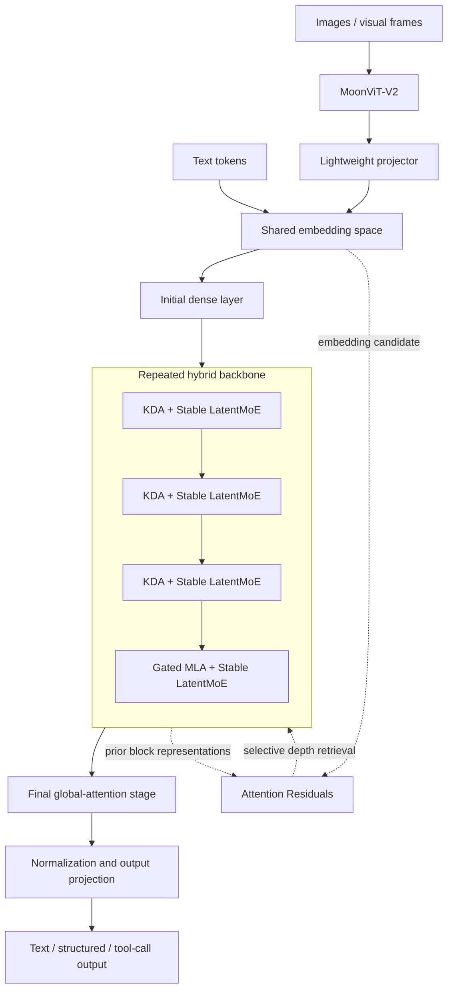

# 01. Architecture Overview

## 1. Model summary

Kimi K3 is a decoder-style native multimodal Mixture-of-Experts model designed around three complementary information-flow dimensions.

| Dimension | Main mechanism | Intended role |
|---|---|---|
| Sequence length | Kimi Delta Attention and periodic Gated MLA | Efficient long-context token mixing with periodic global attention |
| Network depth | Attention Residuals | Selective access to representations from earlier blocks instead of uniform residual accumulation |
| Model width | Stable LatentMoE | Large expert space with sparse activation and reduced expert-communication width |
| Modality | MoonViT-V2 and projector | Map visual features into the shared language-model embedding space |
| Test-time computation | Multi-level reasoning effort | Allow one model to operate with different inference budgets |

## 2. Published model dimensions

| Property | Published value |
|---|---:|
| Total parameters | 2.8 trillion |
| Activated parameters per token | Approximately 104 billion |
| Transformer-style layers | 93 |
| Dense layers | 1 |
| Attention composition | 69 KDA layers and 24 Gated MLA layers |
| Attention hidden dimension | 7168 |
| Attention heads | 96 |
| Latent MoE dimension | 3584 |
| Per-expert hidden dimension | 3072 |
| Routed experts | 896 |
| Routed experts selected per token | 16 |
| Shared experts | 2 |
| Vocabulary | Approximately 160K |
| Context length | 1,048,576 tokens |
| Vision encoder | MoonViT-V2, approximately 401M parameters |
| Released quantization | MXFP4 expert weights and MXFP8 activations |

## 3. Logical architecture

The following diagram is an analytical reconstruction based on the official technical report. It is not a copy of the vendor figure.



## 4. Hybrid block pattern

The report describes a repeated **3:1 pattern**:

```text
KDA
→ KDA
→ KDA
→ Gated MLA
```

Each attention layer is paired with a Stable LatentMoE feed-forward layer. An additional Gated MLA layer is placed near the end of the backbone so that the final stage performs global interaction.

The pattern is significant because it avoids using expensive global softmax attention at every layer while retaining periodic global token-to-token communication.

### Engineering interpretation

- KDA performs most long-sequence mixing using a fixed-size recurrent state.
- Gated MLA periodically refreshes unrestricted global interaction.
- Stable LatentMoE supplies sparse, high-capacity channel transformation after each attention layer.
- Attention Residuals allow the network to retrieve earlier block representations across depth.

No single component explains the claimed scaling efficiency. The architecture is a coordinated design across token mixing, depth mixing, width scaling, training stability, and serving kernels.

## 5. Three-axis information-flow model

### Sequence axis

The sequence axis asks:

> How does information move between tokens over a one-million-token context?

KDA provides recurrent/chunkwise sequence mixing without a KV cache that grows linearly in the same way as conventional full attention. Periodic MLA layers preserve explicit high-capacity global attention.

### Depth axis

The depth axis asks:

> How does a late layer recover information from earlier stages?

Conventional residual networks repeatedly compress prior layers into a single running state. Attention Residuals instead assign learned weights over the embedding and preceding block outputs.

### Width axis

The width axis asks:

> How can the model contain trillions of parameters without activating all of them for every token?

Stable LatentMoE routes each token to 16 of 896 routed experts while also applying two shared experts. Latent projections reduce the representation exchanged with routed experts.

## 6. Why the architecture is system-dependent

Kimi K3's architecture cannot be evaluated separately from its systems implementation.

| Architectural choice | System consequence |
|---|---|
| KDA recurrent state | Requires specialized kernels and state-aware prefix caching |
| Periodic MLA | Requires conventional KV-cache management in parallel with KDA state |
| 896 routed experts | Requires expert placement, all-to-all communication, and load balancing |
| 2.8T total parameters | Requires distributed weight storage and expert parallelism |
| Native vision | Requires visual-token load balancing and vision-encoder scheduling |
| 1M-token Agent trajectories | Requires persistent cache, resumable environments, and adaptive concurrency |
| MXFP4 expert weights | Requires compatible quantized kernels and validation of numerical behavior |

The model is therefore best understood as an **algorithm–system co-design**, not as a checkpoint that can be efficiently served by a generic Transformer runtime without model-specific work.

## 7. Architectural strengths

- Extreme model capacity with sparse activation.
- Explicit design for million-token contexts.
- Native visual pathway rather than an external retrieval-only approach.
- Multi-effort reasoning trained into one model.
- Deployment-aware quantization introduced during post-training.
- Infrastructure disclosure that explains how long-horizon Agent training is made operationally possible.

## 8. Architectural risks and open questions

- Hybrid KDA/MLA runtimes are more complex than standard Transformer serving.
- Extreme expert count creates communication and placement sensitivity.
- Long context increases memory, trace, privacy, and cache-governance risk.
- Preserved reasoning history can expand sensitive-data exposure if stored or replayed carelessly.
- Native quantization may limit portability until kernels mature across hardware vendors.
- Public weights do not include the complete training stack needed for reproduction.
- Vendor-reported scaling efficiency has not yet been independently reproduced.

## 9. AI Cloud relevance

Kimi K3 should be represented as more than a model name. AI Cloud needs versioned records for:

```text
architecture family
+ checkpoint revision
+ custom-code revision
+ modality
+ context limit
+ reasoning-effort levels
+ cache type
+ quantization
+ supported inference engines
+ deployment topology
+ license evidence
+ benchmark evidence
+ runtime health and capacity
```

The integration blueprint is developed in [08-aicloud-integration-blueprint.md](08-aicloud-integration-blueprint.md).
