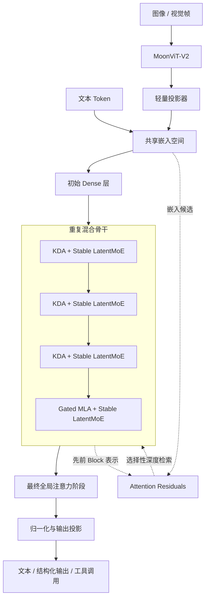

# 01. 总体架构

[English](01-architecture-overview.md) | **简体中文**

## 1. 模型概述

Kimi K3 是一个 Decoder 风格的原生多模态混合专家模型，其设计围绕多个相互补充的信息流维度展开。

| 维度 | 主要机制 | 预期作用 |
|---|---|---|
| 序列长度 | Kimi Delta Attention 与周期性 Gated MLA | 以较低成本完成长上下文 Token 混合，并周期性执行全局注意力 |
| 网络深度 | Attention Residuals | 选择性访问更早 Block 的表示，而不是统一累积残差 |
| 模型宽度 | Stable LatentMoE | 在稀疏激活下扩大专家空间，并降低专家通信宽度 |
| 模态 | MoonViT-V2 与投影器 | 把视觉特征映射到共享语言模型嵌入空间 |
| 测试时计算 | 多级推理强度 | 让同一模型在不同推理预算下工作 |

## 2. 已发布模型规模

| 属性 | 已发布数值 |
|---|---:|
| 总参数量 | 2.8 万亿 |
| 每 Token 激活参数 | 约 1040 亿 |
| Transformer 风格层数 | 93 |
| Dense 层 | 1 |
| 注意力组成 | 69 个 KDA 层和 24 个 Gated MLA 层 |
| 注意力隐藏维度 | 7168 |
| 注意力头 | 96 |
| Latent MoE 维度 | 3584 |
| 单专家隐藏维度 | 3072 |
| 路由专家 | 896 |
| 每 Token 选择的路由专家 | 16 |
| 共享专家 | 2 |
| 词表 | 约 16 万 |
| 上下文长度 | 1,048,576 Token |
| 视觉编码器 | MoonViT-V2，约 4.01 亿参数 |
| 发布量化格式 | MXFP4 专家权重和 MXFP8 激活 |

## 3. 逻辑架构

下图是基于官方技术报告进行的分析性重构，并非复制厂商原图。



## 4. 混合 Block 模式

报告描述了重复的 **3:1 模式**：

```text
KDA
→ KDA
→ KDA
→ Gated MLA
```

每个注意力层后都配有 Stable LatentMoE 前馈层。骨干末段还增加一个 Gated MLA 层，使最终阶段执行全局交互。

该模式的意义在于：不必在所有 93 层中都运行昂贵的全局 Softmax Attention，同时仍保留周期性的全局 Token 交互能力。

### 工程解释

- KDA 通过固定大小的递归状态完成大部分长序列混合；
- Gated MLA 周期性刷新不受限制的全局交互；
- Stable LatentMoE 在每个注意力层后提供稀疏高容量通道变换；
- Attention Residuals 允许网络跨深度检索早期 Block 表示。

不存在一个单独组件可以解释全部扩展效率。其架构是 Token 混合、深度混合、宽度扩展、训练稳定性和服务内核的协同设计。

## 5. 三轴信息流模型

### 序列轴

序列轴回答：

> 在 100 万 Token 上下文中，信息如何在 Token 之间流动？

KDA 提供递归式和分块式序列混合，其状态不会像传统全注意力 KV Cache 那样按相同方式线性增长。周期性 MLA 层则保留显式、高容量的全局注意力。

### 深度轴

深度轴回答：

> 较晚层如何恢复较早阶段的信息？

传统残差网络把所有先前层不断压缩进一个累计状态。Attention Residuals 则对嵌入和先前 Block 输出分配学习到的权重。

### 宽度轴

宽度轴回答：

> 模型如何容纳万亿级参数而无需每个 Token 激活全部参数？

Stable LatentMoE 为每个 Token 从 896 个路由专家中选择 16 个，并额外执行两个共享专家。Latent 投影减少与路由专家交换的表示宽度。

## 6. 为什么该架构依赖系统实现

Kimi K3 不能脱离系统实现单独评价。

| 架构选择 | 系统后果 |
|---|---|
| KDA 递归状态 | 需要专用内核和状态感知 Prefix Cache |
| 周期性 MLA | 需要与 KDA 状态并行管理传统 KV Cache |
| 896 个路由专家 | 需要专家放置、All-to-All 通信和负载均衡 |
| 2.8T 总参数 | 需要分布式权重存储和专家并行 |
| 原生视觉 | 需要视觉 Token 负载均衡和视觉编码器调度 |
| 100 万 Token Agent 轨迹 | 需要持久化缓存、可恢复环境和自适应并发 |
| MXFP4 专家权重 | 需要兼容量化内核和数值行为验证 |

因此，它更适合被理解为一种**算法—系统协同设计**，而不是一个能够在通用 Transformer Runtime 中无需模型特定优化即可高效运行的 Checkpoint。

## 7. 架构优势

- 通过稀疏激活获得极大模型容量；
- 显式面向百万 Token 上下文设计；
- 原生视觉路径，而不是仅依赖外部 OCR 或检索；
- 一个模型内训练多种推理强度；
- 后训练阶段即引入面向部署的量化；
- 披露了让长时程 Agent 训练可运行的系统基础设施。

## 8. 架构风险与开放问题

- KDA/MLA 混合 Runtime 比标准 Transformer 服务更复杂；
- 极高专家数量对通信和放置非常敏感；
- 长上下文增加内存、Trace、隐私和缓存治理风险；
- 保留推理历史若存储或回放不当，会扩大敏感数据暴露；
- 原生量化在多硬件平台上的可移植性取决于内核成熟度；
- 公开权重不包含复现训练所需的完整训练栈；
- 厂商报告的扩展效率尚未得到独立复现。

## 9. 对 AI Cloud 的意义

AI Cloud 不应只记录一个模型名称，而应为以下内容保存版本化记录：

```text
架构家族
+ Checkpoint revision
+ 自定义代码 revision
+ 模态
+ 上下文上限
+ 推理强度等级
+ 缓存类型
+ 量化格式
+ 支持的推理引擎
+ 部署拓扑
+ 许可证证据
+ Benchmark 证据
+ 运行健康与容量
```

具体接入方案见 [08-aicloud-integration-blueprint.zh-CN.md](08-aicloud-integration-blueprint.zh-CN.md)。
