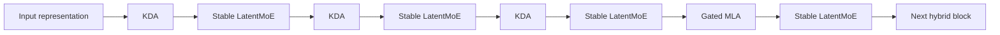
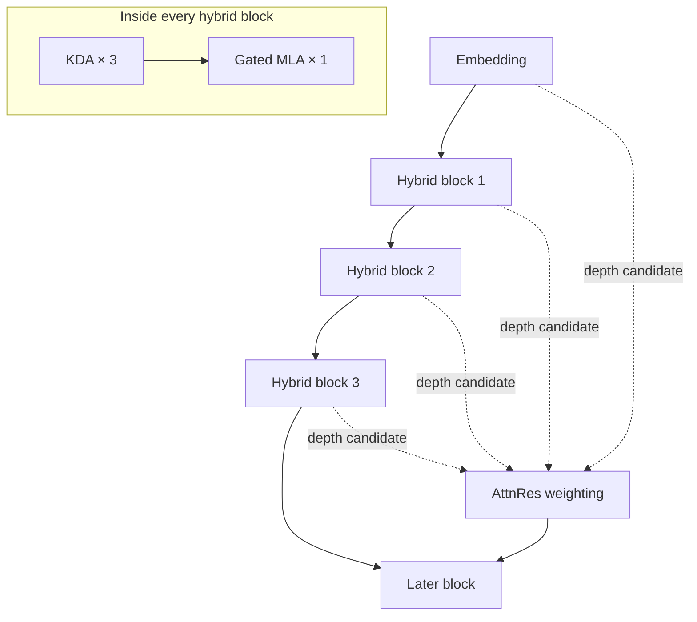

# 02. Hybrid Attention and Depth Mixing

## 1. Design problem

A one-million-token context creates two competing requirements:

1. sequence mixing must remain computationally and operationally manageable;
2. the model must still be able to perform high-capacity global interaction when required.

Using full softmax attention in all 93 layers would create a large KV-cache and high long-sequence cost. Using only a recurrent or linear mechanism could reduce explicit global interaction capacity. Kimi K3 addresses this with a hybrid pattern.

```text
3 × Kimi Delta Attention
+ 1 × Gated MLA
repeated through the backbone
```

## 2. Kimi Delta Attention

Kimi Delta Attention, or KDA, is the dominant sequence-mixing mechanism in Kimi K3.

### Core idea

Instead of retaining a growing key/value entry for every previous token in every KDA layer, KDA maintains a recurrent matrix state that is updated as tokens are processed.

A simplified conceptual view is:

```text
previous state
+ current key/value write
- controlled overwrite of matched information
→ next recurrent state
```

The official formulation applies:

- a channel-wise retention or forget factor;
- a write-strength gate;
- query, key, and value projections;
- short convolution before selected projections;
- L2 normalization of query and key;
- a data-dependent output gate.

### Why the channel-wise gate matters

A single scalar decay would force all key channels to forget at the same rate. Channel-wise retention lets different representation dimensions preserve or overwrite information differently.

This supports a more selective memory behavior:

```text
stable semantic features       -> slower decay
short-lived positional signals -> faster decay
new contradictory evidence     -> stronger overwrite
```

This is an interpretation of the mechanism, not a guarantee that individual channels acquire those exact roles.

### Chunkwise parallel execution

A purely recurrent implementation would process tokens serially and underuse GPUs. The report reformulates KDA so that:

- recurrence is preserved across chunks;
- token computation inside a chunk is parallelized;
- inter-chunk state and intra-chunk interaction are combined exactly.

This is essential because the architecture only becomes useful at scale when the recurrent mathematics maps efficiently to GPU execution.

### Lower-bounded decay

Kimi K3 changes the decay parameterization so that the log-decay has a lower bound. The purpose is numerical and hardware-oriented:

- unbounded reciprocal decay can overflow at finite precision;
- a bounded range permits dense Tensor Core operations for more tiles;
- fewer position-pair-specific diagonal computations are required;
- kernel execution becomes more regular.

This is a clear example of algorithm–hardware co-design: the mathematical parameterization is changed partly to unlock a more efficient kernel path.

### Full-rank output gate

The report states that Kimi K3 replaces an earlier low-rank output-gate parameterization with an input-dependent full-rank gate. This increases gating expressiveness at the output of KDA.

## 3. Gated Multi-head Latent Attention

Kimi K3 periodically inserts Gated MLA layers.

### MLA role

Multi-head Latent Attention compresses key/value information into a lower-dimensional latent representation. During attention, keys and values are reconstructed through learned projections.

Compared with storing full head-specific key/value tensors, this reduces KV-cache size while retaining explicit global token-to-token attention.

### Why Kimi K3 still needs global attention

KDA is efficient for long sequential mixing, but periodic MLA layers provide:

- unrestricted global content interaction;
- a higher-capacity correction path;
- direct recovery of globally relevant tokens;
- a complement to recurrent-state compression.

The architecture therefore does not assume that linear or recurrent attention alone is sufficient.

### No explicit positional encoding in MLA

The report states that Kimi K3 applies no explicit positional encoding to its MLA query/key path. The intervening KDA layers provide position-sensitive and recency-aware mixing, while the MLA layers focus on unrestricted content interaction.

This separation may simplify context extension because the global-attention path does not depend on extending a RoPE frequency schedule. It also means that position behavior emerges from the hybrid system rather than one mechanism alone.

### Input-dependent MLA output gate

The MLA output is also controlled by an input-dependent, channel-wise gate. This gives the model a learned mechanism for regulating how much global-attention output enters the next stage.

## 4. Hybrid sequence-mixing pattern



### Architectural trade-off

| Property | KDA-heavy design | MLA contribution |
|---|---|---|
| Long-context state growth | Fixed-size recurrent state per layer | Compressed but context-growing KV cache |
| Token interaction | Recurrent/chunkwise | Explicit global attention |
| Kernel needs | Custom recurrent/chunk kernels | Attention and latent reconstruction kernels |
| Prefix reuse | KDA state | MLA KV cache |
| Main strength | Efficient sequence mixing | Selective high-capacity global retrieval |

The serving system must restore both state types at the same logical prefix boundary. A prefix is only reusable when the KDA state and MLA cache are consistent with the same token prefix.

## 5. Attention Residuals

Hybrid attention handles sequence length. Attention Residuals, or AttnRes, handles information flow through depth.

### Problem with ordinary residual accumulation

A conventional residual network repeatedly adds each new layer output to a running hidden state. All previous information is compressed into that single accumulated representation.

The Kimi K3 report compares this to a recurrence over depth: later layers cannot directly select which earlier layer representation they want; they receive the accumulated state.

### Selective retrieval over prior depth

AttnRes assigns a learned pseudo-query to a later layer or block and computes weights over earlier representations.

Conceptually:

```text
embedding
+ block 1 output
+ block 2 output
+ ...
+ previous block output
→ learned weighted retrieval
→ current block input
```

This lets a later stage emphasize different earlier representations rather than inheriting them uniformly.

### Block Attention Residuals

Retaining every layer output would increase memory and pipeline communication. Kimi K3 uses a block form:

- layers are grouped into blocks;
- outputs within a block are reduced into a block representation;
- later blocks attend over the embedding and preceding block representations;
- the report describes eight main 12-layer blocks, a partial final block, and the embedding as an additional retrieval state.

The block design preserves most of the selective-depth benefit while reducing the number of retained representations.

## 6. Combined token-and-depth view



KDA and MLA decide how tokens interact inside the sequence. AttnRes decides which earlier depth representations should influence a later block.

## 7. Operational implications

### Cache architecture

The runtime must coordinate:

- KDA recurrent states;
- MLA KV-cache blocks;
- prefix identity and model revision;
- multimodal prefix features;
- reasoning history;
- tool-call messages.

### Observability

A model-level health check is insufficient. Useful metrics include:

- KDA-state cache hit rate;
- MLA KV-cache hit rate;
- aligned hybrid-prefix hit rate;
- context length by request;
- cache-restore latency;
- cache eviction by budget class;
- request preemption rate;
- long-context failure rate.

### AI Cloud routing

A route candidate should expose more than `context_window = 1M`. It should include:

```text
maximum accepted context
+ tested reliable context
+ KDA/MLA cache support
+ prefix-cache compatibility
+ context-compaction policy
+ reasoning-history policy
+ latency curve by context band
+ cost curve by context band
```

## 8. Open questions

- Independent tests are needed to measure usable recall and reasoning quality across the full context window.
- The exact production cache-layout and eviction policy are not fully released.
- Hardware portability of optimized KDA kernels is still evolving.
- The impact of preserved reasoning history on context pressure needs workload-specific measurement.
- The degree to which AttnRes changes interpretability or debugging behavior has not been independently characterized.
