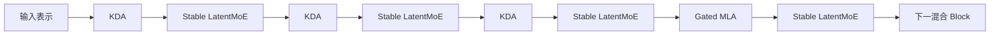
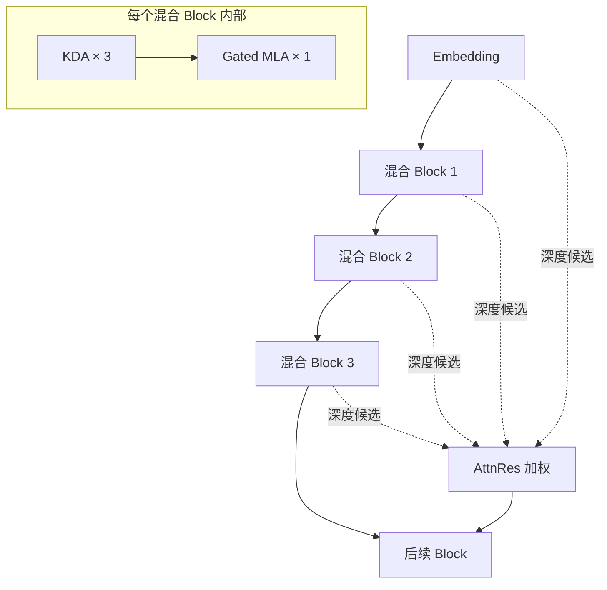

# 02. 混合注意力与深度信息流

[English](02-attention-and-depth-mixing.md) | **简体中文**

## 1. 设计问题

100 万 Token 上下文带来两个相互竞争的要求：

1. 序列混合必须在计算和运行层面保持可管理；
2. 模型在需要时仍要具备高容量全局交互能力。

若在全部 93 层中使用全 Softmax Attention，会产生庞大的 KV Cache 和长序列成本；若只使用递归或线性机制，又可能削弱显式全局交互。Kimi K3 采用混合模式解决这一矛盾：

```text
3 × Kimi Delta Attention
+ 1 × Gated MLA
在骨干网络中重复
```

## 2. Kimi Delta Attention

Kimi Delta Attention（KDA）是 Kimi K3 的主要序列混合机制。

### 核心思想

KDA 不在每一层为所有历史 Token 保留持续增长的 Key/Value 条目，而是维护一个随 Token 处理而更新的递归矩阵状态。

简化概念如下：

```text
上一时刻状态
+ 当前 Key/Value 写入
- 对匹配信息的受控覆盖
→ 下一递归状态
```

官方公式包含：

- 按通道的保留或遗忘因子；
- 写入强度门；
- Query、Key 和 Value 投影；
- 特定投影前的短卷积；
- Query 和 Key 的 L2 归一化；
- 数据相关输出门。

### 按通道 Gate 的意义

单一标量衰减会迫使所有 Key 通道以相同速度遗忘。按通道保留机制允许不同表示维度以不同速度保留或覆盖信息。

可作如下工程解释：

```text
稳定语义特征         → 较慢衰减
短期位置或时序信号   → 较快衰减
新的矛盾证据         → 更强覆盖
```

这只是机制解释，并不保证具体通道必然形成这些语义角色。

### 分块并行执行

纯递归实现会按 Token 串行执行，无法充分利用 GPU。报告将 KDA 重构为：

- Chunk 之间保留递归关系；
- Chunk 内 Token 计算可并行；
- 跨 Chunk 状态与 Chunk 内交互被精确组合。

只有当递归数学能够高效映射到 GPU 时，这种架构才具有大规模实际价值。

### 有下界的衰减

Kimi K3 调整衰减参数，使 Log Decay 具有下界，主要目的包括：

- 避免有限精度下无界倒数衰减导致溢出；
- 让更多 Tile 使用 Dense Tensor Core 路径；
- 减少与位置对相关的对角计算；
- 使内核执行更加规则。

这是典型的算法—硬件协同设计：数学参数化不仅为建模效果，也为了开启更高效的内核路径。

### 全秩输出 Gate

报告称，Kimi K3 将早期版本中的低秩输出门替换为依赖输入的全秩 Gate，从而增强 KDA 输出调节能力。

## 3. Gated Multi-head Latent Attention

Kimi K3 周期性插入 Gated MLA 层。

### MLA 的作用

Multi-head Latent Attention 将 Key/Value 信息压缩到较低维 Latent 表示中，在注意力计算时通过学习到的投影重建 Key 和 Value。

相比存储完整的逐 Head KV 张量，它能够减少 KV Cache，同时保留显式全局 Token-to-Token Attention。

### 为什么仍需要全局注意力

KDA 适合高效长序列混合，但周期性 MLA 提供：

- 不受限制的全局内容交互；
- 更高容量的修正路径；
- 对全局相关 Token 的直接恢复；
- 对递归状态压缩的补充。

因此该架构并不假设线性或递归注意力可以完全替代全局注意力。

### MLA 路径不使用显式位置编码

报告称，Kimi K3 的 MLA Query/Key 路径不施加显式位置编码。中间 KDA 层提供位置敏感和近因感知的混合，而 MLA 聚焦不受限制的内容交互。

这可能简化上下文扩展，因为全局注意力路径不依赖扩展 RoPE 频率方案；同时也意味着位置行为由混合系统共同产生，而非单一机制。

### 输入相关的 MLA 输出 Gate

MLA 输出同样受输入相关、按通道的 Gate 控制，使模型能够学习控制全局注意力输出进入下一阶段的比例。

## 4. 混合序列模式



### 架构权衡

| 属性 | KDA 为主的设计 | MLA 的贡献 |
|---|---|---|
| 长上下文状态增长 | 每层固定大小递归状态 | 压缩但随上下文增长的 KV Cache |
| Token 交互 | 递归/分块式 | 显式全局注意力 |
| 内核需求 | 自定义递归与分块内核 | Attention 与 Latent 重建内核 |
| Prefix 复用 | KDA State | MLA KV Cache |
| 主要优势 | 高效序列混合 | 选择性高容量全局检索 |

服务系统必须在同一个逻辑 Prefix 边界恢复两种状态。只有 KDA State 与 MLA Cache 都对应同一 Token Prefix 时，缓存才可复用。

## 5. Attention Residuals

混合注意力解决序列长度问题，Attention Residuals（AttnRes）解决网络深度中的信息流问题。

### 普通残差累积的问题

传统残差网络不断将每层输出加入运行中的 Hidden State，所有历史信息被压缩进一个累计表示。

Kimi K3 报告将其类比为深度方向的递归：后续层无法直接选择想要的早期层表示，只能接收累计状态。

### 对先前深度的选择性检索

AttnRes 为较晚层或 Block 分配学习到的伪 Query，并对早期表示计算权重。

概念上：

```text
Embedding
+ Block 1 输出
+ Block 2 输出
+ ...
+ 前一 Block 输出
→ 学习到的加权检索
→ 当前 Block 输入
```

因此后续阶段可以强调不同早期表示，而不是统一继承。

### Block Attention Residuals

保留每层输出会增加显存和 Pipeline 通信。Kimi K3 采用 Block 形式：

- 将多层分组为 Block；
- Block 内输出被压缩成一个 Block 表示；
- 后续 Block 对 Embedding 和先前 Block 表示进行注意力检索；
- 报告描述了 8 个主要的 12 层 Block、一个部分最终 Block，并把 Embedding 作为额外检索状态。

这种设计在减少保留表示数量的同时，保留大部分选择性深度访问能力。

## 6. Token 与深度联合视图



KDA 和 MLA 决定序列内部 Token 如何交互；AttnRes 决定哪些早期深度表示影响后续 Block。

## 7. 运行影响

### 缓存架构

Runtime 必须协调：

- KDA 递归状态；
- MLA KV Cache Block；
- Prefix 身份和模型 Revision；
- 多模态 Prefix 特征；
- 推理历史；
- 工具调用消息。

### 可观测性

单一模型 Health Check 不足以反映真实状态。建议指标包括：

- KDA State Cache Hit Rate；
- MLA KV Cache Hit Rate；
- 对齐的混合 Prefix 命中率；
- 每请求上下文长度；
- Cache Restore 延迟；
- 按预算等级的 Cache Eviction；
- 请求抢占率；
- 长上下文失败率。

### AI Cloud 路由

候选模型不能只暴露 `context_window = 1M`，还应记录：

```text
最大可接受上下文
+ 已测试可靠上下文
+ KDA/MLA 缓存支持
+ Prefix Cache 兼容性
+ Context Compaction 策略
+ Reasoning History 策略
+ 按上下文区间的延迟曲线
+ 按上下文区间的成本曲线
```

## 8. 开放问题

- 需要独立测试完整窗口内不同位置的有效召回和推理质量；
- 精确生产 Cache Layout 与 Eviction 策略未完整公开；
- 优化 KDA 内核的跨硬件可移植性仍在发展；
- 保留推理历史对上下文压力的影响需按工作负载测量；
- AttnRes 对可解释性和调试行为的影响尚未被独立刻画。
