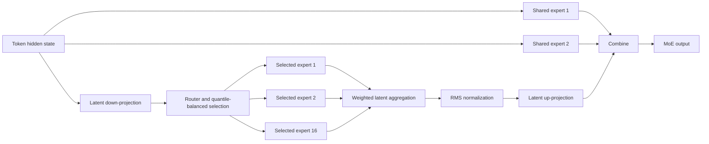
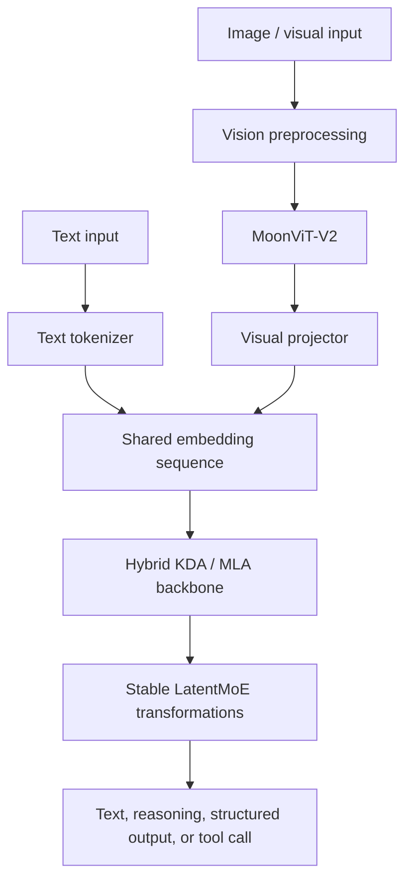

# 03. Stable LatentMoE and Native Multimodality

## 1. Width-scaling problem

Kimi K3 contains 2.8 trillion total parameters but activates approximately 104 billion parameters for each token. This is achieved through sparse expert routing.

The central engineering problem is not only selecting a small number of experts. A conventional expert layer still has to move the full hidden representation to each selected expert, creating communication and memory pressure when:

- the hidden dimension is large;
- the number of routed experts is large;
- more experts are selected per token;
- expert parallelism spans many devices;
- multimodal token lengths vary significantly.

Kimi K3's Stable LatentMoE is designed to reduce this communication width while stabilizing routing at extreme sparsity.

## 2. Published MoE structure

| Property | Value |
|---|---:|
| Routed experts | 896 |
| Routed experts selected per token | 16 |
| Shared experts | 2 |
| Latent MoE dimension | 3584 |
| Expert hidden dimension | 3072 |
| Expert-weight precision in released model | MXFP4 |
| Activation precision for quantized expert path | MXFP8 |

The model has a much larger expert pool and selects more experts per token than many earlier sparse models. This expands the combinations of expert specialization available to a token, but increases routing, load-balancing, and expert-parallel communication complexity.

## 3. Latent expert routing

### Conventional conceptual path

```text
full hidden state
→ dispatch full representation to selected experts
→ expert feed-forward computation
→ weighted expert aggregation
```

### LatentMoE conceptual path

```text
full hidden state
→ down-project to latent expert space
→ dispatch smaller latent representation
→ selected routed experts
→ aggregate latent expert outputs
→ normalize
→ up-project to model hidden space
```

The latent bottleneck reduces the amount of representation data exchanged with routed experts. This matters because expert-parallel systems often become communication-bound before arithmetic capacity is exhausted.

## 4. Shared and routed experts

Kimi K3 uses two full-width shared experts in every MoE layer in addition to routed experts.

A useful interpretation is:

- shared experts provide a common transformation path for all tokens;
- routed experts provide specialized sparse capacity;
- the final output combines common and token-dependent expert computation.

The shared experts reduce complete dependence on the router for universal behavior. They also add fixed compute that must be included in activated-parameter and serving-cost estimates.

## 5. Normalized LatentMoE

The scale of an aggregated routed representation can vary because:

- different experts produce outputs with different magnitudes;
- routing weights vary by token;
- the set of selected experts changes;
- multimodal and long-context token distributions change routing behavior.

Kimi K3 inserts normalization before the latent representation is projected back into the model hidden space. The purpose is to reduce scale variation and improve optimization stability.

This is one reason the mechanism is called **Stable** LatentMoE rather than only LatentMoE.

## 6. SiTU-GLU and expert transformation

The official model summary lists SiTU-GLU as the activation function. In the overall design it contributes to the feed-forward transformation used by the expert path.

The key architectural point is that expert quality depends on more than routing:

```text
router behavior
+ latent projections
+ expert activation
+ normalization
+ shared experts
+ load balancing
+ expert-parallel execution
```

Changing one component may require retraining; the public checkpoint should not be treated as a set of interchangeable experts that can be independently moved, removed, or resized without validation.

## 7. Quantile Balancing

A large expert pool is vulnerable to load imbalance:

- popular experts can become overloaded;
- unpopular experts can receive too few tokens to train effectively;
- token distribution can vary across data-parallel and expert-parallel ranks;
- multimodal samples can create unusually large and uneven token batches.

The report describes a Quantile Balancing method that estimates routing thresholds using global-batch statistics. A histogram-based distributed estimator aggregates per-rank bin counts so the balancing decision reflects the pooled global batch without communicating every routing score.

### Engineering interpretation

Quantile Balancing aims to make routing more predictable at scale while preserving meaningful expert choice.

It does not eliminate all imbalance in arbitrary production workloads. Training-time balancing and serving-time expert load are related but different problems.

## 8. MoE logical diagram



## 9. Native visual pathway

Kimi K3 includes a native visual encoder rather than treating vision only as text produced by an external OCR or caption service.

The published path is:

```text
image or visual frames
→ MoonViT-V2
→ visual features
→ lightweight projector / MLP
→ shared embedding space
→ Kimi K3 backbone
```

Published model characteristics include:

- MoonViT-V2 vision encoder;
- approximately 401 million vision-encoder parameters;
- shared backbone processing after projection;
- text and image support in the released Hugging Face interface;
- the technical report also discusses image and video training/evaluation.

### Important interface distinction

The technical report describes image and video understanding, while the released Hugging Face model is currently tagged primarily for image-text-to-text usage. Direct video input behavior, preprocessing, frame sampling, and API support should be verified for the exact serving stack.

## 10. Vision-training design

The report states that MoonViT-V2 is trained from scratch rather than only initialized from an existing contrastive vision model. It is integrated into native multimodal pre-training.

The visual path introduces system challenges:

- images and videos produce variable visual-token counts;
- large visual samples can dominate encoder latency;
- visual workloads can create device-level load imbalance;
- encoder forward and backward passes must fit into pipeline scheduling;
- context parallelism must handle large visual samples.

The training infrastructure therefore includes dynamic context parallelism for multimodal samples and scheduling that hides much of the vision-encoder work inside pipeline bubbles.

## 11. Unified multimodal token flow



The diagram is logical. Actual KDA, MLA, MoE, and residual operations are interleaved throughout the backbone rather than arranged as one sequential MoE stage.

## 12. Serving implications of extreme MoE

### Expert placement

A production runtime must decide:

- how experts are distributed across devices and nodes;
- whether shared experts are replicated;
- how routed expert weights are sharded;
- how token dispatch and result combination are overlapped with compute;
- how expert hot spots are detected;
- how failures affect only one expert shard or the full model endpoint.

### Capacity metrics

AI Cloud should not rely only on GPU utilization. Useful MoE metrics include:

- tokens per expert;
- expert-load coefficient of variation;
- all-to-all communication time;
- dispatch and combine latency;
- dropped or rerouted tokens;
- shared-expert utilization;
- per-expert queue pressure;
- cross-node bandwidth saturation;
- quantized-kernel fallback count.

### Failure model

A single unavailable expert shard may make the model endpoint unusable even when most GPUs are healthy. Model health must include expert-topology completeness, not only HTTP availability.

## 13. AI Cloud Model Registry fields

Recommended runtime fields include:

```yaml
architecture:
  family: kimi-k3
  type: hybrid-attention-moe
  totalParameters: 2800000000000
  activatedParameters: 104000000000
  routedExperts: 896
  expertsPerToken: 16
  sharedExperts: 2
  contextTokens: 1048576
  modalities:
    - text
    - image
  visionEncoder: MoonViT-V2
  quantization:
    expertWeights: MXFP4
    expertActivations: MXFP8
runtime:
  expertParallelRequired: true
  hybridCacheRequired: true
  customCodeRequired: true
  supportedEngines:
    - vllm
    - sglang
    - tokenspeed
```

These values are descriptive inputs. Production readiness still requires measured capacity and validated engine compatibility.

## 14. Open questions

- Independent work is needed to characterize expert specialization.
- The released material does not provide a complete production expert-placement topology.
- Cross-hardware portability of MXFP4/MXFP8 kernels requires verification.
- Direct video serving behavior needs exact endpoint and processor validation.
- Router behavior under enterprise-specific workloads may differ from training distributions.
- Fine-tuning a model of this scale may require parameter-efficient techniques and still demand substantial distributed infrastructure.
