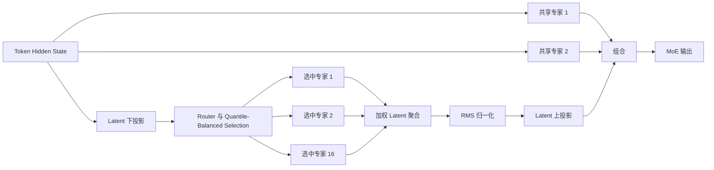
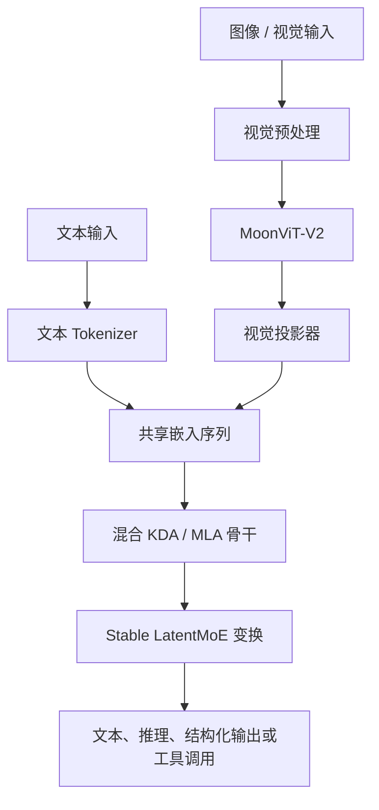

# 03. Stable LatentMoE 与原生多模态

[English](03-moe-and-native-multimodal.md) | **简体中文**

## 1. 宽度扩展问题

Kimi K3 总参数约 2.8 万亿，但每个 Token 仅激活约 1040 亿参数，主要依靠稀疏专家路由实现。

核心工程问题不仅是选择少量专家。传统专家层仍需把完整 Hidden Representation 发送给每个选中专家，在以下条件下会产生严重通信和内存压力：

- Hidden Dimension 很大；
- 路由专家数量很多；
- 每 Token 选择更多专家；
- 专家并行跨越大量设备；
- 多模态 Token 长度差异显著。

Stable LatentMoE 旨在缩小通信宽度，并在极端稀疏条件下提高路由稳定性。

## 2. 已发布 MoE 结构

| 属性 | 数值 |
|---|---:|
| 路由专家 | 896 |
| 每 Token 选择的路由专家 | 16 |
| 共享专家 | 2 |
| Latent MoE 维度 | 3584 |
| 专家隐藏维度 | 3072 |
| 发布模型的专家权重精度 | MXFP4 |
| 量化专家路径的激活精度 | MXFP8 |

与许多早期稀疏模型相比，Kimi K3 拥有更大的专家池，并为每个 Token 选择更多专家。这扩大了专家组合和专业化空间，同时提高了路由、负载均衡与专家并行通信复杂度。

## 3. Latent 专家路由

### 传统概念路径

```text
完整 Hidden State
→ 将完整表示分发到选中专家
→ 专家前馈计算
→ 按权重聚合专家输出
```

### LatentMoE 概念路径

```text
完整 Hidden State
→ 下投影到 Latent 专家空间
→ 分发较小的 Latent 表示
→ 选中的路由专家
→ 聚合 Latent 专家输出
→ 归一化
→ 上投影回模型 Hidden Space
```

Latent Bottleneck 减少与路由专家交换的数据量。专家并行系统往往在算力耗尽之前就先受到通信限制，因此这一点非常关键。

## 4. 共享专家与路由专家

每个 MoE 层除路由专家外，还包含两个全宽共享专家。

可作如下理解：

- 共享专家为所有 Token 提供公共变换路径；
- 路由专家提供面向 Token 的稀疏专业能力；
- 最终输出组合公共计算和 Token 相关的专家计算。

共享专家减少模型对 Router 的完全依赖，但也增加固定计算，必须计入激活参数和服务成本估算。

## 5. Normalized LatentMoE

聚合后的路由表示尺度可能因以下因素变化：

- 不同专家输出幅度不同；
- 路由权重随 Token 变化；
- 选中的专家集合变化；
- 多模态和长上下文 Token 分布改变路由行为。

Kimi K3 在 Latent 表示上投影回模型 Hidden Space 前增加归一化，以降低尺度变化并改善优化稳定性。这是该机制被称为 **Stable LatentMoE** 的原因之一。

## 6. SiTU-GLU 与专家变换

官方模型概述把 SiTU-GLU 列为激活函数，它参与专家路径的前馈变换。

专家质量不只由 Router 决定，而是以下因素的共同结果：

```text
Router 行为
+ Latent 投影
+ 专家激活函数
+ 归一化
+ 共享专家
+ 负载均衡
+ 专家并行执行
```

改变任一组件都可能需要重新训练。公开 Checkpoint 不能被视为可随意移动、删除或调整大小且无需验证的独立专家集合。

## 7. Quantile Balancing

大规模专家池容易出现负载不均：

- 热门专家过载；
- 冷门专家接收的 Token 太少；
- 不同 Data Parallel 和 Expert Parallel Rank 上的 Token 分布不同；
- 多模态样本产生长度异常且不均匀的 Token Batch。

报告描述了一种 Quantile Balancing 方法，利用全局 Batch 统计估计路由阈值。分布式直方图估计器聚合各 Rank 的 Bin Count，使平衡决策反映整个全局 Batch，而无需传输所有路由分数。

### 工程解释

Quantile Balancing 旨在提高大规模路由的可预测性，同时保留有效的专家选择。

它不能保证任意生产工作负载都完全平衡。训练期路由平衡与服务期专家负载相关，但并不相同。

## 8. MoE 逻辑图



## 9. 原生视觉路径

Kimi K3 内置原生视觉编码器，而不是只把视觉任务交给外部 OCR 或 Caption 服务转成文本。

已发布路径为：

```text
图像或视觉帧
→ MoonViT-V2
→ 视觉特征
→ 轻量投影器 / MLP
→ 共享嵌入空间
→ Kimi K3 骨干网络
```

已发布特征包括：

- MoonViT-V2 视觉编码器；
- 视觉编码器约 4.01 亿参数；
- 投影后由共享骨干处理；
- Hugging Face 接口支持文本和图像；
- 技术报告还讨论了图像与视频训练和评测。

### 重要接口区别

技术报告描述图像和视频理解，但公开 Hugging Face 模型目前主要以 Image-Text-to-Text 方式标记。直接视频输入、预处理、抽帧和 API 支持必须针对精确 Serving Stack 验证。

## 10. 视觉训练设计

报告称 MoonViT-V2 从头训练，而不是仅从已有对比学习视觉模型初始化，并在原生多模态预训练中与语言模型结合。

视觉路径带来以下系统挑战：

- 图像与视频产生可变视觉 Token 数；
- 大图像可能主导 Encoder 延迟；
- 视觉工作负载可能造成设备级不均衡；
- Encoder 前向和反向必须适配 Pipeline 调度；
- Context Parallelism 必须处理大型视觉样本。

训练系统因此采用动态 Context Parallelism，并将部分视觉 Encoder 工作安排在 Pipeline Bubble 中执行。

## 11. 统一多模态 Token 流



上图为逻辑图。实际 KDA、MLA、MoE 和 Residual 操作在整个骨干中交错，而不是只存在一个独立 MoE 阶段。

## 12. 极端 MoE 的服务影响

### 专家放置

生产 Runtime 需要决定：

- 专家如何分布到设备和节点；
- 共享专家是否复制；
- 路由专家权重如何分片；
- Token Dispatch 和 Result Combine 如何与计算重叠；
- 如何检测专家热点；
- 单个专家分片故障如何影响 Endpoint。

### 容量指标

AI Cloud 不应只依赖 GPU 利用率。建议 MoE 指标包括：

- 每专家 Token 数；
- 专家负载变异系数；
- All-to-All 通信时间；
- Dispatch 与 Combine 延迟；
- 丢弃或重新路由的 Token；
- 共享专家利用率；
- 每专家队列压力；
- 跨节点带宽饱和度；
- 量化内核 Fallback 次数。

### 故障模型

即使大多数 GPU 健康，单个不可用专家分片也可能使整个模型 Endpoint 不可用。模型健康必须包含专家拓扑完整性，而不只是 HTTP 可访问性。

## 13. AI Cloud Model Registry 字段

```yaml
architecture:
  family: kimi-k3
  type: hybrid-attention-moe
  totalParameters: 2800000000000
  activatedParameters: 104000000000
  routedExperts: 896
  expertsPerToken: 16
  sharedExperts: 2
  contextTokens: 1048576
  modalities:
    - text
    - image
  visionEncoder: MoonViT-V2
  quantization:
    expertWeights: MXFP4
    expertActivations: MXFP8
runtime:
  expertParallelRequired: true
  hybridCacheRequired: true
  customCodeRequired: true
  supportedEngines:
    - vllm
    - sglang
    - tokenspeed
```

这些字段仅用于描述。生产就绪仍需实测容量和经过验证的 Engine 兼容性。

## 14. 开放问题

- 需要独立研究专家专业化模式；
- 公开材料未提供完整生产专家放置拓扑；
- MXFP4/MXFP8 内核的跨硬件可移植性需要验证；
- 直接视频服务行为需要验证精确 Endpoint 与 Processor；
- 企业特定工作负载下的 Router 行为可能不同于训练分布；
- 该规模模型即使进行参数高效微调，仍可能需要大量分布式基础设施。
