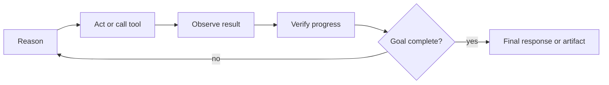
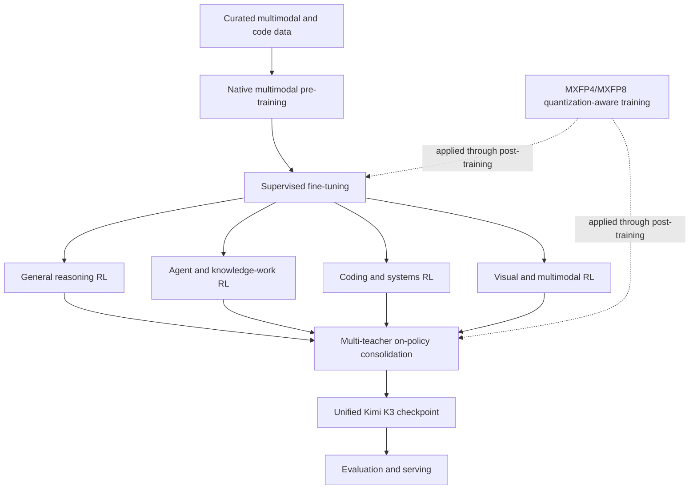

# 04. Pre-training, Post-training, and Agentic RL

## 1. Training-stack overview

The technical report describes Kimi K3 as the result of four linked stages:

```text
native multimodal pre-training
→ supervised fine-tuning
→ domain- and effort-specialized reinforcement learning
→ multi-teacher on-policy consolidation
→ deployment-aware quantized model
```

The full datasets, orchestration code, optimizer checkpoints, and reward infrastructure are not released. The public report is detailed enough to explain the training strategy, but not sufficient to reproduce the model end to end.

## 2. Pre-training objectives

Kimi K3 pre-training has to produce one foundation that supports:

- text reasoning and knowledge;
- code generation and repository understanding;
- native image and visual-document understanding;
- long-context sequence processing;
- later Agentic RL over long tool-use trajectories;
- stable sparse expert specialization;
- deployment under quantized expert weights.

The architecture and data curriculum are therefore co-designed. Long context, native vision, and extreme MoE sparsity are not added only after a standard text model has completed training.

## 3. Pre-training data disclosure

The report describes data construction and curriculum methods, but does not publish a complete source-level dataset manifest.

Published themes include:

- text and code data;
- visual and document data;
- long-context samples;
- synthetic and transformed samples;
- quality filtering and deduplication;
- progressively extended sequence lengths;
- domain balancing and data-mixture refinement.

### What remains unknown

- exact source URLs or dataset-by-dataset inventory;
- exact licensing status for every sample;
- final sample counts and token ratios by source;
- complete removal and opt-out procedures;
- exact proportions of synthetic and human-authored data;
- detailed contamination analysis for every benchmark.

For AI Cloud supply-chain governance, a technical report description is not equivalent to a machine-verifiable training-data bill of materials.

## 4. Long-context curriculum

Training directly at one million tokens for every sample would be extremely expensive and inefficient. The report describes a progressive long-context curriculum in which the model adapts to increasingly long dependencies.

A conceptual curriculum is:

```text
short and medium sequences
→ longer mixed sequences
→ very long samples
→ million-token long-context and Agent trajectories
```

This lets most training computation occur at shorter lengths while reserving the highest-cost stages for adaptation to long-range behavior.

### Engineering implication

The declared maximum context length is not the same as a uniform amount of training at every position. Independent evaluation should test:

- retrieval at different depths;
- multi-hop reasoning across distant evidence;
- instruction retention after long tool traces;
- recency bias;
- multimodal context ordering;
- behavior after context compaction.

## 5. Supervised fine-tuning

The post-training pipeline begins with supervised fine-tuning to initialize baseline capabilities and interaction formats.

Likely responsibilities of this stage, as described at a system level, include:

- following general instructions;
- structured response formats;
- tool-call conventions;
- visual and document tasks;
- coding and Agent traces;
- reasoning-effort conditioning;
- preserved reasoning-history behavior.

The public materials do not release the complete SFT corpus or all formatting templates.

## 6. Multi-domain reinforcement learning

The report organizes RL across several broad capability domains:

- general reasoning and knowledge;
- general Agent and knowledge-work tasks;
- long-horizon coding and software engineering;
- multimodal reasoning and visual tool use;
- persistent assistant workflows;
- autonomous but sandboxed execution environments.

The key design choice is that training trajectories can span hundreds or thousands of tool interactions and accumulate very large contexts.

### General Agent loop



The model is trained not only to produce a first answer, but to continue an iterative loop while preserving state over long horizons.

## 7. Multiple reasoning-effort levels

Kimi K3 exposes multiple reasoning-effort levels such as `low`, `high`, and `max` in the official usage guidance.

The report indicates that RL is performed across multiple effort levels. This means effort is not merely an API-side token cap; the model is trained to behave under different inference budgets.

### AI Cloud interpretation

Reasoning effort should be treated as a first-class routing decision:

```text
simple extraction        -> low effort
standard knowledge task  -> high effort
complex research/coding  -> max effort
```

The actual mapping must be determined by enterprise evaluation, not fixed from vendor labels alone.

## 8. Domain-specialized policies and consolidation

Training separate specialists can improve domain performance but would create multiple operational models. The report describes consolidating domain- and effort-specialized policies into one model through multi-teacher on-policy distillation.

Conceptually:

```text
general-reasoning teacher
+ coding teacher
+ Agent teacher
+ visual teacher
+ multiple effort policies
→ on-policy generated trajectories
→ unified Kimi K3 policy
```

The objective is one deployable model that retains capabilities learned by specialized policies.

### Trade-off

Policy consolidation improves operational simplicity, but can introduce interference:

- one domain may regress while another improves;
- effort-level behavior may become less distinct;
- safety and refusal behavior may change;
- tool-use conventions can conflict;
- hidden benchmark specialization may not transfer to enterprise tasks.

This is why evaluation must be performed on the final consolidated checkpoint.

## 9. Deployment-aware quantization-aware training

Kimi K3 applies quantization-aware training throughout post-training, including SFT and RL.

Published precision design:

- MoE expert weights: MXFP4;
- expert-input activations: MXFP8;
- attention projections, latent projections, routers, shared experts, and other non-expert components: higher precision.

### Why this matters

The expert weights dominate total parameter memory. Quantizing them provides the largest storage and bandwidth reduction.

Training and rollout use the same quantization scheme during RL, reducing mismatch between:

```text
training-time policy
and
production-time quantized policy
```

A separately post-quantized checkpoint might lose behavior learned at higher precision. Kimi K3 instead adapts the policy while quantization effects are present.

## 10. Persistent long-horizon rollout state

Million-token Agent RL creates state that must survive across rollout iterations:

- model context and reasoning history;
- KDA recurrent states;
- MLA KV-cache blocks;
- tool outputs;
- filesystem and workspace state;
- browser or application state;
- sandbox process state;
- task rewards and verification state.

The report describes partial rollouts, external cache retention, and resumable sandbox states so unfinished trajectories do not restart from zero each training iteration.

## 11. Sandbox architecture for training

The report discusses several sandbox types:

- container-based environments;
- GPU-enabled sandboxes;
- microVM-based Agent environments;
- resumable persistent states for long tasks.

The separate AgentENV project is referenced as an open-source sandbox component. Kimi K3's full internal RL orchestration is not thereby fully open-sourced.

### Security interpretation

Training in a sandbox does not prove safe production execution. Production still requires:

- explicit Tool Gateway mediation;
- deterministic policy checks;
- short-lived credentials;
- network restrictions;
- resource limits;
- immutable audit records;
- human approval for high-risk actions.

## 12. Reward and verification design

Long-horizon tasks need stronger signals than subjective response preference alone. The report emphasizes verifiable environments and task synthesis.

Possible verification classes described at a high level include:

- code tests and build results;
- structured-answer checks;
- search and evidence verification;
- task-state inspection;
- visual or application-state validation;
- professional-domain rubrics;
- completion and consistency checks.

The exact full reward functions and evaluator models are not publicly reproducible.

## 13. Training-system diagram



## 14. Reproducibility assessment

| Area | Reproducibility from public material |
|---|---|
| Model inference | High in principle, subject to hardware and kernel support |
| Architecture inspection | High |
| Fine-tuning experiments | Possible but infrastructure-intensive |
| Exact pre-training reproduction | Not possible from current release |
| Exact SFT reproduction | Not possible |
| Exact RL reproduction | Not possible |
| Exact data-mixture reproduction | Not possible |
| Vendor benchmark reproduction | Partial; depends on external and internal harness access |
| License evaluation | Possible from published license, but legal review is still required |

## 15. AI Cloud implications

AI Cloud should record the training and post-training lineage as evidence fields even when some values are unknown:

```yaml
trainingEvidence:
  pretrainingReport: arxiv:2607.24653
  nativeMultimodal: true
  fullDatasetManifestAvailable: false
  fullTrainingCodeAvailable: false
  postTraining:
    supervisedFineTuning: disclosed
    multiDomainRL: disclosed
    multiEffortRL: disclosed
    teacherConsolidation: disclosed
  quantizationAwareTraining:
    enabled: true
    expertWeights: MXFP4
    expertActivations: MXFP8
```

Unknown evidence must remain explicitly unknown rather than being inferred as approved.
