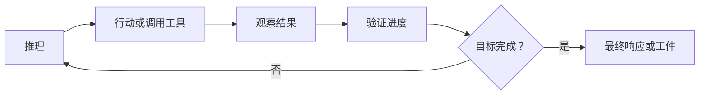
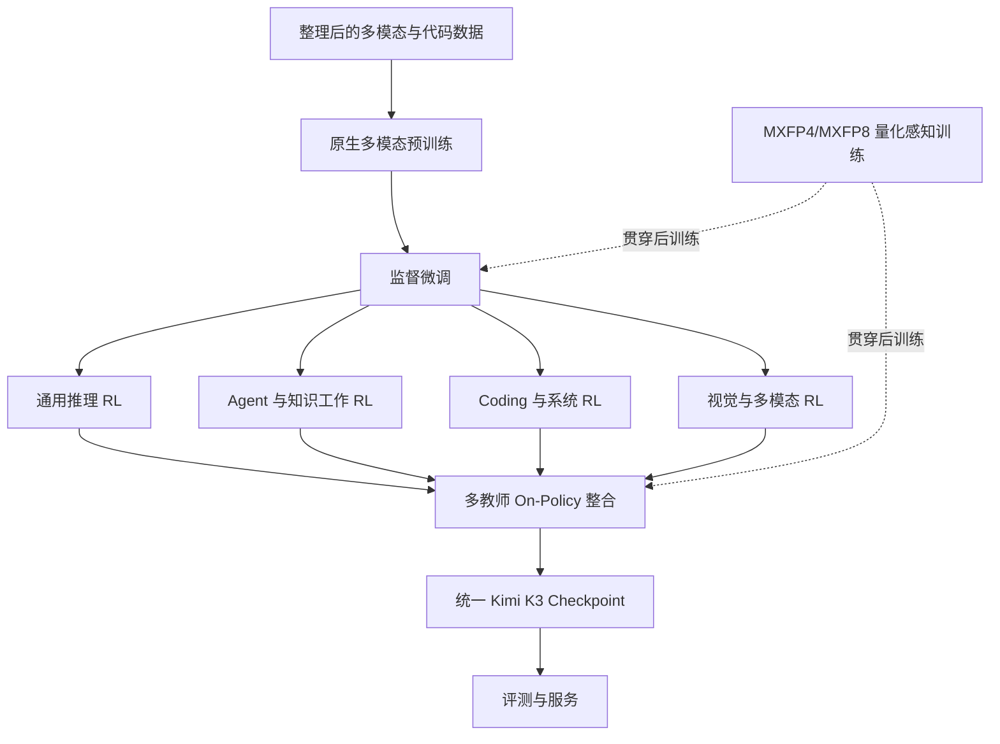

# 04. 预训练、后训练与 Agentic RL

[English](04-training-posttraining-and-agentic-rl.md) | **简体中文**

## 1. 训练栈概览

技术报告将 Kimi K3 描述为四个相互衔接阶段的结果：

```text
原生多模态预训练
→ 监督微调（SFT）
→ 面向领域和推理强度的强化学习
→ 多教师 On-Policy 策略整合
→ 面向部署的量化模型
```

完整数据集、编排代码、优化器 Checkpoint 和奖励基础设施并未公开。公开报告足以解释训练策略，但不足以端到端复现模型。

## 2. 预训练目标

Kimi K3 的预训练需要形成一个同时支持以下能力的基础模型：

- 文本推理与知识；
- 代码生成和仓库理解；
- 原生图像与视觉文档理解；
- 长上下文序列处理；
- 面向长工具调用轨迹的后续 Agentic RL；
- 稳定的稀疏专家专业化；
- 在量化专家权重下部署。

因此，架构和数据课程是协同设计的。长上下文、原生视觉和极端 MoE 稀疏并非在完成标准文本模型训练后才附加。

## 3. 预训练数据披露

报告描述了数据构造和课程方法，但没有发布完整的来源级数据清单。

已披露主题包括：

- 文本和代码数据；
- 视觉和文档数据；
- 长上下文样本；
- 合成和变换样本；
- 质量过滤与去重；
- 逐步扩展序列长度；
- 领域平衡和数据混合优化。

### 仍未知的内容

- 精确来源 URL 或逐数据集清单；
- 每个样本的精确许可证状态；
- 最终样本数量与按来源划分的 Token 比例；
- 完整删除与退出机制；
- 合成数据与人工数据的精确比例；
- 每个 Benchmark 的完整污染分析。

对 AI Cloud 供应链治理而言，技术报告中的文字说明不等同于机器可验证的数据物料清单。

## 4. 长上下文课程

所有样本都直接使用 100 万 Token 训练会非常昂贵且低效。报告采用逐步扩展长上下文的课程，让模型逐渐适应更长依赖。

概念课程如下：

```text
短序列和中等序列
→ 更长的混合序列
→ 超长样本
→ 百万 Token 长上下文与 Agent 轨迹
```

大部分计算可以在较短长度完成，只在最高成本阶段适应长距离行为。

### 工程意义

声明的最大上下文不等于模型在每个位置都接受相同强度训练。独立评测应测试：

- 不同深度位置的检索；
- 跨远距离证据的多跳推理；
- 长工具 Trace 后的指令保持；
- 近因偏置；
- 多模态上下文顺序；
- Context Compaction 后的行为。

## 5. 监督微调

后训练从 SFT 开始，用于初始化基础能力和交互格式。

从系统层面看，该阶段可能承担：

- 通用指令遵循；
- 结构化响应格式；
- 工具调用约定；
- 视觉和文档任务；
- Coding 与 Agent Trace；
- 推理强度条件化；
- 保留推理历史行为。

公开材料未发布完整 SFT 语料和全部格式模板。

## 6. 多领域强化学习

报告将 RL 组织为多个能力领域：

- 通用推理与知识；
- 通用 Agent 与知识工作；
- 长时程 Coding 和软件工程；
- 多模态推理和视觉工具使用；
- 持久化助手工作流；
- 自主但受 Sandbox 限制的执行环境。

关键设计是训练轨迹可跨越数百甚至数千次工具交互，并累积极长上下文。

### 通用 Agent 循环



训练目标不仅是产生首次回答，而是能在长时间范围内保持状态并持续迭代。

## 7. 多种推理强度

官方使用指南提供 `low`、`high` 和 `max` 等推理强度。

报告表明，RL 在多个 Effort Level 上进行。这意味着 Effort 不只是 API 侧 Token 上限，而是模型在不同推理预算下接受过训练。

### AI Cloud 解释

Reasoning Effort 应成为一等路由决策：

```text
简单提取          → low
标准知识任务      → high
复杂研究或 Coding → max
```

实际映射必须由企业评测确定，不能仅依赖厂商标签。

## 8. 领域专用策略与整合

独立专家策略可能提升领域表现，但会形成多个运营模型。报告通过 Multi-Teacher On-Policy Distillation 将不同领域和 Effort 的策略整合进一个模型。

概念上：

```text
通用推理教师
+ Coding 教师
+ Agent 教师
+ 视觉教师
+ 多种 Effort 策略
→ On-Policy 生成轨迹
→ 统一 Kimi K3 策略
```

目标是形成一个可部署模型，并保留多个专用策略学到的能力。

### 权衡

策略整合简化运营，但可能造成干扰：

- 一个领域提升、另一个领域回退；
- Effort Level 间的差异变弱；
- 安全与拒绝行为变化；
- 工具调用格式冲突；
- Benchmark 专业化无法迁移到企业任务。

因此评测必须针对最终整合 Checkpoint 进行。

## 9. 面向部署的量化感知训练

Kimi K3 在整个后训练阶段，包括 SFT 与 RL 中使用 Quantization-Aware Training。

已发布精度设计：

- MoE 专家权重：MXFP4；
- 专家输入激活：MXFP8；
- Attention 投影、Latent 投影、Router、共享专家及其他非专家组件：更高精度。

### 为什么重要

专家权重占据绝大多数参数内存，对其量化可以获得最大的存储和带宽收益。

RL 训练与 Rollout 使用相同量化方案，减少以下不一致：

```text
训练期策略
与
生产期量化策略
```

单独在训练后量化可能损害高精度阶段学到的行为；Kimi K3 则让策略在量化影响存在时进行适应。

## 10. 持久化长时程 Rollout 状态

百万 Token Agent RL 需要跨迭代保存：

- 模型上下文和推理历史；
- KDA 递归状态；
- MLA KV Cache；
- 工具输出；
- 文件系统和 Workspace 状态；
- 浏览器或应用状态；
- Sandbox 进程状态；
- 任务奖励和验证状态。

报告描述了 Partial Rollout、外部 Cache 保存和可恢复 Sandbox，使未完成轨迹无需每个训练迭代都从零开始。

## 11. 训练 Sandbox 架构

报告讨论了：

- 容器环境；
- GPU Sandbox；
- 基于 microVM 的 Agent 环境；
- 长任务的可恢复持久状态。

独立 AgentENV 项目被引用为开放 Sandbox 组件，但这不意味着 Kimi K3 完整内部 RL 编排已经开源。

### 安全解释

训练时使用 Sandbox 不能证明生产执行安全。生产仍需：

- Tool Gateway；
- 确定性 Policy；
- 短期凭据；
- 网络限制；
- 资源限制；
- 不可变审计；
- 高风险操作人工审批。

## 12. 奖励与验证设计

长时程任务需要比主观偏好更强的反馈。报告强调可验证环境和任务合成。

高层次验证类别包括：

- 代码测试和构建结果；
- 结构化答案检查；
- 搜索与证据验证；
- 任务状态检查；
- 视觉或应用状态验证；
- 专业领域 Rubric；
- 完成度与一致性检查。

完整奖励函数和 Evaluator Model 尚无法从公开材料复现。

## 13. 训练系统图



## 14. 可复现性评估

| 领域 | 依据公开材料的可复现程度 |
|---|---|
| 模型推理 | 原理上较高，但受硬件和内核支持限制 |
| 架构检查 | 高 |
| 微调实验 | 可行，但基础设施要求很高 |
| 精确预训练复现 | 当前不可行 |
| 精确 SFT 复现 | 不可行 |
| 精确 RL 复现 | 不可行 |
| 精确数据混合复现 | 不可行 |
| 厂商 Benchmark 复现 | 部分可行，取决于外部和内部 Harness |
| 许可证评估 | 可阅读公开许可证，但仍需法律审查 |

## 15. AI Cloud 影响

即使部分值未知，AI Cloud 也应记录训练和后训练证据：

```yaml
trainingEvidence:
  pretrainingReport: arxiv:2607.24653
  nativeMultimodal: true
  fullDatasetManifestAvailable: false
  fullTrainingCodeAvailable: false
  postTraining:
    supervisedFineTuning: disclosed
    multiDomainRL: disclosed
    multiEffortRL: disclosed
    teacherConsolidation: disclosed
  quantizationAwareTraining:
    enabled: true
    expertWeights: MXFP4
    expertActivations: MXFP8
```

未知证据必须保持明确的 Unknown 状态，不能被推断为已批准。
