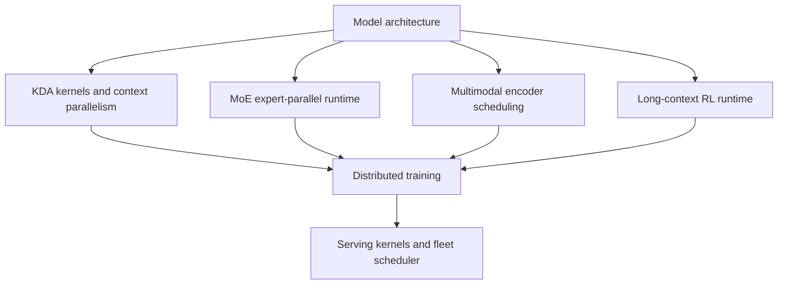
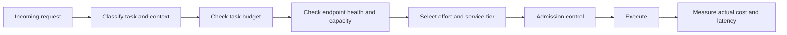

# 05. Systems, Inference, and Deployment

## 1. Why systems design is part of the model

Kimi K3 combines four characteristics that make generic serving difficult:

- 2.8T total parameters;
- 896 routed experts;
- hybrid KDA and MLA state;
- one-million-token contexts with native visual input.

The report therefore presents substantial algorithm–system co-design. The checkpoint alone does not deliver the claimed efficiency.

## 2. Training-system layers



The major disclosed system components are:

- fused KDA kernels across sequence-length regimes;
- KDA Context Parallelism across devices;
- MoonEP expert-parallel execution;
- memory-efficient parameter, optimizer, and activation handling;
- dynamic context parallelism for large visual samples;
- persistent external cache for long RL trajectories;
- resumable sandbox environments;
- state-aware prefix caching;
- cache- and budget-aware online scheduling.

## 3. KDA kernel regimes

KDA replaces a growing full-attention KV cache with a fixed-size recurrent state, but recurrence creates serial dependencies.

The system addresses this with multiple execution regimes:

- specialized fused kernels for shorter or moderate sequences;
- chunkwise parallel computation;
- intra-device sequence partitioning across streaming multiprocessors;
- cross-device KDA Context Parallelism for long sequences;
- state composition so sequence partitions can be processed and then combined.

### Operational consequence

A serving engine that falls back to an unoptimized implementation may be functionally correct but economically unusable. Engine compatibility should include kernel maturity, not only whether the model loads.

## 4. KDA Context Parallelism

For very long sequences, token positions are partitioned across devices. Each partition computes local transitions, while the system composes recurrent states so every partition receives the correct initial state.

This differs from conventional attention context parallelism because the exchanged object is a recurrent transition/state rather than only attention blocks.

AI Cloud should identify this as a model-specific topology requirement:

```yaml
parallelism:
  tensor: required
  expert: required
  pipeline: likely
  context:
    kdaAware: required-for-long-context
```

The exact values depend on the inference engine and hardware deployment.

## 5. MoonEP expert parallelism

The report describes MoonEP as the expert-parallel infrastructure for large-scale MoE training.

Published design goals include:

- balanced expert execution;
- static compute shapes;
- zero-copy or reduced-copy communication paths;
- overlap of expert dispatch/combine communication with computation;
- replicated shared experts;
- predictable handling of variable expert loads.

### Why static shapes matter

GPU kernels and communication collectives perform best when work shapes are predictable. Dynamic expert routing naturally produces irregular token counts. The system attempts to convert this irregular logical workload into regular physical execution.

### Serving implication

A route endpoint may be healthy at the HTTP layer while suffering expert imbalance. Runtime health should include:

```text
expert topology complete
+ all-to-all latency
+ per-expert load
+ dispatch queue
+ cross-node bandwidth
+ quantized-kernel availability
```

## 6. Memory-efficient distributed training

At 2.8T parameters, memory pressure includes:

- model weights;
- gradients;
- optimizer states;
- activations;
- shared expert replicas;
- vision-encoder state;
- long-context caches;
- RL rollout state.

The report describes overlapping computation, communication, and state offloading across pipeline phases. Some training states are offloaded to host memory or NVMe when they are not immediately needed.

The main principle is lifecycle-aware memory use:

```text
keep only hot state on accelerator
→ overlap transfer with compute
→ offload cold state
→ prefetch before reuse
```

## 7. Multimodal encoder scheduling

Large images and videos produce variable workloads. The report introduces:

- dynamic context parallelism for visual samples;
- splitting large images along patch dimensions;
- distributing multiple images across subgroups;
- load-aware assignment of visual samples;
- scheduling vision-encoder work inside pipeline bubbles.

This reduces idle time caused by one device receiving an unusually large visual sample.

## 8. Long-context Agentic RL infrastructure

The report describes a co-located RL setup in which rollout and training resources are closely coordinated.

### Partial rollouts

Long tasks may not finish in one RL iteration. Partial rollout preserves incomplete trajectories so they can resume instead of restarting.

### External cache pool

Keeping every reusable long prefix in GPU memory is impractical. The system writes inactive prefix state to CPU memory and restores it before reuse.

For Kimi K3 the reusable prefix includes both:

- KDA recurrent state;
- MLA KV-cache blocks.

### Auto-throttling scheduler

As a trajectory grows, later requests require more cache and compute. Fixed concurrency can underutilize early stages and overload late stages.

The scheduler adjusts concurrency using runtime signals such as:

- active request count;
- queued request count;
- cache utilization;
- memory pressure;
- trajectory length.

### Resumable microVM sandboxes

Long Agent tasks need environment state as well as model state. The report describes resumable sandbox execution, including a microVM-based AgentENV runtime.

The environment may preserve:

- files;
- process state;
- tool outputs;
- task metadata;
- application state;
- evaluation state.

AI Cloud should adopt the principle, not assume Moonshot's internal orchestrator is publicly reproducible.

## 9. Online-serving architecture

Kimi K3 serving must coordinate two cache classes.

| Cache | Main content | Lifecycle |
|---|---|---|
| KDA state | Fixed-size recurrent state for KDA layers | Updated through sequence; compact to transfer |
| MLA cache | Latent key/value cache for global-attention layers | Grows with context length |

A cached prefix is valid only when both cache classes refer to the same:

```text
model version
+ tokenizer and processor version
+ exact message prefix
+ visual preprocessing output
+ reasoning history
+ tool-call history
```

## 10. State-aware prefix caching

Kimi K3's preserved thinking-history mode makes prefix identity especially important. Multi-turn requests are expected to pass the previous assistant response back with reasoning content and tool calls intact.

### Risks

- caching reasoning content may retain sensitive intermediate information;
- incomplete message replay may change model behavior;
- cache keys that omit processor or tool-schema versions can return invalid state;
- cross-tenant prefix reuse can leak information;
- long cache retention increases data-governance obligations.

### AI Cloud requirements

```text
cache namespace by tenant
+ model and checkpoint revision
+ processor and tokenizer revision
+ tool-schema digest
+ prompt/workflow digest
+ encryption and TTL
+ explicit sensitivity classification
+ deletion and audit support
```

## 11. Budget-aware scheduling

Kimi K3 supports different reasoning-effort levels and request costs can vary widely by:

- input context length;
- visual-token count;
- reasoning effort;
- output length;
- tool-call loop count;
- cache hit or miss;
- selected service tier.

A fleet scheduler therefore needs both resource and financial admission control.



## 12. Released deployment paths

Official materials recommend or document the following paths:

- Moonshot-hosted Kimi API;
- OpenAI-compatible and Anthropic-compatible API access;
- vLLM;
- SGLang;
- TokenSpeed;
- Hugging Face Transformers custom-code loading;
- Docker Model Runner entry points.

### Deployment categories

| Path | Strength | Main risk |
|---|---|---|
| Hosted API | Fastest adoption and vendor-operated capacity | Provider dependency, data policy, changing price or limits |
| Certified inference partner | Potential regional or infrastructure choice | Partner evidence and version consistency |
| Enterprise private endpoint | Data and network control | Capacity and operational ownership |
| Self-hosted open weights | Maximum deployment control | Very high infrastructure, kernel, and operations burden |
| Research loading through Transformers | Architecture inspection and experiments | Not a production-serving design by itself |

## 13. Weight footprint and topology

The public Hugging Face repository is approximately 1.56 TB and contains 96 Safetensors shards. This exceeds the accelerator memory of ordinary single-node deployments before including:

- runtime buffers;
- MLA cache;
- KDA state;
- communication workspaces;
- visual encoder;
- batch activations;
- fault-tolerance headroom.

The practical conclusion is that full self-hosted Kimi K3 is a distributed inference project, not a normal single-server model installation.

Exact node and accelerator counts should be derived from an engine-specific certified recipe rather than a simple checkpoint-size division.

## 14. Deployment validation checklist

Before an endpoint is considered production-capable, validate:

- exact weight and code revision;
- hardware and driver compatibility;
- vLLM/SGLang/TokenSpeed version;
- KDA kernel path actually selected;
- MXFP4/MXFP8 kernel support;
- expert-parallel topology;
- hybrid prefix-cache correctness;
- 1M-context admission behavior;
- visual processor behavior;
- reasoning-effort behavior;
- tool-call format compatibility;
- load, latency, and failure behavior;
- checkpoint and license digest;
- tenant isolation and cache deletion.

## 15. Current unknowns

- Full production hardware topology is not public.
- Certified minimum hardware configurations may change as kernels mature.
- Cross-vendor accelerator support is not established by the checkpoint alone.
- Real capacity under mixed text, image, and long Agent workloads needs measurement.
- Hosted API and self-hosted output parity should not be assumed without version evidence.
