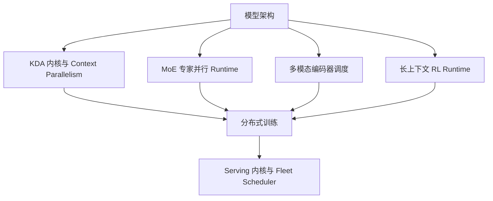
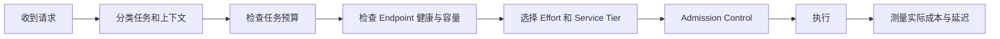

# 05. 系统、推理与部署

[English](05-systems-inference-and-deployment.md) | **简体中文**

## 1. 为什么系统设计是模型的一部分

Kimi K3 同时具备四个使通用 Serving 变得困难的特征：

- 2.8 万亿总参数；
- 896 个路由专家；
- KDA 与 MLA 混合状态；
- 百万 Token 上下文与原生视觉输入。

因此技术报告披露了大量算法—系统协同设计。单独的 Checkpoint 并不能自动提供厂商声称的效率。

## 2. 训练系统层次



主要已披露系统组件包括：

- 面向不同序列长度区间的融合 KDA 内核；
- 跨设备 KDA Context Parallelism；
- MoonEP 专家并行执行；
- 面向参数、优化器和激活的内存优化；
- 大型视觉样本的动态 Context Parallelism；
- 长 RL 轨迹的持久化外部 Cache；
- 可恢复 Sandbox 环境；
- 状态感知 Prefix Cache；
- Cache 与预算感知的在线调度。

## 3. KDA 内核执行区间

KDA 用固定大小递归状态替代持续增长的全注意力 KV Cache，但递归本身会引入串行依赖。

系统采用多个执行区间：

- 短序列和中等序列的专用融合内核；
- Chunkwise Parallel 计算；
- 在单设备 Streaming Multiprocessor 之间划分序列；
- 长序列的跨设备 KDA Context Parallelism；
- 组合序列分区状态的 State Composition。

### 运行后果

Serving Engine 即使能够通过非优化实现正确加载模型，也可能在经济上完全不可用。引擎兼容性必须包含内核成熟度，而不只是“能够加载模型”。

## 4. KDA Context Parallelism

超长序列会按 Token 位置划分到多个设备。每个分区计算本地状态转换，系统再组合递归状态，使每个分区获得正确初始状态。

这不同于传统 Attention Context Parallelism，因为交换的是递归 Transition/State，而不只是 Attention Block。

AI Cloud 应把它标记为模型特定拓扑要求：

```yaml
parallelism:
  tensor: required
  expert: required
  pipeline: likely
  context:
    kdaAware: required-for-long-context
```

精确值取决于推理引擎和硬件部署。

## 5. MoonEP 专家并行

报告把 MoonEP 描述为大规模 MoE 训练的专家并行基础设施。

已发布设计目标包括：

- 平衡专家执行；
- 静态计算 Shape；
- 零拷贝或少拷贝通信路径；
- Dispatch/Combine 通信与计算重叠；
- 复制共享专家；
- 可预测处理动态专家负载。

### 为什么静态 Shape 重要

GPU 内核和通信 Collective 在工作 Shape 可预测时效率最高。动态专家路由天然产生不规则 Token 数，系统需要把不规则的逻辑负载转化为规则的物理执行。

### Serving 影响

Endpoint 可能在 HTTP 层健康，却因专家不均衡而不可用。Runtime Health 应包含：

```text
专家拓扑完整
+ All-to-All 延迟
+ 每专家负载
+ Dispatch Queue
+ 跨节点带宽
+ 量化内核可用性
```

## 6. 内存高效的分布式训练

2.8T 参数下的内存压力包括：

- 模型权重；
- 梯度；
- 优化器状态；
- 激活；
- 共享专家副本；
- 视觉编码器状态；
- 长上下文 Cache；
- RL Rollout State。

报告描述了在 Pipeline 阶段之间重叠计算、通信与状态 Offload，并在状态不需要立即使用时卸载到 Host Memory 或 NVMe。

主要原则是按生命周期使用内存：

```text
Accelerator 只保留 Hot State
→ 数据传输与计算重叠
→ Cold State Offload
→ 使用前 Prefetch
```

## 7. 多模态编码器调度

大型图像和视频产生可变工作量。报告采用：

- 视觉样本动态 Context Parallelism；
- 按 Patch 维度切分大图；
- 在 Subgroup 间分配多图；
- 根据负载分配视觉样本；
- 把视觉编码器计算调度进 Pipeline Bubble。

目标是减少单个设备接收超大视觉样本所造成的空闲时间。

## 8. 长上下文 Agentic RL 基础设施

报告描述了 Rollout 和训练资源紧密协同的 Co-Located RL 架构。

### Partial Rollout

长任务可能无法在一个 RL Iteration 内完成，Partial Rollout 保存未完成轨迹，使其可以继续而不是重启。

### 外部 Cache Pool

把所有可复用长 Prefix 留在 GPU 内存并不现实。系统把非活跃 Prefix State 写入 CPU Memory，并在复用前恢复。

Kimi K3 的可复用 Prefix 包含：

- KDA 递归状态；
- MLA KV Cache Block。

### Auto-Throttling Scheduler

随着轨迹增长，后续请求需要更多 Cache 和计算。固定并发会导致早期利用率不足、后期过载。

调度器根据以下信号调整并发：

- 活跃请求数；
- 排队请求数；
- Cache 利用率；
- 内存压力；
- 轨迹长度。

### 可恢复 microVM Sandbox

长 Agent 任务不仅需要模型状态，也需要环境状态。报告描述了可恢复 Sandbox，包括基于 microVM 的 AgentENV Runtime。

可保存内容包括：

- 文件；
- 进程状态；
- 工具输出；
- 任务元数据；
- 应用状态；
- 评测状态。

AI Cloud 应采用这些原则，但不能假设 Moonshot 内部编排已经可公开复现。

## 9. 在线 Serving 架构

Kimi K3 Serving 必须协调两类 Cache：

| Cache | 主要内容 | 生命周期 |
|---|---|---|
| KDA State | KDA 层固定大小递归状态 | 随序列更新，较适合传输 |
| MLA Cache | 全局注意力层的 Latent KV Cache | 随上下文长度增长 |

只有当两类 Cache 对应相同的以下信息时，Prefix Cache 才有效：

```text
模型版本
+ Tokenizer 与 Processor 版本
+ 精确消息 Prefix
+ 视觉预处理输出
+ 推理历史
+ 工具调用历史
```

## 10. 状态感知 Prefix Cache

Kimi K3 的保留思考历史模式使 Prefix Identity 尤其重要。多轮请求预期把上一轮 Assistant Message，包括推理内容和工具调用完整传回。

### 风险

- 缓存推理内容可能保存敏感中间信息；
- 不完整消息回放会改变模型行为；
- Cache Key 若遗漏 Processor 或 Tool Schema 版本，可能返回错误状态；
- 跨租户 Prefix 复用可能泄漏信息；
- 长时间 Cache Retention 会增加治理义务。

### AI Cloud 要求

```text
按租户划分 Cache Namespace
+ 模型与 Checkpoint Revision
+ Processor 与 Tokenizer Revision
+ Tool Schema Digest
+ Prompt/Workflow Digest
+ 加密与 TTL
+ 显式敏感度分类
+ 删除与审计支持
```

## 11. 预算感知调度

Kimi K3 支持不同推理强度，单次请求成本会随以下因素变化：

- 输入上下文长度；
- 视觉 Token 数；
- Reasoning Effort；
- 输出长度；
- 工具调用循环次数；
- Cache Hit/Miss；
- Service Tier。

Fleet Scheduler 因此既需要资源准入，也需要财务准入。



## 12. 已发布部署路径

官方材料推荐或记录：

- Moonshot 托管 Kimi API；
- OpenAI-Compatible 与 Anthropic-Compatible API；
- vLLM；
- SGLang；
- TokenSpeed；
- Hugging Face Transformers 自定义代码加载；
- Docker Model Runner 入口。

### 部署类别

| 路径 | 优势 | 主要风险 |
|---|---|---|
| 托管 API | 最快采用，由厂商运营容量 | Provider 依赖、数据政策、价格和限制变化 |
| 认证推理伙伴 | 可选择区域或基础设施 | 伙伴证据和版本一致性 |
| 企业私有 Endpoint | 数据和网络控制 | 容量与运营责任 |
| 自托管开放权重 | 最大部署控制权 | 极高基础设施、内核和运维负担 |
| Transformers 研究加载 | 架构检查和实验 | 本身不是生产 Serving 方案 |

## 13. 权重体积与拓扑

公开 Hugging Face 仓库约 1.56 TB，包含 96 个 Safetensors 分片。即使不计以下内容，也已超过普通单节点 Accelerator Memory：

- Runtime Buffer；
- MLA Cache；
- KDA State；
- 通信 Workspace；
- 视觉编码器；
- Batch Activation；
- 容错余量。

完整自托管 Kimi K3 是一个分布式推理项目，而不是普通单机模型安装。

精确节点和 Accelerator 数量应依据特定引擎认证配方，而不能只用 Checkpoint 大小除以显存。

## 14. 部署验证清单

生产 Endpoint 应验证：

- 精确权重和代码 Revision；
- 硬件与 Driver 兼容性；
- vLLM/SGLang/TokenSpeed 版本；
- 是否真正选择 KDA 优化内核；
- MXFP4/MXFP8 内核支持；
- Expert Parallel 拓扑；
- 混合 Prefix Cache 正确性；
- 1M Context Admission 行为；
- 视觉 Processor 行为；
- Reasoning Effort 行为；
- 工具调用格式兼容性；
- 负载、延迟和故障行为；
- Checkpoint 与 License Digest；
- 租户隔离和 Cache 删除。

## 15. 当前未知项

- 完整生产硬件拓扑未公开；
- 认证最低硬件配置可能随内核成熟而变化；
- Checkpoint 本身不能证明跨硬件厂商支持；
- 混合文本、图像和长 Agent 工作负载下的真实容量需要实测；
- 不应在缺少版本证据时假设托管 API 与自托管输出完全一致。
