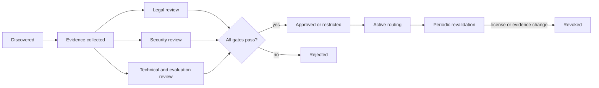

# 07. License, Openness, and Supply Chain

## 1. Correct classification

Kimi K3 should be described as:

> a high-capability open-weight model released with model configuration, custom inference code, processors, documentation, and a custom Kimi K3 License.

It should not automatically be described as a fully reproducible open-source model because the complete training data, training pipeline, SFT/RL corpora, reward infrastructure, and intermediate checkpoints are not released.

## 2. What is publicly available

| Component | Public status |
|---|---|
| Final model weights | Public |
| Weight index and Safetensors shards | Public |
| Model configuration | Public |
| Generation configuration | Public |
| Custom Transformers configuration | Public |
| Text and multimodal model implementation | Public |
| Processor and vision preprocessing code | Public |
| Media utilities and conversation encoding | Public |
| Technical report | Public |
| Kimi K3 License | Public |
| Complete pre-training data | Not public |
| Complete training orchestration | Not public |
| Complete SFT/RL data | Not public |
| Complete reward implementation | Not public |
| Optimizer state and intermediate checkpoints | Not public |

## 3. Rights granted by the license

The published Kimi K3 License broadly permits recipients of the released software to:

- use and copy it;
- modify and merge it;
- publish and distribute it;
- sublicense or sell copies;
- run and deploy it;
- fine-tune and create derivative works;
- permit downstream recipients to exercise those rights.

The copyright and permission notice must be retained in copies or substantial portions, and use must comply with applicable law.

These rights are subject to additional commercial conditions.

## 4. Model-as-a-Service condition

The license defines Model as a Service broadly as giving third parties meaningful control over model inference or fine-tuning inputs, parameters, or training data.

If a licensee or its affiliates operates such a business and aggregate revenue exceeds **US$20 million over any consecutive 12-month period**, a separate agreement with Moonshot AI is required before commercial use of Kimi K3 or derivative works.

### Engineering impact

AI Cloud must not represent the license as a simple boolean such as:

```yaml
commercialUse: true
```

The correct representation is conditional:

```yaml
commercialUse:
  generallyPermitted: true
  modelAsAService:
    revenueThresholdUSD: 20000000
    period: consecutive-12-months
    separateAgreementRequiredAboveThreshold: true
```

The legal interpretation must still be reviewed by counsel.

## 5. Large-product attribution condition

If Kimi K3 or a derivative is used in a commercial product or service with either:

- more than 100 million monthly active users; or
- more than US$20 million monthly revenue,

then `Kimi K3` must be prominently displayed in the product or service user interface.

This creates an operational obligation that may apply after initial deployment if the product grows.

AI Cloud governance should therefore support a periodic license-condition review rather than a one-time approval.

## 6. Exemptions stated in the license

The Model-as-a-Service and large-product conditions do not apply to specified uses including:

- internal use that does not expose the software, outputs, or underlying capabilities to third parties;
- use through Moonshot AI official products;
- use through certified inference partners.

Whether a particular enterprise workflow qualifies as internal use is a legal and product-architecture question, not something a model gateway can infer only from an endpoint label.

## 7. Warranty and liability

The software and outputs are provided on an `as is` basis without warranty. The license disclaims warranties and limits liability.

This means production risk remains with the deploying organization, including:

- output quality;
- security behavior;
- infringement risk;
- service availability;
- regulatory compliance;
- harm caused by downstream automation.

## 8. Open-weight versus open-source dimensions

A useful openness model has several independent dimensions.

| Dimension | Kimi K3 assessment |
|---|---|
| Weight access | High |
| Inference architecture visibility | High |
| Processor visibility | High |
| License visibility | High |
| Standard OSI-style software license | No; custom model license |
| Complete training-code access | Limited / not established |
| Complete training-data access | No |
| Data provenance reproducibility | Limited |
| Exact post-training reproduction | No |
| Independent benchmark reproducibility | Partial |
| Deployment sovereignty | High for organizations with sufficient infrastructure |

The model is therefore more open than a pure hosted API but less reproducible than a project that releases code, data, recipes, and intermediate checkpoints under standard open licenses.

## 9. Model supply-chain objects

AI Cloud should treat Kimi K3 as a set of versioned artifacts rather than one registry row.

```text
license document
+ GitHub repository revision
+ Hugging Face repository revision
+ 96 weight shards
+ weight index
+ model configuration
+ generation configuration
+ custom model code
+ processor code
+ tokenizer assets
+ inference-engine integration
+ container image
+ kernel libraries
+ deployment manifest
+ evaluation evidence
```

Each object can change independently and should have a digest.

## 10. Recommended AIBOM record

```yaml
model:
  id: moonshotai-Kimi-K3
  version: <pinned-checkpoint-revision>
  source: https://huggingface.co/moonshotai/Kimi-K3
artifacts:
  weightManifestDigest: <sha256>
  customCodeDigest: <sha256>
  processorDigest: <sha256>
  tokenizerDigest: <sha256>
  containerImageDigest: <sha256>
  inferenceEngine:
    name: vllm
    version: <version>
    imageDigest: <sha256>
license:
  id: Kimi-K3-License-2026
  authoritativeRef: https://github.com/MoonshotAI/Kimi-K3/blob/main/LICENSE
  documentDigest: <sha256>
  modelAsAServiceRevenueThresholdUSD: 20000000
  largeProductMAUThreshold: 100000000
  largeProductMonthlyRevenueThresholdUSD: 20000000
  attributionRequiredAboveThreshold: true
provenance:
  upstreamPublisher: Moonshot AI
  trainingDataManifestAvailable: false
  fullTrainingCodeAvailable: false
review:
  legalReviewer: <identity>
  securityReviewer: <identity>
  technicalReviewer: <identity>
  reviewedAt: <timestamp>
  status: restricted-or-approved
```

## 11. Admission policy

A Kimi K3 endpoint should be excluded from production routing when any required evidence is missing or revoked.



## 12. Production restrictions to consider

Depending on organizational circumstances, approval may include restrictions such as:

- internal use only;
- no external Model-as-a-Service exposure;
- approved regions only;
- approved business units only;
- no use above specified scale without new review;
- mandatory user-interface attribution when thresholds are reached;
- pinned certified inference partner;
- no unreviewed derivative fine-tuning;
- mandatory logging and output review for high-risk domains.

## 13. Derivative models

Fine-tuned, merged, distilled, or otherwise modified variants must receive new Model Registry identities.

A derivative should not inherit production approval automatically because it may change:

- behavior;
- safety characteristics;
- benchmark performance;
- artifact digests;
- training-data provenance;
- license obligations;
- quantization behavior;
- serving compatibility.

## 14. Continuous license monitoring

The license threshold conditions depend on business scale. AI Cloud FinOps and governance can provide evidence for revalidation:

- external API exposure;
- organization revenue category;
- product monthly active users;
- product monthly revenue;
- deployment through official or certified providers;
- attribution status.

Sensitive business values should remain in the appropriate governance system; the model registry may store only the resulting policy decision and evidence reference.

## 15. Legal disclaimer

This document is a technical reading of the published license and is not legal advice. Production adoption requires review by qualified legal counsel using the exact license revision and intended deployment model.
