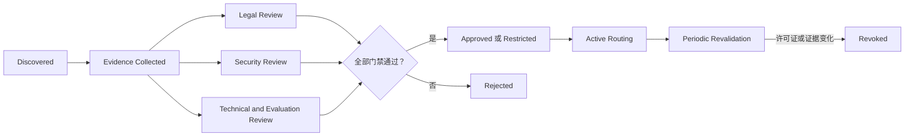

# 07. 许可证、开放程度与供应链

[English](07-license-openness-and-supply-chain.md) | **简体中文**

## 1. 正确分类

Kimi K3 应被描述为：

> 一个高能力开放权重模型，同时发布了模型配置、自定义推理代码、Processor、技术文档和自定义 Kimi K3 License。

它不应被自动描述为完全可复现的开源模型，因为完整训练数据、训练流水线、SFT/RL 语料、奖励基础设施和中间 Checkpoint 均未发布。

## 2. 已公开内容

| 组件 | 公开状态 |
|---|---|
| 最终模型权重 | 已公开 |
| 权重索引与 Safetensors 分片 | 已公开 |
| 模型配置 | 已公开 |
| 生成配置 | 已公开 |
| 自定义 Transformers 配置 | 已公开 |
| 文本和多模态模型实现 | 已公开 |
| Processor 与视觉预处理代码 | 已公开 |
| 媒体工具和会话编码 | 已公开 |
| 技术报告 | 已公开 |
| Kimi K3 License | 已公开 |
| 完整预训练数据 | 未公开 |
| 完整训练编排 | 未公开 |
| 完整 SFT/RL 数据 | 未公开 |
| 完整奖励实现 | 未公开 |
| 优化器状态与中间 Checkpoint | 未公开 |

## 3. 许可证授予的权利

Kimi K3 License 广泛允许使用者：

- 使用和复制；
- 修改和合并；
- 发布和分发；
- 再许可或出售副本；
- 运行和部署；
- 微调和创建衍生作品；
- 允许下游接收者行使这些权利。

副本或实质性部分必须保留版权和许可声明，并遵守适用法律。

这些权利同时受到附加商业条件约束。

## 4. Model-as-a-Service 条件

许可证对 Model as a Service 的定义较广，包括向第三方提供对模型推理或微调输入、参数或训练数据的实质控制。

如果 Licensee 或其关联方经营此类业务，且任何连续 12 个月的合计收入超过 **2000 万美元**，则在商业使用 Kimi K3 或其衍生作品前，需要与 Moonshot AI 另行签署协议。

### 工程影响

AI Cloud 不能把许可证简单表示为：

```yaml
commercialUse: true
```

应采用条件化表达：

```yaml
commercialUse:
  generallyPermitted: true
  modelAsAService:
    revenueThresholdUSD: 20000000
    period: consecutive-12-months
    separateAgreementRequiredAboveThreshold: true
```

具体法律解释仍需法律顾问审查。

## 5. 大型产品归属条件

如果 Kimi K3 或衍生模型用于满足以下任一条件的商业产品或服务：

- 月活跃用户超过 1 亿；
- 月收入超过 2000 万美元；

则必须在产品或服务界面中显著展示 `Kimi K3`。

这一义务可能在部署后随产品增长才触发，因此 AI Cloud 治理应支持周期性许可证复核，而不是一次性审批。

## 6. 许可证中的豁免

Model-as-a-Service 和大型产品条件不适用于许可证列明的部分场景，包括：

- 不向第三方暴露软件、输出或底层能力的内部使用；
- 通过 Moonshot AI 官方产品使用；
- 通过认证推理合作伙伴使用。

具体企业工作流是否属于内部使用，是法律和产品架构问题，不能仅根据 Endpoint 标签自动判断。

## 7. 保证与责任

软件及输出按 `as is` 提供，不附带保证，许可证还限制责任。

因此生产风险仍由部署组织承担，包括：

- 输出质量；
- 安全行为；
- 侵权风险；
- 服务可用性；
- 监管合规；
- 下游自动化造成的损害。

## 8. 开放权重与开源维度

开放程度应拆分为多个独立维度。

| 维度 | Kimi K3 评估 |
|---|---|
| 权重访问 | 高 |
| 推理架构可见性 | 高 |
| Processor 可见性 | 高 |
| 许可证可见性 | 高 |
| 标准 OSI 风格软件许可证 | 否；自定义模型许可证 |
| 完整训练代码访问 | 有限 / 未确认 |
| 完整训练数据访问 | 无 |
| 数据来源可复现性 | 有限 |
| 精确后训练复现 | 不可行 |
| 独立 Benchmark 复现 | 部分可行 |
| 部署主权 | 对有足够基础设施的组织较高 |

它比纯托管 API 更开放，但比同时发布代码、数据、Recipe 和中间 Checkpoint 的标准开源项目更难完整复现。

## 9. 模型供应链对象

AI Cloud 应把 Kimi K3 视为一组版本化工件，而不是一条 Registry 记录：

```text
许可证文档
+ GitHub 仓库 Revision
+ Hugging Face 仓库 Revision
+ 96 个权重分片
+ 权重索引
+ 模型配置
+ 生成配置
+ 自定义模型代码
+ Processor 代码
+ Tokenizer 资产
+ 推理引擎集成
+ 容器镜像
+ 内核库
+ 部署 Manifest
+ 评测证据
```

每个对象都可能独立变化，应该分别保存 Digest。

## 10. 推荐 AIBOM 记录

```yaml
model:
  id: moonshotai-Kimi-K3
  version: <pinned-checkpoint-revision>
  source: https://huggingface.co/moonshotai/Kimi-K3
artifacts:
  weightManifestDigest: <sha256>
  customCodeDigest: <sha256>
  processorDigest: <sha256>
  tokenizerDigest: <sha256>
  containerImageDigest: <sha256>
  inferenceEngine:
    name: vllm
    version: <version>
    imageDigest: <sha256>
license:
  id: Kimi-K3-License-2026
  authoritativeRef: https://github.com/MoonshotAI/Kimi-K3/blob/main/LICENSE
  documentDigest: <sha256>
  modelAsAServiceRevenueThresholdUSD: 20000000
  largeProductMAUThreshold: 100000000
  largeProductMonthlyRevenueThresholdUSD: 20000000
  attributionRequiredAboveThreshold: true
provenance:
  upstreamPublisher: Moonshot AI
  trainingDataManifestAvailable: false
  fullTrainingCodeAvailable: false
review:
  legalReviewer: <identity>
  securityReviewer: <identity>
  technicalReviewer: <identity>
  reviewedAt: <timestamp>
  status: restricted-or-approved
```

## 11. 准入策略

任何必要证据缺失或被撤销时，Kimi K3 Endpoint 都应被排除在生产路由之外。



## 12. 可考虑的生产限制

根据组织具体情况，批准可能附带：

- 仅限内部使用；
- 禁止对外 Model-as-a-Service；
- 仅限批准区域；
- 仅限批准业务部门；
- 超过特定规模必须重新审查；
- 达到门槛时强制界面归属；
- 固定认证推理伙伴；
- 禁止未经审查的衍生微调；
- 高风险领域强制日志与输出复核。

## 13. 衍生模型

微调、合并、蒸馏或其他修改版本必须获得新的 Model Registry Identity。

衍生模型不能自动继承生产批准，因为它可能改变：

- 行为；
- 安全特性；
- Benchmark 表现；
- Artifact Digest；
- 训练数据来源；
- 许可证义务；
- 量化行为；
- Serving 兼容性。

## 14. 持续许可证监控

许可证条件依赖业务规模。AI Cloud FinOps 与治理系统可以提供复核证据：

- 是否暴露外部 API；
- 组织收入类别；
- 产品月活；
- 产品月收入；
- 是否通过官方或认证 Provider 部署；
- 归属展示状态。

敏感业务数据应保留在相应治理系统中，Model Registry 可以只保存策略结论和证据引用。

## 15. 法律声明

本文是对公开许可证的技术解读，不构成法律意见。生产采用必须由合格法律顾问基于精确许可证 Revision 和计划部署方式审查。
