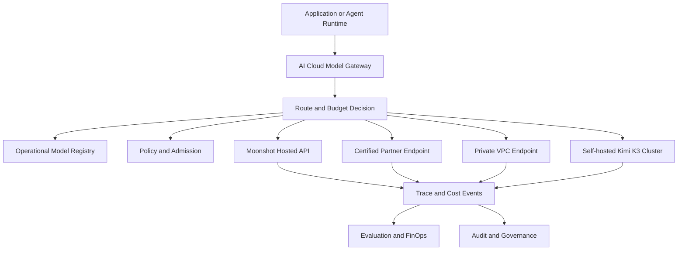
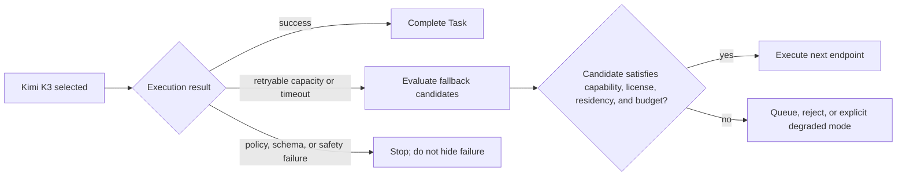

# 08. AI Cloud Integration Blueprint

## 1. Integration objective

Kimi K3 should be integrated into AI Cloud as a governed model family with several possible deployment endpoints, not as a hard-coded provider name.

The integration must support:

```text
Moonshot hosted API
+ certified inference partner
+ enterprise private endpoint
+ self-hosted open weights
```

All paths should expose the same normalized provider contract while preserving deployment-specific health, capacity, cost, license, and security evidence.

## 2. Architectural placement



## 3. Model-family identity

Separate the abstract model family from concrete deployable revisions.

```text
Model family: Kimi K3
  ├─ Moonshot API revision A
  ├─ Partner endpoint revision A
  ├─ Self-hosted checkpoint revision X on vLLM
  └─ Self-hosted checkpoint revision X on SGLang
```

Even when the weight checkpoint is identical, endpoints can differ because of:

- inference-engine version;
- custom-code revision;
- kernel implementation;
- quantization support;
- context-management policy;
- tool-call formatting;
- safety controls;
- capacity and regional placement.

Each combination requires a distinct deployable Model Registry record.

## 4. Proposed Model Registry object

```yaml
apiVersion: aicloud.io/v1alpha1
kind: ModelVersion
metadata:
  name: kimi-k3-hf-revision-x
spec:
  family: kimi-k3
  publisher: Moonshot AI
  modelId: moonshotai/Kimi-K3
  checkpointRevision: <immutable-revision>
  architecture:
    type: hybrid-kda-mla-latent-moe
    totalParameters: 2800000000000
    activatedParameters: 104000000000
    layers: 93
    attention:
      kdaLayers: 69
      gatedMlaLayers: 24
      hybridPattern: 3-kda-to-1-gated-mla
    moe:
      routedExperts: 896
      expertsPerToken: 16
      sharedExperts: 2
      latentDimension: 3584
    contextTokens: 1048576
    modalities:
      - text
      - image
    visionEncoder: MoonViT-V2
  inference:
    reasoningEfforts:
      - low
      - high
      - max
    preservedReasoningHistory: true
    quantization:
      expertWeights: MXFP4
      expertActivations: MXFP8
    customCodeRequired: true
  artifacts:
    modelManifestDigest: <sha256>
    customCodeDigest: <sha256>
    processorDigest: <sha256>
    licenseDigest: <sha256>
  admissionRef: kimi-k3-admission-x
  evaluationRef: kimi-k3-eval-x
```

This is a proposed AI Cloud representation, not an upstream Kimi schema.

## 5. Endpoint object

```yaml
apiVersion: aicloud.io/v1alpha1
kind: ModelEndpoint
metadata:
  name: kimi-k3-private-vllm-prod
spec:
  modelVersionRef: kimi-k3-hf-revision-x
  deploymentMode: private-endpoint
  providerProtocol: openai-compatible
  endpoint: https://kimi-k3.internal.example/v1
  region: ap-northeast
  dataResidency: private-region
  engine:
    name: vllm
    version: <pinned-version>
    imageDigest: <sha256>
  serviceTiers:
    - standard
    - batch
  capabilities:
    - long-context
    - native-vision
    - structured-output
    - tool-use
    - coding
    - research
  runtimeSignals:
    healthTTLSeconds: 60
    capacityTTLSeconds: 30
```

## 6. Provider Adapter

The AI Cloud adapter should normalize Kimi-specific behavior into the common `ModelProvider` contract.

### Request mapping

```text
AI Cloud normalized request
→ model name and endpoint
→ messages with preserved assistant history
→ reasoning_effort
→ multimodal content blocks
→ structured-output schema
→ tool definitions and tool choice
→ maximum output budget
→ provider timeout and retry policy
```

### Response mapping

```text
provider response
→ content
→ reasoning-content evidence reference
→ structured output
→ tool calls
→ token usage
→ finish reason
→ latency
→ provider request ID
→ safety or error classification
```

### Preserved reasoning history

Official usage guidance expects complete previous assistant messages, including reasoning content and tool calls, to be passed back for multi-turn interaction.

AI Cloud must not expose or persist this blindly.

Recommended behavior:

- store reasoning history in a restricted trace payload store;
- expose only a digest or redacted summary through normal APIs;
- encrypt it at rest;
- bind it to tenant and Task;
- apply short retention by default;
- prevent cross-tenant prefix-cache reuse;
- allow policy to disable preserved reasoning for sensitive workloads;
- validate whether hosted-provider terms permit storage and replay.

## 7. Joint routing

Kimi K3 routing should jointly select:

```text
execution path
+ endpoint
+ reasoning effort
+ service tier
+ context strategy
+ tool policy
+ budget
```

### Example route classes

| Task | Preferred initial route |
|---|---|
| Deterministic extraction | Rule, parser, or small model; not Kimi K3 |
| Short standard coding question | Lower-cost coding model |
| Repository-scale engineering task | Kimi K3 high/max or another evaluated flagship |
| Million-token document research | Kimi K3 endpoint only after long-context evaluation |
| Sensitive internal visual document | Private or self-hosted Kimi K3 endpoint |
| High-risk infrastructure action | Model proposes only; Tool Gateway and approval execute |

### Route filter

A Kimi K3 endpoint is eligible only when:

- exact model revision is approved;
- license and provenance evidence is valid;
- endpoint health is fresh;
- expert topology is complete;
- capacity is available;
- requested modality is supported by the exact endpoint;
- context length is inside the tested production band;
- reasoning effort is supported;
- data-residency policy is satisfied;
- estimated total Task cost is within budget;
- required evaluation suite passed.

## 8. Capacity-aware routing

Kimi K3 capacity signals should include model-specific fields.

```yaml
health:
  status: healthy
  checkedAt: <timestamp>
  expertTopologyComplete: true
  kdaKernelReady: true
  mxfpKernelReady: true
capacity:
  availableConcurrency: <number>
  queuedRequests: <number>
  estimatedWaitMs: <number>
  acceleratorMemoryPressure: <ratio>
  hybridCacheUtilization: <ratio>
  kdaStateCacheHitRate: <ratio>
  mlaKvCacheHitRate: <ratio>
  allToAllP95Ms: <number>
  contextBandAvailability:
    short: available
    medium: available
    ultraLong: constrained
```

A generic `/healthz` response is not enough for routing.

## 9. Fallback policy

Fallback must preserve capability and governance requirements.



Retryable classes may include:

- endpoint unavailable;
- timeout;
- rate limit;
- explicit capacity exhaustion;
- transient transport error.

Non-retryable classes should include:

- invalid schema;
- policy rejection;
- license or admission rejection;
- unsafe output;
- unsupported modality;
- business-rule failure.

## 10. Task-level cost ledger

Kimi K3 cost must be measured at the Task level.

```text
provider input and output
+ reasoning effort
+ long-context premium
+ visual processing
+ cache storage and transfer
+ tool calls
+ Sandbox compute
+ retries and fallbacks
+ evaluation
+ human review
```

Recommended immutable events:

```yaml
- component: model-input
  endpoint: kimi-k3-private-vllm-prod
  attempt: 1
  quantity: <tokens>
- component: model-output
  effort: max
  attempt: 1
  quantity: <tokens>
- component: cache
  cacheType: hybrid-prefix
  quantity: <bytes-or-time>
- component: sandbox
  quantity: <compute-seconds>
- component: retry
  reason: provider-timeout
  attempt: 1
```

The key business metric is **cost per successful Task**, not only price per million tokens.

## 11. Trace model

Every Kimi K3 Task should use one root Trace.

```text
Task created
→ classification
→ RouteDecision
→ admission evidence version
→ Kimi endpoint attempt
→ model response or error
→ tool proposal
→ policy decision
→ approval when required
→ Sandbox execution
→ verification
→ evaluation
→ final Task state and cost
```

Trace metadata should store digests and references rather than sensitive full content wherever possible.

## 12. Evaluation admission

Recommended mandatory suites before production routing:

```text
K3-CAPABILITY-001
K3-CODE-001
K3-LONGCTX-001
K3-AGENT-001
K3-VISION-001
K3-SAFETY-001
K3-COST-001
K3-FAILOVER-001
K3-LICENSE-001
K3-CACHE-001
```

Evaluation configuration must pin:

- checkpoint and code revisions;
- inference engine and image digest;
- reasoning effort;
- context policy;
- tool schema and permissions;
- Agent harness;
- Sandbox image and network policy;
- dataset and evaluator version.

## 13. Tool Gateway and Sandbox

Kimi K3's Agent capability does not change AI Cloud's execution principle:

```text
Models propose.
Policy decides.
Humans approve when required.
Controllers execute.
```

Kimi K3 must never receive unrestricted production credentials or direct infrastructure access.

The execution sequence remains:

```text
model tool proposal
→ Tool Gateway
→ deterministic policy
→ human approval if required
→ Task-scoped short-lived credential
→ Sandbox or controlled controller
→ result validation
→ immutable audit
```

## 14. Deployment profiles

### Profile A: Hosted API evaluation

Use for quick capability and protocol validation.

Requirements:

- provider secret in vault;
- provider terms and data-policy review;
- no implicit production approval;
- cost and rate-limit telemetry;
- exact API model revision evidence where available.

### Profile B: Private endpoint

Use for enterprise-sensitive workloads when a controlled regional endpoint is available.

Requirements:

- network-private access;
- tenant isolation;
- capacity contract;
- endpoint-version pinning;
- evidence of underlying checkpoint and engine.

### Profile C: Self-hosted open weights

Use only when deployment sovereignty justifies the operational burden.

Requirements:

- distributed inference topology;
- certified engine and kernels;
- artifact verification;
- expert-parallel health;
- hybrid-cache isolation;
- capacity and failure runbooks;
- dedicated performance and safety evaluation.

## 15. Proposed engineering backlog

```text
K3-001 Add Kimi K3 Model Registry schema and evidence fixture
K3-002 Add OpenAI-compatible Kimi adapter fields for reasoning effort
K3-003 Add preserved-reasoning-history secure storage policy
K3-004 Add multimodal request normalization and processor versioning
K3-005 Add Kimi-specific health and capacity collector interface
K3-006 Add hybrid KDA/MLA cache metrics
K3-007 Add Kimi K3 license admission policy
K3-008 Add long-context evaluation suite
K3-009 Add coding Agent and Tool Gateway evaluation suite
K3-010 Add hosted-versus-self-hosted cost comparison
K3-011 Add fallback tests across Kimi and alternative models
K3-012 Add production runbook for expert-topology failure
```

## 16. Recommended implementation order

```text
Registry and evidence fixture
→ hosted API adapter
→ reasoning-effort and multimodal protocol
→ Trace and Task cost
→ evaluation suites
→ capacity and fallback
→ private endpoint
→ self-hosted proof of concept
→ production admission decision
```

Starting with the hosted API avoids making a multi-node infrastructure investment before the model proves useful on AI Cloud's actual workloads.

## 17. Decision criteria for self-hosting

Self-hosting should be considered only when several conditions hold:

- sensitive data cannot leave the controlled environment;
- sustained workload can justify low utilization risk;
- required kernels are stable on available hardware;
- the organization can operate distributed MoE serving;
- license terms are compatible;
- hosted API cost or availability is unacceptable;
- enterprise evaluation demonstrates a material advantage over smaller models.

The existence of public weights alone is not a sufficient reason to self-host a 2.8T model.
