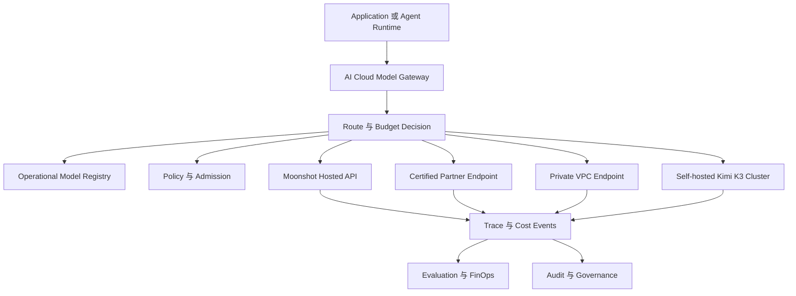
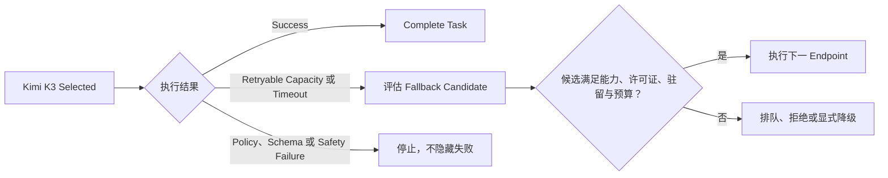

# 08. AI Cloud 接入蓝图

[English](08-aicloud-integration-blueprint.md) | **简体中文**

## 1. 接入目标

Kimi K3 应作为一个受治理的模型家族接入 AI Cloud，并支持多种部署 Endpoint，而不是被硬编码成一个 Provider 名称。

接入必须支持：

```text
Moonshot 托管 API
+ 认证推理合作伙伴
+ 企业私有 Endpoint
+ 自托管开放权重
```

所有路径应暴露相同的标准化 Provider Contract，同时保留部署特定的健康、容量、成本、许可证和安全证据。

## 2. 架构位置



## 3. 模型家族身份

应把抽象模型家族与可部署的具体 Revision 分离：

```text
Model Family: Kimi K3
  ├─ Moonshot API Revision A
  ├─ Partner Endpoint Revision A
  ├─ Self-hosted Checkpoint Revision X on vLLM
  └─ Self-hosted Checkpoint Revision X on SGLang
```

即使使用相同权重 Checkpoint，不同 Endpoint 仍可能因以下因素产生差异：

- 推理引擎版本；
- 自定义代码 Revision；
- 内核实现；
- 量化支持；
- Context Management Policy；
- 工具调用格式；
- 安全控制；
- 容量和区域位置。

每种组合都应拥有独立的可部署 Model Registry 记录。

## 4. 建议的 Model Registry 对象

```yaml
apiVersion: aicloud.io/v1alpha1
kind: ModelVersion
metadata:
  name: kimi-k3-hf-revision-x
spec:
  family: kimi-k3
  publisher: Moonshot AI
  modelId: moonshotai/Kimi-K3
  checkpointRevision: <immutable-revision>
  architecture:
    type: hybrid-kda-mla-latent-moe
    totalParameters: 2800000000000
    activatedParameters: 104000000000
    layers: 93
    attention:
      kdaLayers: 69
      gatedMlaLayers: 24
      hybridPattern: 3-kda-to-1-gated-mla
    moe:
      routedExperts: 896
      expertsPerToken: 16
      sharedExperts: 2
      latentDimension: 3584
    contextTokens: 1048576
    modalities:
      - text
      - image
    visionEncoder: MoonViT-V2
  inference:
    reasoningEfforts:
      - low
      - high
      - max
    preservedReasoningHistory: true
    quantization:
      expertWeights: MXFP4
      expertActivations: MXFP8
    customCodeRequired: true
  artifacts:
    modelManifestDigest: <sha256>
    customCodeDigest: <sha256>
    processorDigest: <sha256>
    licenseDigest: <sha256>
  admissionRef: kimi-k3-admission-x
  evaluationRef: kimi-k3-eval-x
```

这是 AI Cloud 建议表示，并非上游 Kimi Schema。

## 5. Endpoint 对象

```yaml
apiVersion: aicloud.io/v1alpha1
kind: ModelEndpoint
metadata:
  name: kimi-k3-private-vllm-prod
spec:
  modelVersionRef: kimi-k3-hf-revision-x
  deploymentMode: private-endpoint
  providerProtocol: openai-compatible
  endpoint: https://kimi-k3.internal.example/v1
  region: ap-northeast
  dataResidency: private-region
  engine:
    name: vllm
    version: <pinned-version>
    imageDigest: <sha256>
  serviceTiers:
    - standard
    - batch
  capabilities:
    - long-context
    - native-vision
    - structured-output
    - tool-use
    - coding
    - research
  runtimeSignals:
    healthTTLSeconds: 60
    capacityTTLSeconds: 30
```

## 6. Provider Adapter

AI Cloud Adapter 应把 Kimi 特有行为映射到通用 `ModelProvider` Contract。

### 请求映射

```text
AI Cloud 标准化请求
→ 模型名与 Endpoint
→ 包含完整 Assistant 历史的 Messages
→ reasoning_effort
→ 多模态 Content Block
→ Structured Output Schema
→ Tool Definition 与 Tool Choice
→ 最大输出预算
→ Provider Timeout 与 Retry Policy
```

### 响应映射

```text
Provider Response
→ Content
→ Reasoning Content Evidence Reference
→ Structured Output
→ Tool Calls
→ Token Usage
→ Finish Reason
→ Latency
→ Provider Request ID
→ Safety 或 Error Classification
```

### 保留推理历史

官方使用指南要求在多轮交互中，把之前的 Assistant Message，包括 Reasoning Content 与 Tool Call 完整传回。

AI Cloud 不能无条件暴露或持久化这些内容。建议：

- Reasoning History 保存到受限 Trace Payload Store；
- 普通 API 仅暴露 Digest 或脱敏摘要；
- 静态加密；
- 绑定 Tenant 和 Task；
- 默认短 Retention；
- 禁止跨租户 Prefix Cache 复用；
- 对敏感工作负载允许 Policy 禁用保留推理；
- 验证 Hosted Provider 条款是否允许存储和回放。

## 7. 联合路由

Kimi K3 路由应联合选择：

```text
执行路径
+ Endpoint
+ Reasoning Effort
+ Service Tier
+ Context Strategy
+ Tool Policy
+ Budget
```

### 示例路由类别

| 任务 | 建议初始路由 |
|---|---|
| 确定性提取 | Rule、Parser 或 Small Model，不使用 Kimi K3 |
| 短标准 Coding 问题 | 低成本 Coding Model |
| 仓库级工程任务 | Kimi K3 high/max 或其他已评测 Flagship |
| 百万 Token 文档研究 | 仅在长上下文评测通过后使用 Kimi K3 Endpoint |
| 敏感内部视觉文档 | Private 或 Self-hosted Kimi K3 Endpoint |
| 高风险基础设施操作 | 模型只提出建议，由 Tool Gateway 和 Approval 执行 |

### Route Filter

Kimi K3 Endpoint 仅在以下条件满足时可进入候选：

- 精确模型 Revision 已批准；
- 许可证和来源证据有效；
- Endpoint Health Signal 新鲜；
- 专家拓扑完整；
- 容量可用；
- 精确 Endpoint 支持请求模态；
- Context Length 位于已测试生产区间；
- 支持请求的 Reasoning Effort；
- 满足 Data Residency；
- 预计 Task 总成本在预算内；
- 必需 Evaluation Suite 已通过。

## 8. 容量感知路由

Kimi K3 容量信号应包含模型特定字段：

```yaml
health:
  status: healthy
  checkedAt: <timestamp>
  expertTopologyComplete: true
  kdaKernelReady: true
  mxfpKernelReady: true
capacity:
  availableConcurrency: <number>
  queuedRequests: <number>
  estimatedWaitMs: <number>
  acceleratorMemoryPressure: <ratio>
  hybridCacheUtilization: <ratio>
  kdaStateCacheHitRate: <ratio>
  mlaKvCacheHitRate: <ratio>
  allToAllP95Ms: <number>
  contextBandAvailability:
    short: available
    medium: available
    ultraLong: constrained
```

通用 `/healthz` 不足以用于路由决策。

## 9. Fallback Policy

Fallback 必须保持能力和治理约束。



可重试类别可包括：

- Endpoint Unavailable；
- Timeout；
- Rate Limit；
- 显式容量耗尽；
- 短暂 Transport Error。

不可重试类别应包括：

- Invalid Schema；
- Policy Rejection；
- License 或 Admission Rejection；
- Unsafe Output；
- Unsupported Modality；
- Business Rule Failure。

## 10. Task 级成本账本

Kimi K3 成本必须在 Task 层计算：

```text
Provider Input 与 Output
+ Reasoning Effort
+ Long-Context Premium
+ Visual Processing
+ Cache Storage 与 Transfer
+ Tool Calls
+ Sandbox Compute
+ Retry 与 Fallback
+ Evaluation
+ Human Review
```

建议不可变事件：

```yaml
- component: model-input
  endpoint: kimi-k3-private-vllm-prod
  attempt: 1
  quantity: <tokens>
- component: model-output
  effort: max
  attempt: 1
  quantity: <tokens>
- component: cache
  cacheType: hybrid-prefix
  quantity: <bytes-or-time>
- component: sandbox
  quantity: <compute-seconds>
- component: retry
  reason: provider-timeout
  attempt: 1
```

核心业务指标是**每个成功 Task 的成本**，不是每百万 Token 单价。

## 11. Trace 模型

每个 Kimi K3 Task 应使用一个根 Trace：

```text
Task Created
→ Classification
→ RouteDecision
→ Admission Evidence Version
→ Kimi Endpoint Attempt
→ Model Response 或 Error
→ Tool Proposal
→ Policy Decision
→ Approval（如需要）
→ Sandbox Execution
→ Verification
→ Evaluation
→ Final Task State 与 Cost
```

Trace 元数据应尽量保存 Digest 与 Reference，而不是敏感完整内容。

## 12. 评测准入

进入生产路由前建议强制运行：

```text
K3-CAPABILITY-001
K3-CODE-001
K3-LONGCTX-001
K3-AGENT-001
K3-VISION-001
K3-SAFETY-001
K3-COST-001
K3-FAILOVER-001
K3-LICENSE-001
K3-CACHE-001
```

评测配置必须固定：

- Checkpoint 和代码 Revision；
- 推理引擎和 Image Digest；
- Reasoning Effort；
- Context Policy；
- Tool Schema 与 Permission；
- Agent Harness；
- Sandbox Image 与 Network Policy；
- Dataset 和 Evaluator Version。

## 13. Tool Gateway 与 Sandbox

Kimi K3 的 Agent 能力不改变 AI Cloud 的执行原则：

```text
Models propose.
Policy decides.
Humans approve when required.
Controllers execute.
```

Kimi K3 不得获得不受限制的生产凭据或直接基础设施访问。

执行顺序保持：

```text
Model Tool Proposal
→ Tool Gateway
→ Deterministic Policy
→ Human Approval（如需要）
→ Task-Scoped Short-Lived Credential
→ Sandbox 或受控 Controller
→ Result Validation
→ Immutable Audit
```

## 14. 部署 Profile

### Profile A：Hosted API Evaluation

用于快速验证能力和协议。

要求：

- Provider Secret 存入 Vault；
- 审查 Provider 条款和数据政策；
- 不隐式获得生产批准；
- 采集成本和 Rate Limit Telemetry；
- 在可获得时记录精确 API Model Revision。

### Profile B：Private Endpoint

用于存在受控区域 Endpoint 的企业敏感工作负载。

要求：

- 私有网络访问；
- 租户隔离；
- 容量合同；
- Endpoint Version Pinning；
- 底层 Checkpoint 和 Engine 证据。

### Profile C：Self-hosted Open Weights

仅在部署主权确实值得承担运营负担时使用。

要求：

- 分布式推理拓扑；
- 认证 Engine 与 Kernel；
- Artifact Verification；
- Expert Parallel Health；
- Hybrid Cache Isolation；
- 容量与故障 Runbook；
- 专用性能和安全评测。

## 15. 建议工程 Backlog

```text
K3-001 Add Kimi K3 Model Registry schema and evidence fixture
K3-002 Add OpenAI-compatible Kimi adapter fields for reasoning effort
K3-003 Add preserved-reasoning-history secure storage policy
K3-004 Add multimodal request normalization and processor versioning
K3-005 Add Kimi-specific health and capacity collector interface
K3-006 Add hybrid KDA/MLA cache metrics
K3-007 Add Kimi K3 license admission policy
K3-008 Add long-context evaluation suite
K3-009 Add coding Agent and Tool Gateway evaluation suite
K3-010 Add hosted-versus-self-hosted cost comparison
K3-011 Add fallback tests across Kimi and alternative models
K3-012 Add production runbook for expert-topology failure
```

## 16. 建议实施顺序

```text
Registry 与 Evidence Fixture
→ Hosted API Adapter
→ Reasoning Effort 与 Multimodal Protocol
→ Trace 与 Task Cost
→ Evaluation Suite
→ Capacity 与 Fallback
→ Private Endpoint
→ Self-hosted Proof of Concept
→ Production Admission Decision
```

优先使用 Hosted API，可以避免在模型尚未证明适用于 AI Cloud 实际任务前就投入多节点基础设施。

## 17. 自托管决策标准

只有在多个条件同时满足时才考虑自托管：

- 敏感数据不能离开受控环境；
- 持续工作负载足以降低低利用率风险；
- 可用硬件上的必要内核已经稳定；
- 组织具备运营分布式 MoE Serving 的能力；
- 许可证条款兼容；
- Hosted API 成本或可用性不可接受；
- 企业评测证明相对更小模型存在实质优势。

公开权重本身不是自托管 2.8T 模型的充分理由。
