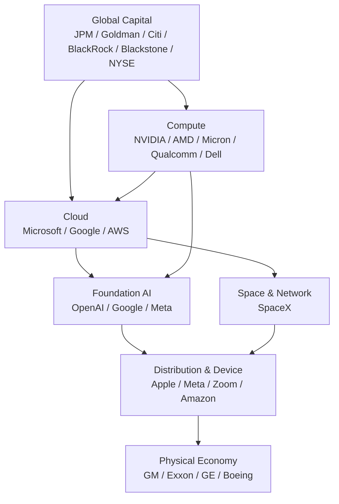

# U.S.-China AI Industrial Stacks and AI Execution OS: Reading Industrial Control Points from the 2026 Trump-Xi State Dinner

**English** | [简体中文](us-china-ai-industrial-stack-and-execution-os.zh-CN.md)

> observation-date: 2026-09-25  
> status: research-input  
> scope: industry structure, AI infrastructure, execution control plane  
> evidence-boundary: State Dinner guests are used only as an observation sample of U.S. industrial capabilities. Chinese companies mentioned below are capability mappings, not confirmed dinner attendees or formal negotiators.

## 1. Research question and evidence boundary

This study asks three questions:

1. What U.S. industrial capability stack is visible in the confirmed corporate guest list for the September 24, 2026 White House State Dinner?
2. Compared with China's current industrial capabilities, where do the two AI ecosystems have advantages, dependencies, and bottlenecks?
3. What do these external developments imply for AI Cloud, especially the AI Execution Control Plane / AI Execution OS direction?

### 1.1 Evidence levels

- **Published fact**: visit, State Dinner, and corporate guest information confirmed by public sources such as the White House and Reuters.
- **Code-verifiable fact**: not applicable; this is not a code audit.
- **Engineering inference**: AI Cloud implications derived from public industrial structure.
- **Unknown or unverified**: attendance does not establish participation in formal negotiations or endorsement of government policy.

## 2. Confirmed corporate representation by industrial layer

Reuters published the formal guest list based on information provided by the White House press office. The important signal is not any single executive but the breadth of the industrial stack represented.

| Layer | Representative executives | Company | Core capability |
|---|---|---|---|
| Frontier AI | Sam Altman / Greg Brockman | OpenAI | Foundation models, agents, AI platform |
| AI / Search / Cloud | Sundar Pichai / Sergey Brin | Google / Alphabet | Gemini, search, cloud, data, AI silicon |
| AI / Social / Distribution | Mark Zuckerberg | Meta | Models, open ecosystem, global distribution |
| Enterprise AI / Cloud | Satya Nadella | Microsoft | Azure, enterprise software, AI distribution |
| Cloud / Commerce | Jeff Bezos | Amazon | AWS, cloud, data centers, commerce distribution |
| AI Compute | Jensen Huang | NVIDIA | GPU, networking, interconnect, CUDA, systems |
| AI Compute | Lisa Su | AMD | CPU, GPU, AI accelerators |
| Memory | Sanjay Mehrotra | Micron | DRAM, HBM, NAND |
| Edge AI | Cristiano Amon | Qualcomm | Mobile SoC, edge AI, communications |
| Enterprise Infra | Michael Dell | Dell Technologies | AI servers and enterprise infrastructure |
| Device / OS | Tim Cook | Apple | Devices, OS, silicon, distribution |
| Collaboration | Eric Yuan | Zoom | Enterprise communication and AI work surface |
| Space / Network | Elon Musk | SpaceX | Commercial space and satellite networks |
| Aviation | Kelly Ortberg | Boeing | Civil aviation and global supply chain |
| Aerospace Engine | Larry Culp | GE Aerospace | Aircraft engines |
| Automotive | Mary Barra | General Motors | Automotive, EV, intelligent vehicles |
| Energy | Darren Woods | ExxonMobil | Oil, gas, energy supply |
| Banking | Jamie Dimon / Jane Fraser | JPMorgan / Citi | Global banking, finance, cross-border capital |
| Capital Markets | David Solomon / John F.W. Rogers | Goldman Sachs | Investment banking and capital markets |
| Asset Management | Larry Fink | BlackRock | Global asset allocation |
| Private Capital | Stephen Schwarzman | Blackstone | PE, infrastructure, private credit |
| Exchange | Lynn Martin | NYSE | Listing and market infrastructure |
| Payments | Ryan McInerney / Michael Miebach | Visa / Mastercard | Global payment networks |
| Healthcare | Albert Bourla | Pfizer | Biopharma |
| Media / Consumer | David Ellison / Bernard Arnault | Paramount Skydance / LVMH | Media distribution and consumer brands |

### 2.1 Important limitation

The list establishes attendance/invitation only. It does not establish that these executives:
- participated in formal bilateral negotiations;
- represented U.S. government industrial policy;
- committed to any bilateral agreement.

The list is therefore treated as an **industrial capability observation sample**, not a negotiation roster.

## 3. U.S. stack: Capital → Compute → Intelligence → Distribution → Physical Economy



### 3.1 The core U.S. advantage is not a single model

The stronger system-level pattern is:

```text
Capital
  × Compute
  × Cloud
  × Foundation Model
  × Developer Ecosystem
  × Global Distribution
```

Even if model capability gaps narrow, the closed loop across financing, compute, cloud, developers, and distribution remains strategically important.

### 3.2 Capital markets are an underappreciated layer

AI infrastructure requires sustained investment in:
- accelerators;
- HBM / memory;
- data centers;
- power and grid;
- cooling;
- networking;
- semiconductor fabs.

The scaling loop is therefore:

```text
Idea
→ VC
→ Private Capital / Credit
→ Investment Bank
→ Public Market
→ Global Asset Manager
→ Infrastructure CAPEX
```

Cost of capital becomes part of AI competitiveness.

## 4. China capability mapping: Manufacturing → Materials → Device / EV → Industrial AI

This section is an **industrial mapping, not an attendance list**.

| Layer | Representative capability | Example participants |
|---|---|---|
| Model | LLMs and cost-efficient inference | DeepSeek, Alibaba, ByteDance, Tencent, Zhipu, Moonshot, etc. |
| Compute | Domestic AI accelerators | Huawei Ascend, Cambricon, domestic GPU ecosystem |
| Memory / Storage | DRAM / NAND localization | CXMT, YMTC |
| Cloud | Public and enterprise cloud | Alibaba Cloud, Huawei Cloud, Tencent Cloud |
| Device | Mobile, PC, AIoT | Huawei, Xiaomi, Lenovo, OPPO/vivo, etc. |
| EV / Battery | EV, battery, storage | BYD, CATL, Gotion, etc. |
| Manufacturing | Large-scale manufacturing clusters | Electronics, machinery, automotive, energy equipment |
| Critical Materials | Rare-earth mining, separation, processing | Rare-earth industrial system |
| Industrial AI | AI + manufacturing / robot / EV | Industrial software, robotics, intelligent vehicle ecosystem |

Reuters reported ahead of the summit that China holds a large share of global rare-earth mining and an even larger share of refining/processing. This illustrates that AI and advanced manufacturing bottlenecks exist not only in GPUs, but also in materials, power systems, motors, grids, and manufacturing capability.

## 5. Structural asymmetry and interdependence

| Dimension | U.S. relative strength | China relative strength |
|---|---|---|
| Frontier AI | Strong | Rapidly advancing |
| High-end AI Compute | Strong | Localization accelerating |
| Cloud / Developer Platform | Strong | Strong |
| Global Capital Markets | Major advantage | Relatively weaker |
| Global OS / Distribution | Strong | Strong domestic ecosystems, different global reach |
| EV / Battery | Capable | Scale and supply-chain strength |
| Manufacturing Clusters | Strong | Large scale and completeness |
| Critical-material processing | Diversification dependency | Strong in selected processing chains |
| Energy | Oil/gas and global energy companies | Large consumption plus equipment manufacturing |
| Industrial AI scenarios | Strong | Large scenario scale and deep manufacturing coupling |

A useful simplification is:

```text
US:
Capital → Compute → Cloud → Model → Distribution → Physical AI

China:
Materials / Manufacturing → Compute → Cloud → Model
→ Device / EV / Robot → Industrial AI
```

Both sides control nodes that are difficult to replace quickly. This supports simultaneous:
- technology competition;
- supply-chain diversification;
- de-risking of single points of failure;
- continued ordinary commerce;
- minimum crisis communication in high-risk domains.

## 6. Direct implications for AI Cloud / AI Execution OS

### 6.1 Model Router is only the first layer

```text
Task
→ Identity / Context
→ Policy / Jurisdiction
→ Execution Planner
→ Model Router
→ Compute / Hardware Router
→ Region Router
→ Agent Runtime
→ Tool Permission
→ Runtime Observer
→ Cost / Risk Accounting
→ Audit / Outcome
```

This is the boundary of an AI Execution Control Plane, not merely a Token Gateway.

### 6.2 Jurisdiction-aware routing must be first-class

```yaml
execution_policy:
  jurisdiction: CN|US|EU|JP|...
  data_residency: local|required|flexible
  model_capability_class: frontier|standard|local
  allowed_providers: []
  allowed_accelerators: []
  tool_permissions: []
  human_approval:
    required_for: []
```

The platform should not hard-code country policy. It should expose an extensible policy contract.

### 6.3 Compute must be abstracted as a heterogeneous resource pool

```text
CPU
GPU
NPU
ASIC
Local Device
Private Cluster
Public Cloud
Remote Provider
```

The planner should select execution placement using:
- latency;
- cost;
- privacy;
- capability;
- energy;
- availability;
- jurisdiction.

### 6.4 Cost per successful task should supersede token-only economics

```text
Cost / Token
Cost / Attempt
Cost / Successful Task
Task Success Rate
Human Intervention Rate
Unauthorized Action Rate
Compute Utilization
Economic Value / AI Capital Employed
```

As capital becomes more expensive, the key question is whether AI produces economic value above its cost of capital.

## 7. 2030 scenario framework: product stress tests, not predictions

### Scenario A — Two ecosystems continue to diverge

- Frontier models, chips, clouds, and regulation become more regional.
- Enterprises manage multiple U.S. / China / EU provider and policy stacks.
- AI Execution OS gains value as a cross-ecosystem abstraction and policy enforcement layer.

### Scenario B — Models commoditize; execution becomes the control point

- Capability differences at the same tier narrow.
- Token prices continue to fall.
- Competition shifts to agents, tools, data, workflows, and cost per successful task.
- AI Execution OS becomes the task and economics control layer.

### Scenario C — Physical AI accelerates

- Agents move from digital tools into robots, vehicles, labs, and industrial systems.
- Action risk exceeds output risk.
- Identity, least privilege, human override, safety boundaries, and audit become mandatory.

### Scenario D — Infrastructure becomes the bottleneck

- GPU is no longer the only scarce resource.
- Power, grid, memory, cooling, networks, permitting, and capital become primary constraints.
- Schedulers must incorporate infrastructure cost and availability.

## 8. Long-term monitoring metrics

| Metric | Meaning |
|---|---|
| Cost per Successful Task | Real cost of completing one useful task |
| Task Success Rate | End-to-end task completion rate |
| Runtime Intervention Rate | Human/policy interventions per million agent actions |
| Provider / Model Fallback Coverage | Portability during provider/model failure |
| Compute Utilization | Effective utilization of GPU/NPU/ASIC |
| Power Conversion Rate | Planned AI capacity converted into operational capacity |
| AI Revenue Conversion | Efficiency of converting AI CAPEX into revenue |
| AI-DSCR | AI operating cash flow coverage of fixed AI financing obligations |
| AI Self-Development Ratio | Share of AI R&D work led or materially executed by AI |
| AI Productivity Distribution Ratio | Degree to which AI productivity gains diffuse into broader income/economic benefit |
| Resilient Capacity Ratio | Effective capacity remaining after loss of the largest failure domain |
| Jurisdiction Portability | Portability of tasks across jurisdictions/providers/hardware |

## 9. Engineering inputs for AI Cloud

This study does not directly modify the committed roadmap. It should feed future ADR / roadmap review in these areas:

1. **Execution Policy Contract**
   - jurisdiction, data residency, model class, tool permissions.
2. **Hardware / Compute Abstraction**
   - decouple Provider selection and Hardware selection from the Model Registry.
3. **Region-aware Scheduler**
   - joint Task → Model → Hardware → Region decision.
4. **Runtime Governance**
   - Identity, Sandbox, Action Guard, Kill Switch, Audit.
5. **Economic Telemetry**
   - evolve from Token Billing to Cost / Successful Task and Value / Task.
6. **Resilience**
   - Provider fallback, Model fallback, Region fallback, Compute fallback.
7. **Physical AI Boundary**
   - reserve an Action Policy interface for robots, vehicles, labs, and industrial tools.

### 9.1 Relationship to the existing AI Execution Control Plane

This study reinforces the existing principle:

> Provider, Model Registry, Router, Execution Runtime, and Policy Engine must remain decoupled.

It adds two long-term dimensions:

```text
AI Execution Control Plane
= Model / Provider Control
+ Compute / Region Control
+ Identity / Policy Control
+ Tool / Action Control
+ Cost / Economic Control
+ Jurisdiction / Resilience Control
```

## 10. Conclusion

The 2026 Trump-Xi State Dinner guest list should not be interpreted as a formal industrial negotiating team. It does, however, offer a useful observation window into the U.S. capability stack across technology, capital, cloud, semiconductors, payments, energy, and industry:

```text
Capital → Compute → Intelligence → Distribution → Physical Economy
```

China's industrial capabilities are better understood through:

```text
Materials / Manufacturing → Device / EV / Battery
→ Compute / Cloud / Model → Industrial AI
```

For AI Cloud, the product conclusion is not to bet on one country or one model. It is to build a trusted execution control plane across Provider, Model, Compute, Region, Jurisdiction, and Tool.

> **The long-term control point is not the Model API. It is Execution.**

## 11. References

- Reuters, 2026-09-25, *Trump-Xi state dinner guest list includes SpaceX’s Musk, Nvidia’s Huang and LVMH’s Arnault*  
  https://www.reuters.com/legal/government/trump-xi-state-dinner-guest-list-includes-spacexs-musk-nvidias-huang-lvmhs-2026-09-25/
- The White House, 2026-09-21, *First Lady Melania Trump Releases Details Ahead of Xi Jinping and Peng Liyuan’s Visit to the White House*  
  https://www.whitehouse.gov/briefings-statements/2026/09/first-lady-melania-trump-releases-details-ahead-of-his-excellency-xi-jinping-president-of-the-peoples-republic-of-china-and-madame-peng-liyuans-visit-to-the-white-house/
- Reuters, 2026-09-21, *Rare earths force Trump to be less hostile before Xi summit*  
  https://www.reuters.com/world/china/rare-earths-force-trump-be-less-hostile-before-xi-summit-2026-09-21/
- Reuters, 2026-09-18, *US Treasury's Bessent to discuss AI, rare earths with China's He*  
  https://www.reuters.com/world/china/us-treasurys-bessent-plans-discuss-ai-rare-earths-with-chinas-he-source-says-2026-09-18/
- Reuters, 2026-09-22, *US battery startup that chose China over Kentucky opens first factory as Trump, Xi meet*  
  https://www.reuters.com/world/china/us-battery-startup-that-ditched-kentucky-china-opens-factory-trump-xi-meet-2026-09-22/
