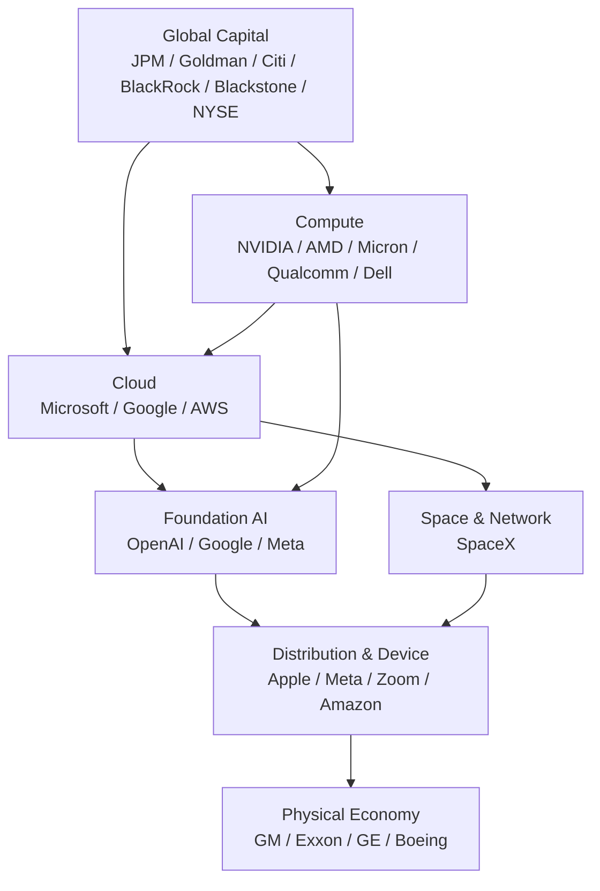

# 中美 AI 产业栈与 AI Execution OS：从 2026 年川习会企业阵容看产业控制点

[English](us-china-ai-industrial-stack-and-execution-os.md) | **简体中文**

> observation-date: 2026-09-25  
> status: research-input  
> scope: industry structure, AI infrastructure, execution control plane  
> evidence-boundary: 晚宴嘉宾用于观察美国产业能力展示；文中“中国对应企业/能力”仅为产业映射，不表示相关企业出席晚宴或参与正式谈判。

## 1. 研究问题与证据边界

本研究回答三个问题：

1. 2026 年 9 月 24 日白宫国宴中已确认的企业界嘉宾，反映了怎样的美国产业能力栈？
2. 与中国现有产业能力相比，中美 AI 产业体系分别在哪些层形成优势、依赖和瓶颈？
3. 这些外部变化对 AI Cloud 的长期方向——尤其是 AI Execution Control Plane / AI Execution OS——意味着什么？

### 1.1 证据等级

- **已发布事实**：白宫、Reuters 等公开来源确认的访问、国宴和企业嘉宾信息。
- **代码可验证事实**：不适用，本研究不是代码审计。
- **工程推断**：基于公开产业结构推导 AI Cloud 所需的控制面能力。
- **未知或未验证**：企业嘉宾是否直接参与具体谈判、个别公司是否代表政府立场，均不得从出席名单直接推断。

## 2. 已确认企业界代表：按产业层分组

Reuters 根据白宫新闻办公室提供的正式宾客名单列出了多名企业家和高管。对 AI Cloud 最有分析价值的不是逐个名字，而是这些公司覆盖了近乎完整的产业栈。

| 产业层 | 代表人物 | 公司 | 核心能力 |
|---|---|---|---|
| Frontier AI | Sam Altman / Greg Brockman | OpenAI | 基础模型、Agent、AI 平台 |
| AI / 搜索 / 云 | Sundar Pichai / Sergey Brin | Google / Alphabet | Gemini、搜索、Cloud、数据与自研 AI 芯片 |
| AI / 社交 / 分发 | Mark Zuckerberg | Meta | 模型、开源生态、全球用户分发 |
| 企业 AI / 云 | Satya Nadella | Microsoft | Azure、企业软件、AI 分发 |
| 云 / 电商 | Jeff Bezos | Amazon | AWS、云、数据中心与商业分发 |
| AI Compute | Jensen Huang | NVIDIA | GPU、网络、互连、CUDA 与系统平台 |
| AI Compute | Lisa Su | AMD | CPU、GPU、AI 加速器 |
| Memory | Sanjay Mehrotra | Micron | DRAM、HBM、NAND |
| Edge AI | Cristiano Amon | Qualcomm | 手机 SoC、边缘 AI、通信 |
| Enterprise Infra | Michael Dell | Dell Technologies | AI Server、企业基础设施 |
| Device / OS | Tim Cook | Apple | 终端、OS、自研芯片、设备分发 |
| Collaboration | Eric Yuan | Zoom | 企业通信与 AI 工作入口 |
| Space / Network | Elon Musk | SpaceX | 商业航天、卫星网络 |
| Aviation | Kelly Ortberg | Boeing | 民航与全球航空供应链 |
| Aerospace Engine | Larry Culp | GE Aerospace | 航空发动机 |
| Automotive | Mary Barra | General Motors | 汽车、EV、智能汽车 |
| Energy | Darren Woods | ExxonMobil | 石油天然气与能源供应 |
| Banking | Jamie Dimon / Jane Fraser | JPMorgan / Citi | 全球银行、融资、跨境金融 |
| Capital Markets | David Solomon / John F.W. Rogers | Goldman Sachs | 投行、资本市场 |
| Asset Management | Larry Fink | BlackRock | 全球资产配置 |
| Private Capital | Stephen Schwarzman | Blackstone | PE、基础设施、私募信贷 |
| Exchange | Lynn Martin | NYSE | 上市与资本市场基础设施 |
| Payments | Ryan McInerney / Michael Miebach | Visa / Mastercard | 全球支付网络 |
| Healthcare | Albert Bourla | Pfizer | 生物医药 |
| Media / Consumer | David Ellison / Bernard Arnault | Paramount Skydance / LVMH | 内容分发、高端消费 |

### 2.1 重要限制

这份名单只能证明“受邀/列入正式宾客名单”，不能证明这些企业家：
- 参与了正式双边谈判；
- 代表美国政府提出产业政策；
- 就某项协议作出承诺。

因此本文把名单当作**产业能力展示样本**，而不是谈判代表名册。

## 3. 美国展示出的产业栈：Capital → Compute → Intelligence → Distribution → Physical Economy

将企业重新按依赖关系排列，可以得到：



### 3.1 美国的核心优势不是单一模型

美国更突出的系统优势是：

```text
Capital
  × Compute
  × Cloud
  × Foundation Model
  × Developer Ecosystem
  × Global Distribution
```

即使模型领先幅度缩小，只要资本市场、云、芯片、开发者生态和全球分发仍然形成闭环，系统优势依然存在。

### 3.2 资本市场是容易被低估的一层

AI 进入基础设施阶段后，需要长期、巨额资本投入：

- GPU / Accelerator；
- HBM / Memory；
- Data Center；
- Power / Grid；
- Cooling；
- Networking；
- Semiconductor Fab。

因此竞争不再只是“谁能训练最强模型”，还包括：

```text
Idea
→ VC
→ Private Capital / Credit
→ Investment Bank
→ Public Market
→ Global Asset Manager
→ Infrastructure CAPEX
```

这使资本获取成本成为 AI 国家与企业竞争力的一部分。

## 4. 中国能力映射：Manufacturing → Materials → Device / EV → Industrial AI

本节是**产业映射，不是出席名单**。

中国较突出的能力集中在：

| 层级 | 代表性能力 | 典型产业参与者（示例） |
|---|---|---|
| Model | 大模型与低成本推理 | DeepSeek、阿里、字节、腾讯、智谱、月之暗面等 |
| Compute | 国产 AI 加速器 | 华为昇腾、寒武纪及国产 GPU 生态 |
| Memory / Storage | DRAM / NAND 国产化 | 长鑫存储、长江存储 |
| Cloud | 公有云与政企云 | 阿里云、华为云、腾讯云 |
| Device | 手机、PC、AIoT | 华为、小米、联想、OPPO/vivo 等 |
| EV / Battery | 电动车、动力电池、储能 | 比亚迪、宁德时代、国轩等 |
| Manufacturing | 大规模制造与供应链 | 电子、机械、汽车、能源设备等完整集群 |
| Critical Materials | 稀土开采、分离、加工 | 稀土产业体系 |
| Industrial AI | AI + 制造 / Robot / EV | 工业软件、机器人、智能汽车生态 |

Reuters 在峰会前的分析中指出，中国在全球稀土采矿和精炼/加工环节占有很高份额；这说明现代 AI 与高端制造的瓶颈并不只存在于 GPU，也存在于材料、能源、电机、电网和制造能力。

## 5. 中美的结构性不对称与相互依赖

可将当前结构简化为：

| 维度 | 美国相对突出 | 中国相对突出 |
|---|---|---|
| Frontier AI | 强 | 快速追赶 |
| 高端 AI Compute | 强 | 国产替代推进 |
| Cloud / Developer Platform | 强 | 强 |
| 全球资本市场 | 显著优势 | 相对较弱 |
| 全球 OS / 分发 | 强 | 国内生态强、全球化程度不同 |
| EV / Battery | 有能力 | 规模与供应链突出 |
| 制造业集群 | 强 | 规模与完整性突出 |
| 关键材料加工 | 依赖多元化 | 稀土等环节突出 |
| 能源资源 | 油气与全球能源企业优势 | 大型能源消费与设备制造体系 |
| 工业 AI 场景 | 强 | 场景规模大、制造耦合深 |

因此中美 AI 竞争不是一条单轴：

```text
Model A vs Model B
```

而更像：

```text
US:
Capital → Compute → Cloud → Model → Distribution → Physical AI

China:
Materials / Manufacturing → Compute → Cloud → Model
→ Device / EV / Robot → Industrial AI
```

双方各自控制部分难以短期替代的节点，因此会同时出现：
- 技术竞争；
- 供应链多元化；
- 关键节点去单点依赖；
- 普通商业继续；
- 高风险领域建立最低限度危机沟通。

## 6. 对 AI Cloud / AI Execution OS 的直接启示

### 6.1 Model Router 只是第一层

当 AI 进入跨模型、跨硬件、跨地区和跨法规环境后，调度决策应升级为：

```text
Task
→ Identity / Context
→ Policy / Jurisdiction
→ Execution Planner
→ Model Router
→ Compute / Hardware Router
→ Region Router
→ Agent Runtime
→ Tool Permission
→ Runtime Observer
→ Cost / Risk Accounting
→ Audit / Outcome
```

这正是 AI Execution Control Plane 的边界，而不是一个单纯 Token Gateway。

### 6.2 必须支持 jurisdiction-aware routing

模型和算力逐渐具备地域、用途和能力边界。控制面应原生表达：

```yaml
execution_policy:
  jurisdiction: CN|US|EU|JP|...
  data_residency: local|required|flexible
  model_capability_class: frontier|standard|local
  allowed_providers: []
  allowed_accelerators: []
  tool_permissions: []
  human_approval:
    required_for: []
```

目标不是硬编码国家规则，而是提供可扩展 Policy Contract。

### 6.3 Compute 应被抽象为异构资源池

长期不能把 AI Cloud 等同于 NVIDIA GPU 调度器。

应该支持：

```text
CPU
GPU
NPU
ASIC
Local Device
Private Cluster
Public Cloud
Remote Provider
```

Task Planner 根据：
- latency；
- cost；
- privacy；
- capability；
- energy；
- availability；
- jurisdiction；

选择最适合的执行位置。

### 6.4 “成功任务成本”应替代单纯 Token 成本

控制面至少应跟踪：

```text
Cost / Token
Cost / Attempt
Cost / Successful Task
Task Success Rate
Human Intervention Rate
Unauthorized Action Rate
Compute Utilization
Economic Value / AI Capital Employed
```

因为资本成本升高后，真正有意义的是 AI 是否产生高于资本成本的经济价值。

## 7. 2030 场景框架：不是预测，而是产品压力测试

### Scenario A — 双生态继续分化

- Frontier Model、芯片、云和法规形成明显区域生态；
- 企业必须同时管理 US / China / EU 等多套 Provider 与规则；
- AI Execution OS 的价值集中在跨生态抽象与 Policy Enforcement。

### Scenario B — Model 商品化，Execution 成为主要控制点

- 同档模型能力差距缩小；
- Token 价格持续下降；
- 企业竞争转向 Agent、工具、数据、流程与成功任务成本；
- AI Execution OS 成为“任务与经济性控制层”。

### Scenario C — Physical AI 加速

- Agent 从数字工具扩展到 Robot、Vehicle、Lab、Industrial System；
- Action Risk 高于 Output Risk；
- 控制面必须强化 Identity、Least Privilege、Human Override、Safety Boundary 和 Audit。

### Scenario D — Infrastructure 成为瓶颈

- GPU 不再是唯一稀缺项；
- Power、Grid、Memory、Cooling、Network、Permitting、Capital 成为主要约束；
- Scheduler 需要把基础设施成本和可用性纳入路由。

## 8. 建议长期监控指标

为了把产业研究转为可持续观察，建议维护以下指标：

| 指标 | 含义 |
|---|---|
| Cost per Successful Task | 完成一次有效任务的真实成本 |
| Task Success Rate | 端到端任务完成率 |
| Runtime Intervention Rate | 每百万次 Agent Action 的人工/策略干预率 |
| Provider / Model Fallback Coverage | 单 Provider/Model 故障时的可迁移能力 |
| Compute Utilization | GPU/NPU/ASIC 等有效利用率 |
| Power Conversion Rate | 规划 AI 容量转为实际可运行容量的比例 |
| AI Revenue Conversion | AI CAPEX 转为收入的效率 |
| AI-DSCR | AI 经营现金流覆盖 AI 相关固定融资支出的能力 |
| AI Self-Development Ratio | AI 参与下一代 AI 研发工作的比例 |
| AI Productivity Distribution Ratio | AI 生产率收益向家庭收入/广泛经济收益传导的程度 |
| Resilient Capacity Ratio | 最大单一故障域失效后剩余有效 AI Capacity |
| Jurisdiction Portability | Task 在不同法域/Provider/硬件之间可迁移程度 |

## 9. 对 AI Cloud 的工程输入

本研究不直接修改正式产品路线，但建议进入后续 ADR / Roadmap 评审的研究项：

1. **Execution Policy Contract**
   - jurisdiction、data residency、model class、tool permissions。
2. **Hardware / Compute Abstraction**
   - 把 Provider 与 Hardware 选择从 Model Registry 中解耦。
3. **Region-aware Scheduler**
   - Task → Model → Hardware → Region 联合决策。
4. **Runtime Governance**
   - Identity、Sandbox、Action Guard、Kill Switch、Audit。
5. **Economic Telemetry**
   - 从 Token Billing 升级到 Cost / Successful Task 和 Value / Task。
6. **Resilience**
   - Provider fallback、Model fallback、Region fallback、Compute fallback。
7. **Physical AI Boundary**
   - 为 Robot / Vehicle / Lab / Industrial Tool 预留 Action Policy 接口。

### 9.1 与现有 AI Execution Control Plane 的关系

本研究强化现有结论：

> Provider、Model Registry、Router、Execution Runtime、Policy Engine 必须解耦。

进一步增加两个长期维度：

```text
AI Execution Control Plane
= Model / Provider Control
+ Compute / Region Control
+ Identity / Policy Control
+ Tool / Action Control
+ Cost / Economic Control
+ Jurisdiction / Resilience Control
```

## 10. 结论

2026 年川习会国宴企业阵容不能被解释为正式产业谈判代表团，但它提供了一个观察窗口：美国最具代表性的科技、资本、云、芯片、支付、能源和工业企业被同时置于同一外交场景中，展示的是一条接近完整的：

```text
Capital → Compute → Intelligence → Distribution → Physical Economy
```

中国的产业能力则更适合从：

```text
Materials / Manufacturing → Device / EV / Battery
→ Compute / Cloud / Model → Industrial AI
```

理解。

对 AI Cloud 而言，最重要的产品结论不是“押注哪一个国家或模型”，而是建立一个能够跨 Provider、Model、Compute、Region、Jurisdiction 和 Tool 的可信执行控制面。

> **长期控制点不是 Model API，而是 Execution。**

## 11. 参考资料

- Reuters, 2026-09-25, *Trump-Xi state dinner guest list includes SpaceX’s Musk, Nvidia’s Huang and LVMH’s Arnault*  
  https://www.reuters.com/legal/government/trump-xi-state-dinner-guest-list-includes-spacexs-musk-nvidias-huang-lvmhs-2026-09-25/
- The White House, 2026-09-21, *First Lady Melania Trump Releases Details Ahead of Xi Jinping and Peng Liyuan’s Visit to the White House*  
  https://www.whitehouse.gov/briefings-statements/2026/09/first-lady-melania-trump-releases-details-ahead-of-his-excellency-xi-jinping-president-of-the-peoples-republic-of-china-and-madame-peng-liyuans-visit-to-the-white-house/
- Reuters, 2026-09-21, *Rare earths force Trump to be less hostile before Xi summit*  
  https://www.reuters.com/world/china/rare-earths-force-trump-be-less-hostile-before-xi-summit-2026-09-21/
- Reuters, 2026-09-18, *US Treasury's Bessent to discuss AI, rare earths with China's He*  
  https://www.reuters.com/world/china/us-treasurys-bessent-plans-discuss-ai-rare-earths-with-chinas-he-source-says-2026-09-18/
- Reuters, 2026-09-22, *US battery startup that chose China over Kentucky opens first factory as Trump, Xi meet*  
  https://www.reuters.com/world/china/us-battery-startup-that-ditched-kentucky-china-opens-factory-trump-xi-meet-2026-09-22/
